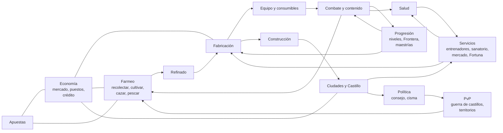

# Red de sistemas: todo depende de todo

> **Módulo** [00 · Visión](README.md) · **Se conecta con:** todos los módulos · **Estado:** propuesta

**Qué pediste.** Que todo tenga que ver una cosa con la otra, y que todo lo que se agregue tenga **una infraestructura que dependa de los farmeos, de los crafteos, de los sistemas de progresión** y del resto.

Este documento es la regla general y el mapa de cómo se cumple.

---

## 1. Las tres reglas de la red

1. **Nada sale de la nada.** Todo edificio, objeto, servicio o mejora cuesta algo que otro jugador **farmeó, cultivó, cazó o fabricó**. Los PNJ solo venden lo básico y los sumideros de oro.
2. **Nada existe suelto.** Todo sistema **consume** de otros y **produce** para otros. Si un sistema no tiene entradas ni salidas, se rediseña o se quita.
3. **Todo avance tiene un requisito de otro sistema.** Subir de rango en un oficio pide materiales de otros oficios; pacificar una región pide vencer a su Guardián y un esfuerzo de guerra de todo el servidor (ver [Mapa infinito y viaje](../02-mundo/mapa-infinito-y-viaje.md)); subir de etapa una ciudad pide que sus necesidades estén cubiertas (ver [Fundación y cisma](../02-mundo/fundacion-y-cisma.md)).

## 2. El mapa

## 3. Qué consume y qué produce cada sistema

| Sistema | Consume (entradas) | Produce (salidas) | Depende del farmeo | Depende de la fabricación | Depende de la progresión |
|---|---|---|---|---|---|
| **Combate y contenido** | Equipo, consumibles, comida, salud | Materiales de monstruo, artefactos, experiencia, heridas | Comida, pociones | Todo el equipo | Nivel, talentos, títulos de Pionero |
| **Salud** | Remedios, vendas, férulas, comida, descanso | Pacientes para médicos, demanda de oficios | Hierbas, lino, comida | Remedios, instrumental, prótesis | Rango de Medicina |
| **Construcción** | Piedra, madera, metal, telas, mecanismos, jornadas de trabajo | Casas, talleres, castillos, defensas | Todo el material base | Clavos, puertas, ornamentos, mecanismos | Rango de Construcción |
| **Ciudades** | Comida, materiales, defensa, salud, ánimo, impuestos | Servicios, entrenadores, mercados, votos | Comida semanal | Herramientas, reparaciones | Etapa de la ciudad |
| **Profesiones** | Materiales, estaciones, entrenadores, Enfoque. En el juego (D-109): lo recolectado y la carne y piel de las bestias, energía, las estaciones del Claro y del campamento | Objetos, servicios. En el juego: materiales refinados, equipo de artesano (a veces ✒️ obra maestra firmada, D-116), pociones y vendas, 🪑 muebles del campamento (Carpintería, D-116), experiencia de héroe y de oficio | Sí | Herramientas de otros oficios; hoy, materiales de otros oficios (toda receta de fabricación pide dos o más) | Rangos, exámenes, especializaciones; hoy, rango 1-100 por oficio y 🎓 especializaciones (una al 25, otra al 75, D-141). Red completa de 26 oficios y sus ciclos: [Red de oficios](../07-economia/red-de-oficios.md) (D-115) |
| **Economía** | Todo lo que se vende | Precios, crédito, sumideros | Mercancía | Mercancía | Acceso a puestos y licencias |
| **Cacerías** | Cebos, trampas, sedantes, equipo | Pieles de calidad, bestias vivas, trofeos, control de poblaciones | Es farmeo | Trampas, cebos | Rangos de la Orden de Cazadores |
| **Apuestas** | Oro, monturas criadas, bestias capturadas, dados y mazos fabricados | Sumidero de oro, fama de tahúr | Bestias para el Foso | Dados, mazos, casinos | Fama de tahúr |
| **Investigaciones** | Tiempo, pistas del mundo, bibliotecas | Recetas, curas, vacunas, secretos, jefes ocultos | Muestras, fragmentos | Pergaminos, bibliotecas | Rangos de detective y erudito |
| **Defensa** | Murallas, trampas, guardias equipados | Seguridad, botín de incursiones | Poblaciones de monstruos (ecología) | Todas las defensas | Rangos de construcción, nivel de los guardias |
| **PvP** | Equipo (que se pierde), consumibles | Botín, territorios, vetas exclusivas | Materiales de zonas de riesgo | Reposición de equipo | Rangos, temporadas |
| **Política** | Residentes activos, tesoro | Leyes, impuestos, cismas | La comida decide si la gente se queda | — | Etapa de la ciudad |
| **Presencia en la zona** (en el juego, D-96 provisional) | Posición y actividad de cada jugador (botones, lotes de exploración y recolección) | Quién está en cada zona y qué hace, cruces al explorar: motivos para juntarse, comerciar y agruparse (cuando existan los grupos) | Los lotes de exploración y recolección la mantienen | — | Muestra clase, nivel y el estandarte comprado (cosmético) |
| **Mejoras del campamento** (en el juego, D-101 provisional) | Materiales recolectados (madera, piedra, fibra, arcilla, hierba, metal), 🍖 carne y monedas que aportan los miembros; desde el nivel 7, 🧱 sillar y 🟫 tablón (D-115) | Servicios en el campamento (refugio, trueque, taller, herrería), despensa que rinde más, vida que vuelve antes, 🛡️ Defensa contra las oleadas (que cada oleada daña hasta repararla, D-115), conocimiento colectivo y la llave del castillo (15 mejoras) | Todo lo pide la recolección; Herramientas y Pozo la devuelven | Taller y Herrería abren bolsas, cofres y venta de equipo en el campamento; los 🪑 muebles del carpintero suman +1 lugar y +1 de 🛡️ Defensa (D-116) | Nivel del campamento (abre cada mejora) |
| **Oficios del campamento** (en el juego, D-115 y D-116; [Profesiones](../07-economia/profesiones.md) §0.4) | 🐟 pescado de las zonas con agua, 🍖 carne, hierbas, 🪨 piedra y 🟫 tablones; energía de cocinar y refinar; materiales que los miembros aportan a las obras y a la reparación | Raciones cocinadas que rinden más en la despensa, 🧱 sillar para las mejoras grandes y la reparación, defensas reparadas después de cada oleada, y beneficios de campamento (rige el mejor rango entre los miembros): más raciones, obras y reparaciones más baratas | El 🎣 Pescador junta el pescado recolectando | La 🍲 Cocina y la 🗿 Cantería son oficios de estación (Claro, 🔥 Fogón, 🧵 Taller); las mejoras desde el nivel 7 piden sillar y tablón | Rango 1-100 de cada oficio; el mejor del campamento manda |
| **Cacería en la zona y partida de caza** (en el juego, D-106 provisional) | Energía (2 por presa, D-108), vida y pociones; para la partida, miembros del campamento presentes en la misma zona | Peleas sin esperar: experiencia, monedas, 🍖 carne para la despensa, botín, victorias del gremio; con la partida, más experiencia y botín y un premio chico | La carne alimenta la despensa del campamento | — | Nivel del héroe |
| **Peleas automáticas y ⚙️ Opciones** (en el juego, D-114) | Lo que eligió el jugador (✋ Manual o ⚔️ Automática, límite de vida, pociones), vida, pociones y vendas del cinturón, energía de los lotes (2 ⚡ por presa al cazar en lote) | Las mismas salidas que una pelea a mano (experiencia, monedas, botín, 🍖 carne y piel, victorias del gremio, presas de la partida de caza) sin estar conectado; lotes que siguen después de una pelea | Los lotes de explorar, recolectar y cazar la usan | Las pociones y vendas fabricadas (Alquimia) se gastan solas si se permite | Nivel, talentos y equipo del héroe (la forma de jugar es la misma para todos) |
| **🧭 Explorador y 👹 campamentos enemigos** (en el juego, D-112; [Mapa infinito y viaje](../02-mundo/mapa-infinito-y-viaje.md) §1.14) | Energía de explorar, de pelear (2 ⚡ por pelea del asalto) y de infiltrarse (3 ⚡); vida y pociones; jugadores que pelean juntos el mismo día | Experiencia de Explorador e información del mapa (tiempos, campamentos, su fuerza); zonas que se liberan para explorar y recolectar; un cofre (monedas, materiales de la zona, equipo de botín) para quien termina el jefe y una parte para cada uno que peleó | Bloquean un día la exploración y la recolección de su zona (empujan a moverse y a juntarse); el cofre suelta materiales | Pociones y vendas fabricadas para el jefe | Rango de Explorador (1-100) y el título Gran Explorador |
| **🔭 Reconocer y 🥷 Sigilo del Explorador** (en el juego, D-172; [Mapa infinito y viaje](../02-mundo/mapa-infinito-y-viaje.md) §1.14) | Energía (2 ⚡ por reconocimiento), rango de Explorador (10, 30 y 50 para llegar a 1, 2 y 3 zonas), lo que marca el 🗺️ Mapa (❓ mazmorras y 👹 campamentos enemigos) | Saber antes de ir qué familia y qué jefe tiene hoy una mazmorra, el récord de la profunda y la guarnición de un campamento (nunca su cofre); experiencia de Explorador y de héroe y unas monedas; menos peleas al azar al explorar con ✋ Manual y al viajar | Decide a qué mazmorra o campamento conviene viajar (menos viajes perdidos); el sigilo deja seguir explorando sin cortar el lote | Menos pociones y vendas gastadas explorando; la 🎓 🕵️ Infiltrado suma sigilo | Rango de Explorador; las mazmorras reconocidas quedan 🕳️ / 🌀 en el mapa |
| **Catálogo de cada terreno** (en el juego, D-180, D-183; [Mapa infinito y viaje](../02-mundo/mapa-infinito-y-viaje.md) §1.12.2) | Energía de recolectar y de explorar (cada zona se conoce de a un recurso: al 1, 20, 40, 60 y 80 % y todos al 100 %); el viaje a otros terrenos | 21 materiales propios de los terrenos (10 por terreno con los de base; de 4 a 6 por zona): plantas, hongos y miel (🌿 Herbolario), resina y corteza (🪓 Leñador), minerales (⛏️ Minero); ventas al mercader para cualquiera (D-169) | Es farmeo: cada vuelta saca las mismas unidades que antes, repartidas entre más recursos; empuja a viajar a otros terrenos | Cada material tiene al menos una receta: otra forma de hacer tela, lingotes, cuero, extracto, sillar, pociones, ungüentos, botiquines y comidas de la 🍲 Cocina (que llenan la despensa) | Rangos de los oficios de recolección (sus beneficios valen para los materiales nuevos) |
| **Nodos de recursos** (en el juego, D-171, D-181, D-184; [Mapa infinito y viaje](../02-mundo/mapa-infinito-y-viaje.md) §1.16) | El viaje hasta su zona (solo al llegar se sabe de qué son), energía de recolectar ahí | El doble de su recurso, que se agota la mitad de rápido, y a veces 💠 gema en bruto o 🌸 flor de luna; ✨ en el mapa que empujan a explorar; zonas que valen más para agrandar un campamento (D-87) | Es farmeo concentrado: más unidades por vuelta en un mismo lugar, para cualquiera que llegue | Las gemas y las flores de luna que piden la 💍 Joyería, la ⚗️ Alquimia y el equipo de artesano; después, los nodos que mejora el 🪑 carpintero (E-96) | Ninguna hoy: lo descubierto queda para siempre por héroe |
| **🕳️ 🌀 Mazmorras para uno** (en el juego, D-164, D-165, D-170, D-171; [Mazmorras y bandas](../06-contenido/mazmorras-y-bandas.md) §0) | Energía (2 ⚡ por pelea; 2 más para entrar a la profunda), vida, pociones y vendas (entre pisos de la profunda la vida no vuelve sola), el viaje hasta la entrada | Peleas sin esperar (experiencia a la par de cazar, monedas y botín de cada pelea); un cofre modesto por mazmorra chica y día, y la bolsa de la profunda: monedas, materiales de la familia del día (también de otros oficios: gemas, flores de luna, lingotes) y piezas de equipo de **cualquier clase** para vender a quien las use (D-165); el récord y la lista 🏆 del día; ❓ en el mapa que empujan a explorar (D-171) | El cofre y la bolsa sueltan materiales que piden los oficios; el mapa marca ❓ cerca de lo que exploraste | Pociones y vendas fabricadas (Alquimia, Medicina) para bajar más hondo; las piezas de otra clase alimentan el ✨ Encantamiento (desencantar) y el futuro mercado | Nivel, talentos y equipo del héroe; el récord de la profunda |
| **Gremio del campamento** (en el juego, D-97) | Monedas para crearlo; exploraciones, peleas ganadas y recursos recolectados de sus miembros (las misiones, cuando existan) | Cupo de miembros del campamento, la llave del castillo | Recolectar y explorar cuentan para subirlo | — | Nivel de gremio |
| **Historia, facciones y encargos** (en el juego, D-117 provisional; [Historia y rol](../06-contenido/historia-y-rol.md) §0) | Lo que el héroe hace en los otros sistemas: explorar, recolectar, ganar peleas (y al Guardián), fabricar, vender, viajar, fundar un campamento, aportar a la despensa y a las obras; sus decisiones | Experiencia (al ritmo de D-108), monedas, consumibles y materiales, reputación con 3 facciones y sus títulos, el diario del héroe; encargos que empujan cada día a un camino distinto y encargos de campamento que juntan a sus miembros | Los encargos piden recolectar, explorar y cazar | Pasos y encargos de fabricar; los premios son vendas, pociones y materiales | Nivel de cada misión; el rango de oficio da el emblema junto al nombre |
| **✨ Encantamiento y la ⬆️ pieza mejor** (en el juego, fase 2 de D-115; [Profesiones](../07-economia/profesiones.md) §0.5) | Equipo viejo de todos (el botín, el 👹 cofre, los artesanos; las 🟣 épicas para la 🔮 esencia mayor), 🔩 lingotes de la Fundición, 🧴 extracto de la Destilación, 💠 gemas del Minero, energía | ✨ Encantamientos (un bono chico por pieza que sube el poder en combate), el gran sumidero de equipo (desencantar lo destruye), demanda de equipo y de refinados; el aviso ⬆️ hace que la pieza nueva se use | El botín y lo recolectado que acaba en refinados | Todo el equipo de artesano (ahora en las 7 ranuras) y los refinados | Rango de ✨ Encantamiento (valor del encantamiento, 🛡️ Guarda desde el 25, más esencias), nivel del héroe (qué pieza puede usar) |
| **🎓 Especializaciones de oficio** (en el juego, D-115 y D-141; [Red de oficios](../07-economia/red-de-oficios.md) §3.1) | La experiencia de oficio (el dominio crece mientras la tienes), el rango 25 y el 75 de cada oficio, monedas para cambiar de especialización | Más rendimiento en su línea (materiales, refinados, pociones y remedios), 💠 gemas y 🌸 flores de luna halladas, ✒️ obras maestras de más, 16 piezas y 2 muebles exclusivos, beneficios chicos (pociones, vendas, curaciones, mochila, exploración, esencias, encantamientos) y monedas de más (Comercio, campamentos enemigos); un sumidero de monedas al cambiar | Los recolectores juntan más de lo suyo | Los refinadores y artesanos rinden más en su línea; las piezas exclusivas piden refinados de varias ramas | Rango del oficio (25 y 75) y dominio (25 % para las recetas exclusivas) |

## 4. Tres cadenas de ejemplo

**Una espada.** Minero (farmeo) → Fundidor (refinado) → Herrero con rango, en un taller que construyó un Constructor (fabricación + construcción) → Encantador → el Guerrero la usa contra un Guardián (combate) → gana su título de Pionero (progresión) → la espada se gasta y la repara el Herrero (economía) → se pierde en una zona negra (PvP) → vuelta a empezar.

**Una ciudad.** Agricultores y cazadores cubren la comida → la ciudad sube de etapa → se construye el ala de Oficios → llegan los entrenadores → los artesanos suben de rango → hacen mejor equipo → los guerreros pacifican la región siguiente → se abren parcelas nuevas que se subastan → llegan más residentes, que necesitan más comida.

**Una epidemia.** Un gremio abre una cripta (contenido) → brota la plaga (salud) → los médicos investigan la cura (investigaciones) con hierbas de los herboristas (farmeo) y frascos de los joyeros (fabricación) → los cazadores eliminan a los portadores (cacerías) → la cura se fabrica en cadena (profesiones) → los médicos suben de rango (progresión) → la Gaceta lo cuenta (social).

## 5. Cómo se vigila

- **Revisión de diseño:** todo sistema nuevo debe llenar su fila en la tabla del §3 antes de construirse.
- **Informe económico mensual** (ver [Economía](../07-economia/economia.md)): muestra qué materiales se usan, cuáles sobran, qué oficios no tienen demanda.
- **Alarma de sistema aislado:** si un material no lo compra nadie durante semanas, o un oficio no tiene clientes, se le busca una salida (una receta nueva, un pedido de la ciudad, una necesidad).
