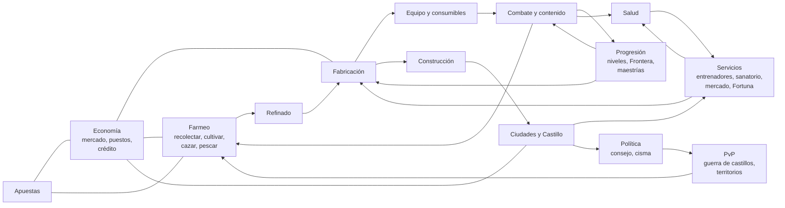

# Red de sistemas: todo depende de todo

> **Módulo** [00 · Visión](README.md) · **Se conecta con:** todos los módulos · **Estado:** propuesta

**Qué pediste.** Que todo tenga que ver una cosa con la otra, y que todo lo que se agregue tenga **una infraestructura que dependa de los farmeos, de los crafteos, de los sistemas de progresión** y del resto.

Este documento es la regla general y el mapa de cómo se cumple.

---

## 1. Las tres reglas de la red

1. **Nada sale de la nada.** Todo edificio, objeto, servicio o mejora cuesta algo que otro jugador **farmeó, cultivó, cazó o fabricó**. Los PNJ solo venden lo básico y los sumideros de oro.
2. **Nada existe suelto.** Todo sistema **consume** de otros y **produce** para otros. Si un sistema no tiene entradas ni salidas, se rediseña o se quita.
3. **Todo avance tiene un requisito de otro sistema.** Subir de rango en un oficio pide materiales de otros oficios; pacificar una región pide vencer a su Guardián y un esfuerzo de guerra de todo el servidor (ver [Mapa infinito y viaje](../02-mundo/mapa-infinito-y-viaje.md)); subir de etapa una ciudad pide que sus necesidades estén cubiertas (ver [Fundación y cisma](../02-mundo/fundacion-y-cisma.md)).

## 2. El mapa

## 3. Qué consume y qué produce cada sistema

| Sistema | Consume (entradas) | Produce (salidas) | Depende del farmeo | Depende de la fabricación | Depende de la progresión |
|---|---|---|---|---|---|
| **Combate y contenido** | Equipo, consumibles, comida, salud | Materiales de monstruo, artefactos, experiencia, heridas | Comida, pociones | Todo el equipo | Nivel, talentos, títulos de Pionero |
| **Salud** | Remedios, vendas, férulas, comida, descanso | Pacientes para médicos, demanda de oficios | Hierbas, lino, comida | Remedios, instrumental, prótesis | Rango de Medicina |
| **Construcción** | Piedra, madera, metal, telas, mecanismos, jornadas de trabajo | Casas, talleres, castillos, defensas | Todo el material base | Clavos, puertas, ornamentos, mecanismos | Rango de Construcción |
| **Ciudades** | Comida, materiales, defensa, salud, ánimo, impuestos | Servicios, entrenadores, mercados, votos | Comida semanal | Herramientas, reparaciones | Etapa de la ciudad |
| **Profesiones** | Materiales, estaciones, entrenadores, Enfoque | Objetos, servicios | Sí | Herramientas de otros oficios | Rangos, exámenes, especializaciones |
| **Economía** | Todo lo que se vende | Precios, crédito, sumideros | Mercancía | Mercancía | Acceso a puestos y licencias |
| **Cacerías** | Cebos, trampas, sedantes, equipo | Pieles de calidad, bestias vivas, trofeos, control de poblaciones | Es farmeo | Trampas, cebos | Rangos de la Orden de Cazadores |
| **Apuestas** | Oro, monturas criadas, bestias capturadas, dados y mazos fabricados | Sumidero de oro, fama de tahúr | Bestias para el Foso | Dados, mazos, casinos | Fama de tahúr |
| **Investigaciones** | Tiempo, pistas del mundo, bibliotecas | Recetas, curas, vacunas, secretos, jefes ocultos | Muestras, fragmentos | Pergaminos, bibliotecas | Rangos de detective y erudito |
| **Defensa** | Murallas, trampas, guardias equipados | Seguridad, botín de incursiones | Poblaciones de monstruos (ecología) | Todas las defensas | Rangos de construcción, nivel de los guardias |
| **PvP** | Equipo (que se pierde), consumibles | Botín, territorios, vetas exclusivas | Materiales de zonas de riesgo | Reposición de equipo | Rangos, temporadas |
| **Política** | Residentes activos, tesoro | Leyes, impuestos, cismas | La comida decide si la gente se queda | — | Etapa de la ciudad |
| **Presencia en la zona** (en el juego, D-96 provisional) | Posición y actividad de cada jugador (botones, lotes de exploración y recolección) | Quién está en cada zona y qué hace, cruces al explorar: motivos para juntarse, comerciar y agruparse (cuando existan los grupos) | Los lotes de exploración y recolección la mantienen | — | Muestra clase, nivel y el estandarte comprado (cosmético) |
| **Gremio del campamento** (en el juego, D-97) | Monedas para crearlo; exploraciones, peleas ganadas y recursos recolectados de sus miembros (las misiones, cuando existan) | Cupo de miembros del campamento, la llave del castillo | Recolectar y explorar cuentan para subirlo | — | Nivel de gremio |

## 4. Tres cadenas de ejemplo

**Una espada.** Minero (farmeo) → Fundidor (refinado) → Herrero con rango, en un taller que construyó un Constructor (fabricación + construcción) → Encantador → el Guerrero la usa contra un Guardián (combate) → gana su título de Pionero (progresión) → la espada se gasta y la repara el Herrero (economía) → se pierde en una zona negra (PvP) → vuelta a empezar.

**Una ciudad.** Agricultores y cazadores cubren la comida → la ciudad sube de etapa → se construye el ala de Oficios → llegan los entrenadores → los artesanos suben de rango → hacen mejor equipo → los guerreros pacifican la región siguiente → se abren parcelas nuevas que se subastan → llegan más residentes, que necesitan más comida.

**Una epidemia.** Un gremio abre una cripta (contenido) → brota la plaga (salud) → los médicos investigan la cura (investigaciones) con hierbas de los herboristas (farmeo) y frascos de los joyeros (fabricación) → los cazadores eliminan a los portadores (cacerías) → la cura se fabrica en cadena (profesiones) → los médicos suben de rango (progresión) → la Gaceta lo cuenta (social).

## 5. Cómo se vigila

- **Revisión de diseño:** todo sistema nuevo debe llenar su fila en la tabla del §3 antes de construirse.
- **Informe económico mensual** (ver [Economía](../07-economia/economia.md)): muestra qué materiales se usan, cuáles sobran, qué oficios no tienen demanda.
- **Alarma de sistema aislado:** si un material no lo compra nadie durante semanas, o un oficio no tiene clientes, se le busca una salida (una receta nueva, un pedido de la ciudad, una necesidad).
