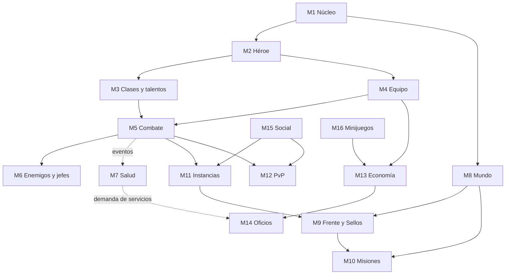

# Arquitectura modular (sin código todavía)

> **Módulo** [01 · Plataforma](README.md) · **Condiciona a:** todos los módulos · **Estado:** propuesta

Todavía no se escribe código. Este documento fija **cómo se va a partir el juego en piezas** (25 módulos) para que, cuando empiece el código, cada sistema del diseño se convierta en un módulo que se pueda construir, probar y cambiar sin romper los demás. Las carpetas de `diseno/` están ordenadas igual que estos módulos.

---

## 1. Seis reglas de arquitectura

1. **El motor no sabe que existe Telegram.** Las reglas del juego viven en un motor puro. Telegram es un **adaptador** que traduce botones a órdenes y resultados a mensajes. Mañana puede haber otro adaptador (Mini App, web, app) sin tocar una regla. Es la arquitectura hexagonal que TowerWars ya usa ("nada en el motor importa nada de los adaptadores"), y es su mejor decisión técnica.
2. **Cada módulo es dueño de sus datos.** Salud es la única que escribe heridas; Economía, la única que mueve oro. Los demás piden, no tocan.
3. **Los módulos se hablan por eventos.** Combate no llama a Salud: publica `GolpeRecibido` y Salud decide si hay herida. Así se puede construir Combate antes que Salud, y agregar Salud después sin reescribir Combate.
4. **El contenido son datos, no código.** Pisos, jefes, clases, recetas, enfermedades y misiones se describen en archivos de datos. Agregar el piso 37 no debería requerir programar.
5. **Identificadores estables, solo se agregan.** Cada habilidad, objeto, receta o jefe tiene un ID que nunca cambia ni se reutiliza. TowerWars aprendió por las malas que asignar códigos por orden de aparición rompe todo lo que viene detrás cuando se inserta algo en el medio.
6. **Todo azar es reproducible.** Cada combate usa una semilla guardada. Eso permite repetir una pelea para investigar un error, mostrar las "manchas de sangre" (las últimas rondas de una muerte) y correr el simulador de balance.

## 2. Mapa de módulos

| # | Módulo | Responsabilidad | Documento de diseño |
|---|---|---|---|
| M1 | **Núcleo** | Identidad de jugador, tiempo del juego, azar con semilla, bus de eventos, idiomas | Este documento |
| M2 | **Héroe** | Creación, raza, trasfondo, nivel, experiencia, perfil | [Creación de personaje](../03-personaje/creacion-de-personaje.md), [Progresión](../03-personaje/progresion.md) |
| M3 | **Clases y talentos** | Specs, recursos, repertorios, árboles, configuraciones | [Clases](../03-personaje/clases-y-especializaciones.md), [Talentos](../03-personaje/talentos.md) |
| M4 | **Equipo e inventario** | Objetos, ranuras, durabilidad, carga, técnicas de equipo | [Equipamiento](../03-personaje/equipamiento.md) |
| M5 | **Combate** | El motor de rondas: iniciativa, acciones, daño, estados, filas | [04 · Combate](../04-combate/README.md) |
| M6 | **Enemigos y jefes** | Repertorios, avisos, fases, postura, partes, elección de objetivo | [Jefes](../06-contenido/jefes.md) |
| M7 | **Salud** | Heridas, condiciones, enfermedades, mente, secuelas, muerte | [05 · Salud](../05-salud/README.md) |
| M8 | **Mundo** | Pisos, nodos, zonas, clima, estaciones, ecología, viaje | [02 · Mundo](../02-mundo/README.md) |
| M9 | **Frente, Sellos y Fundación** | Apertura de pisos, esfuerzo de guerra, pioneros, sellos personales, necesidades de la ciudad, gobierno, cismas, crisis | [Torre y pisos](../02-mundo/torre-y-pisos.md), [Fundación y cisma](../02-mundo/fundacion-y-cisma.md), [Crisis](../02-mundo/crisis-problemas-y-soluciones.md) |
| M10 | **Misiones** | Campañas, encargos, tablones, expediciones, cacerías, investigaciones | [Misiones y exploración](../06-contenido/misiones-y-exploracion.md), [Cacerías](../06-contenido/cacerias.md), [Investigaciones](../06-contenido/investigaciones.md) |
| M11 | **Instancias** | Mazmorras, Llaves del Piso, Profundidades, bandas, buscador de grupos | [Mazmorras y bandas](../06-contenido/mazmorras-y-bandas.md) |
| M12 | **PvP, crimen y justicia** | Zonas, karma, invasiones, arenas, campos, guerra de castillos, territorios, delitos, tribunal | [PvP](../06-contenido/pvp.md), [Crimen y justicia](../06-contenido/crimen-y-justicia.md) |
| M13 | **Economía** | Monedas, mercados, órdenes, correo, impuestos, Mercado Negro, contratos | [Economía](../07-economia/economia.md) |
| M14 | **Oficios** | Recolección, refinado, fabricación, recetas, calidad, vetas | [Profesiones](../07-economia/profesiones.md), [Fabricación](../07-economia/fabricacion.md) |
| M15 | **Social** | Gremios, alianzas, grupos, amigos, salas retransmitidas, vivienda | [08 · Social](../08-social/README.md) |
| M16 | **Minijuegos y apuestas** | Cada minijuego es un complemento que se enchufa (taberna, dados, cartas…); apuestas legales e ilegales | [Minijuegos](../08-social/minijuegos-y-formatos-telegram.md), [Apuestas](../08-social/apuestas.md) |
| M17 | **Colecciones y logros** | Bestiario, apariencias, títulos, logros, cicatrices como trofeo | [Progresión](../03-personaje/progresion.md) |
| M18 | **Temporadas y rankings** | Temporadas de M+, arena, ligas, tablas | [Progresión](../03-personaje/progresion.md) |
| M19 | **Mensajería** | Mensaje vivo, cola de ediciones, límites de envío, avisos | [Telegram](telegram.md) |
| M20 | **Administración y telemetría** | Radiografías, registro de balance, informe económico, clasificación de feedback | Este documento, §5 |
| M21 | **Simulador de balance** | Corre specs contra escenarios fijos | [Balance](../03-personaje/balance.md) |
| M22 | **Pagos** | Telegram Stars, aislado del resto | [Monetización](../07-economia/monetizacion.md) |
| M23 | **Anti-trampas** | Multicuentas, bots, comercio sospechoso | [Seguridad](seguridad-y-anti-trampas.md) |
| M24 | **Construcción** | Parcelas, planos, obras por jornadas, casas, edificios de organizaciones, defensa | [09 · Construcción](../09-construccion/README.md) |
| M25 | **Propiedad** | Puestos, locales, licencias, subastas, tasas, crédito | [Propiedad y concesiones](../07-economia/propiedad-y-concesiones.md) |

**Adaptadores:** bot de Telegram · Mini App · API pública de solo lectura (para herramientas de la comunidad, como la que tuvo Chat Wars) · panel de administración.

## 3. Quién depende de quién



Las flechas punteadas son relaciones **por eventos**: el módulo de la izquierda no sabe que el de la derecha existe.

## 4. Eventos principales

| Evento | Lo publica | Lo escuchan |
|---|---|---|
| `GolpeRecibido` (zona, tipo de daño, crítico) | Combate | Salud (¿hay herida?), Equipo (durabilidad), Mente (estrés) |
| `HeroeDerribado` / `HeroeCaido` | Combate | Salud (herida garantizada), Mundo (mancha), PvP (karma), Gaceta |
| `HeridaCreada` / `HeridaTratada` | Salud | Mensajería, Oficios (experiencia de Medicina) |
| `EnfermedadContagiada` | Salud | Mundo (mapa de epidemia), Gaceta |
| `ParteRota` | Combate | Enemigos (quita movimiento), Economía (material exclusivo) |
| `JefeDerrotado` | Enemigos | Frente (Pionero, Sello), Colecciones, Gaceta |
| `PisoAbierto` | Frente | Mundo, Mensajería (aviso escalonado), Economía (mercado nuevo) |
| `ObjetoFabricado` | Oficios | Economía, Colecciones (firma del artesano) |
| `OrdenEjecutada` | Economía | Telemetría (informe económico), Anti-trampas |
| `ObjetoDestruido` | Equipo | Telemetría (sumideros) |

## 5. Herramientas de administración desde el día uno

TowerWars aprendió que "un diagnóstico de segunda mano no es un hecho": varias discusiones se cerraron recién cuando existió una herramienta para **mirar** qué hacía el motor. Aquí se construyen desde el principio:

- **Radiografía de héroe**: de dónde sale cada número de su poder, heridas activas, historial.
- **Radiografía de combate**: repetir una pelea con su semilla y ver cada tirada.
- **Registro de balance**: cada número que se mueve, con su antes → después y la medición que lo justifica.
- **Informe económico**: oro que entra y sale por fuente y sumidero, precios por ciudad, objetos destruidos.
- **Cola de feedback clasificada** por tema, sistema y gravedad.

## 6. Cómo se vería el repositorio cuando empiece el código (propuesta)

```
motor/          reglas puras, un subpaquete por módulo (M1-M23)
contenido/      datos: pisos, jefes, clases, recetas, enfermedades, misiones
adaptadores/    telegram/, miniapp/, api/, admin/
simulador/      balance
pruebas/        por módulo, sin Telegram
diseno/         este documento
```

No se crea nada de esto hasta que se decida empezar a programar (ver [Hoja de ruta](../00-vision/hoja-de-ruta.md)).

## 7. Decisiones técnicas abiertas

- **Base de datos.** Un MMORPG con muchas escrituras simultáneas (combates en paralelo, mercado) necesita una base que las aguante; PostgreSQL es la opción natural. TowerWars usa SQLite, y agregarle una columna tocaba seis lugares del código: aquí conviene usar migraciones desde el día uno.
- **Lenguaje y librería.** Python con aiogram permitiría reutilizar lo que ya se sabe de TowerWars (sin copiar su código).
- **Colas y temporizadores.** Los temporizadores perezosos alcanzan al principio; con miles de jugadores hará falta una cola de trabajos.

Ver preguntas P-46 y P-47 en [Preguntas abiertas](../00-vision/preguntas-abiertas.md).
