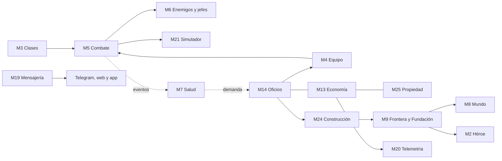

# Mapa de impacto: qué se mueve cuando cambias algo

> **Módulo** [01 · Plataforma](README.md) · **Depende de:** [Arquitectura modular](arquitectura-modular.md), [Convenciones de código](convenciones-de-codigo.md), [Red de sistemas](../00-vision/red-de-sistemas.md) · **Se conecta con:** todos los módulos, [Web y multiplataforma](web-y-multiplataforma.md) · **Estado:** propuesta; el mapa en sí lo pide D-42 (confirmada)

**Qué pediste.** Que cuando le pidas a la IA que crea el juego cambiar una sola cosa, la IA entienda todo lo que pasa alrededor y pueda decirte: "ok, pero esto también va a romper esto, esto y esto, o puede afectar esto y esto". Es la decisión D-42 (ver [Decisiones](../00-vision/decisiones.md)).

Este documento es **el mapa que se consulta antes de cambiar algo**: una regla, un número, un módulo, un texto o una pantalla. Las notas `[ES]` del código apuntan aquí (ver [Convenciones de código](convenciones-de-codigo.md)), y este mapa apunta a los documentos de diseño. El código ya está autorizado (D-59, que reemplaza a D-04): los ejemplos de código de este mapa son ilustrativos, y el mapa se actualiza en el mismo cambio que el código (§1.5).

**De dónde sale.**
- **Lecciones de TowerWars** (ver [Lecciones de TowerWars](../99-referencias/lecciones-de-towerwars.md)): "la ropa no contaba" (la guerra calculaba el poder por su lado y el equipo no sumaba), "si un número de balance se movió y no está en el registro, se movió a ciegas" y "la documentación vieja miente".
- **Análisis de impacto** de la ingeniería de software: antes de tocar una pieza se lista quién la usa, qué datos comparte y qué pruebas hay que repetir.
- La [Red de sistemas](../00-vision/red-de-sistemas.md) de este diseño: si todo depende de todo (D-20), hace falta un mapa de esas dependencias.

---

## 1. Cómo leerlo y cuándo se actualiza

### 1.1 Los cuatro pasos antes de cambiar algo

1. **Busca el módulo dueño** de lo que vas a cambiar en las fichas (§2). Cada dato tiene un solo dueño (regla 2 de la [arquitectura](arquitectura-modular.md)).
2. **Lee su "Si cambias esto, revisa"** y sigue las flechas hacia los otros módulos. Las referencias `C-xx` llevan a las cascadas típicas (§3).
3. **Mira si el cambio mueve un número sensible** (§4) o una regla que está escrita en varios documentos (§4.7).
4. **Mira si toca a los clientes** (§5): Telegram, web y app.

Con eso se arma el **mensaje de impacto** (plantilla en [Convenciones de código](convenciones-de-codigo.md) §6.3) **antes** de editar. Las Convenciones también fijan los cinco caminos por los que se propaga un cambio (importaciones, eventos, datos compartidos, números de balance y contrato con los clientes) y los niveles de riesgo. Este mapa da el contenido de esos cinco caminos para cada módulo.

### 1.2 Ejemplo de respuesta de impacto

El dueño dice: "las heridas graves duran muy poco, que duren más".

```
Cambio: las heridas graves pasan de 1-3 días a 2-4 días.
Dónde: datos de curación de heridas · M7 Salud · diseño: 05-salud/heridas.md §3
Esto también afecta a:
  1. Combate (M5): más rondas jugadas con penalización de herida.
  2. Construcción (M24): el dormitorio (x2) y la enfermería (x3) valen más.
  3. Oficios (M14): más demanda de médicos; más experiencia de Medicina.
  4. Economía (M13): más uso del sanatorio (sumidero) y consultas más caras.
  5. Instancias (M11): menos gente lista para mazmorras y bandas.
  6. PvP y apuestas (M12, M16): más luchadores "no aptos" en el Foso.
Reglas que toca: ninguna, si el tiempo fuera de línea sigue curando.
Números de balance: herida grave 1-3 días -> 2-4 días.
Pruebas: las de M7 y el cálculo de "sana en..." que ve el jugador.
Voy a actualizar: heridas.md §3, este mapa (C-02 y §4.2), registro de balance.
Riesgo: medio · ¿Sigo?
```

### 1.3 Tres palabras con significado fijo

| Palabra | Significa | Qué se hace |
|---|---|---|
| **Rompe** | El cambio contradice una regla que nunca se rompe o una decisión confirmada del dueño (D-xx), o deja datos o pantallas sin funcionar | No se hace sin el sí explícito del dueño |
| **Afecta** | Cambia resultados en otro módulo, aunque nada falle | Se avisa y se revisa ese módulo |
| **Medir** | Mueve un número de balance o de economía | Simulador (M21) o informe económico (M20) antes y después, y entrada en el registro de balance |

Las **propuestas** (P-xx) todavía no son ley: cambiar algo que una propuesta recomienda no "rompe", pero se avisa ("va contra la recomendación de P-xx").

### 1.4 Cómo leer una ficha

Cada ficha usa los mismos campos que el encabezado `[ES]` de los archivos de código (ver [Convenciones de código](convenciones-de-codigo.md) §2), para que el código y este mapa se puedan comparar campo por campo:

| Campo | Qué dice |
|---|---|
| **Para qué sirve** | La responsabilidad del módulo en una frase |
| **Documentos de diseño** | Dónde están sus reglas |
| **Depende de** | Lo que necesita de otros módulos. Si cambia algo allá, este módulo se puede romper |
| **Lo usan** | Quiénes lo necesitan. Si cambias este módulo, revisa a todos ellos |
| **Eventos que publica / escucha** | Las conexiones invisibles: quien publica no sabe quién escucha |
| **Datos de los que es dueño** | Lo que solo este módulo escribe. Los demás piden |
| **Reglas que nunca se rompen** | Reglas fijas del diseño o decisiones del dueño. Cambiarlas no es un ajuste: es una decisión nueva |
| **Si cambias esto, revisa** | Cascadas concretas, con el módulo afectado entre paréntesis |

**Sobre los eventos:**
- Sin marca: están en la tabla de [Arquitectura](arquitectura-modular.md) §4. Se escriben con el nombre del diseño y, entre paréntesis, el nombre en código del diccionario de [Convenciones](convenciones-de-codigo.md) §7.2: `GolpeRecibido` (`HitReceived`).
- **Propuestos:** no existen todavía. Muestran una dependencia real del diseño y se confirman en Arquitectura antes de programarlos. Su nombre en inglés se elige al agregarlos al diccionario.

**Sobre el paquete de código:** el título de cada ficha lleva el paquete propuesto en [Convenciones](convenciones-de-codigo.md) §7.1, por ejemplo `engine/health`.

### 1.5 Cuándo se actualiza

Este mapa se actualiza **en el mismo cambio** que lo vuelve viejo, nunca después:

1. Se agrega, se quita o cambia un módulo, un evento o un dato con dueño en la [arquitectura](arquitectura-modular.md).
2. Un documento de diseño agrega una dependencia nueva (un "Depende de" o "Se conecta con" nuevo en su línea de módulo).
3. Se mueve un número sensible (§4), junto con su entrada en el registro de balance.
4. Se confirma o se descarta una decisión (D-xx) o una pregunta (P-xx) que cambia una regla.
5. Con el código (D-59): en el mismo cambio que toca el código. La herramienta de grafo de dependencias de las [Convenciones](convenciones-de-codigo.md) §8 comparará el grafo real con este mapa y avisará de las diferencias.

**Quién lo actualiza:** quien hace el cambio, persona o IA.

**Si este mapa y otro documento no coinciden:** manda el documento del módulo, que es más específico, y se corrige el mapa. Por encima de los dos mandan las decisiones confirmadas del dueño. Si un documento todavía no recoge una decisión confirmada, este mapa sigue la decisión y lo anota en §6.2.

**Estado al 1 de octubre de 2026.** El diseño se está revisando en paralelo para aplicar las decisiones D-44 a D-59. Donde un documento todavía dice otra cosa, aquí se sigue la decisión y la diferencia queda anotada en §6.2. Tres decisiones cambian reglas que este mapa daba por fijas:

- **D-58: ya no hay Torre ni pisos.** El mundo es un mapa sin borde y moverse entre lugares toma tiempo real. Vocabulario (propuesta de [Mapa infinito y viaje](../02-mundo/mapa-infinito-y-viaje.md)): piso → zona y región; Frente → Frontera; Techo del Piso → Techo de la Frontera. Siguen el Guardián (ahora de la región), el Eco, los Pioneros y el Viento de Cola. Se retiran el Sello del Piso y, como propuesta, la piedra de paso; las menciones que quedan al Sello (sus pruebas, `SelloObtenido`) son conexiones que se caen con él. Ya están ajustadas las fichas M2, M8, M9, M11 y M22 y las cascadas C-05, C-08 y C-15. El evento `PisoAbierto` pasa a `RegionAbierta` (`RegionOpened`), las Llaves del Piso pasan a Llaves de Mazmorra y M9 se llama Frontera y Fundación, sin cambiar de número (ver la [arquitectura](arquitectura-modular.md)).
- **D-57: no hay límite de oficios.** El freno es el costo natural del conocimiento: tiempo, materiales, preparación y los costos de cada oficio. Ya están ajustadas la ficha M14 y la cascada C-12.
- **D-59: el código ya está autorizado** (reemplaza a D-04). Este mapa y las [Convenciones](convenciones-de-codigo.md) valen desde la primera línea.

Las demás decisiones nuevas suman sistemas sin cambiar las reglas de este mapa: roles por spec y juego en solitario (D-50), secuelas definitivas y cómo reponerlas (D-51, D-53), botín amplio (D-52), escalera de conocimiento (D-54), elixires propios (D-55) y aprender con pistas (D-56). Su dueño propuesto está en §6.1.

### 1.6 Cómo se ve en el código

Un archivo de datos de balance con su nota `[ES]` debajo, que remite a este mapa (formato de [Convenciones](convenciones-de-codigo.md) §4):

```yaml
# Wound healing windows in real hours, before rest multipliers.
# Schema: content/schemas/wound_healing.schema.yaml
#
# [ES]
# Para qué sirve: cuánto tarda en sanar sola cada herida según su gravedad.
# Documento de diseño: diseno/05-salud/heridas.md §3
# Lo leen: engine/health/wounds.py (M7). Cambia el valor de los tratamientos (M14)
#          y del descanso en casa y enfermería (M24).
# Si cambias esto, revisa: diseno/01-plataforma/mapa-de-impacto.md · C-02 y §4.2.
#          Todo cambio va al registro de balance.

minor:    {min_hours: 1,  max_hours: 6}
moderate: {min_hours: 6,  max_hours: 24}
severe:   {min_hours: 24, max_hours: 72}
critical: {min_hours: 72, max_hours: 168}
```

---

## 2. Fichas por módulo

### 2.1 Reglas que valen para todos los módulos

Si un cambio en cualquier módulo choca con una de estas, **rompe**:

| Regla | De dónde sale |
|---|---|
| El motor no sabe desde qué cliente juega cada uno; ningún cliente da ventaja | D-40, D-41, regla 1 de la [arquitectura](arquitectura-modular.md) |
| Cada dato tiene un solo dueño; los demás piden, no tocan | Regla 2 |
| Los módulos se hablan por eventos | Regla 3 |
| El contenido son datos, no código | Regla 4 |
| Identificadores estables: solo se agregan, nunca se renombran ni se reutilizan | Regla 5 |
| Todo azar usa una semilla guardada | Regla 6 |
| El motor devuelve vistas, no mensajes: estado, avisos y acciones con su ID, con los textos ya traducidos; cada cliente las dibuja | Regla 7 |
| Todo en texto y por turnos | D-05 |
| Amplio pero ligero: cada sistema tiene una capa simple por defecto y una profunda opcional | D-44 |
| Combate de 6 botones como máximo y una sola elección por ronda | D-46 |
| Sin pisos: el mapa no tiene borde y moverse entre lugares toma tiempo real | D-58 |
| Sin límites duros de oficios: el freno es el costo natural del conocimiento | D-57 |
| Clases igualadas: la diferencia la hacen los oficios y el conocimiento | D-49 |
| Sumideros siempre en porcentaje | D-27 |
| El dinero real compra solo cosméticos y aceleradores; nadie paga para apostar | D-43 |
| Todo sistema consume de otros y produce para otros | D-20, D-38, [Red de sistemas](../00-vision/red-de-sistemas.md) |
| Código en inglés con notas `[ES]`; diseño y código se actualizan juntos | D-42 |

### 2.2 Mapa rápido: qué tan peligroso es tocar cada módulo

| # | Módulo | Radio de impacto | Lo más delicado de tocar |
|---|---|---|---|
| M1 | Núcleo | Muy alto: lo usan todos | Semilla del azar, reinicios diarios y semanales, forma de los eventos, IDs, cuentas |
| M2 | Héroe | Alto | Nivel 10 (protecciones de novato), Techo de la Frontera, rasgos de linaje, experiencia por ⚡ de cada camino (`hero.xp_level_scale`, `gather.xp_per_step`, `explore.xp_*`: D-108 pide que todos lleguen al 100 a un ritmo parecido) |
| M3 | Clases y talentos | Alto | Presupuesto de poder, IDs de habilidades, utilidades clave, la barra de 6 |
| M4 | Equipo e inventario | Muy alto | Poder de Objeto (una sola fuente de verdad), durabilidad, zona que protege cada ranura, mochilas |
| M5 | Combate | Muy alto | Mitigación, datos de `GolpeRecibido`, temporizador, tope de PvP, la forma de jugar sola (`engine/combat/auto.py`, `auto_fight.policy`, D-114: la usan a la vez las peleas automáticas de todos los jugadores y el simulador) |
| M6 | Enemigos y jefes | Medio | Avisos (de su texto dependen las Tácticas y el Bestiario), botín, contagio de monstruos |
| M7 | Salud | Alto | Duraciones, contagio, qué cura la magia, protección de novato |
| M8 | Mundo | Alto | Terreno de cada zona (D-186: tablero de piezas de Tetris, `engine/world/mapgen.py` → `terrain_at` y `block_tilings`, `balance.yaml` → `terrain` y `content/biomes.yaml` → `terrain`; cambiarlo mueve los enemigos y el peligro de zonas ya visitadas, no los recursos de tierra, que siguen `classic_biome`, D-185), color de zona (D-179: por terreno, `content/biomes.yaml` → `color`; la leyenda del mapa se arma sola), cuántas entradas de mazmorra hay por tramo (`dungeons.second_chance` y `third_chance`, D-181: subirlas solo agrega), tiempo de viaje (D-58), ecología, clima, cuántas casillas de alrededor se exploran sin moverse (`explore.around_radius`, D-107: también cuenta para las vecinas conocidas al fundar). En el juego (D-172): el 🔭 reconocimiento de lejos y el 🥷 sigilo del Explorador (`recon.*`, `explorer.stealth_max`, C-27). En el juego (D-183, D-184): el catálogo de cada terreno (`content/biomes.yaml` → `own`, `resources.terrain`) y los nodos de recursos (`nodes.*`: moverlos mueve los nodos de todos, C-28) |
| M9 | Frontera y Fundación | Alto | Etapas del Claro (se guardan por posición), costo de crecer de los campamentos, territorio, despensa (`pantry.*`) e incursiones ("oleadas" para el jugador, desde la fundación, D-105) y Noche de prueba (`raids.*`, D-99), mejoras de los campamentos y el castillo que pide 15 (`content/camp_upgrades.yaml`, `upgrades.*`, D-101), y la 🛡️ Defensa que frena las oleadas (`raids.defense_weaken_per_point`, `raids.defense_floor`, `raids.night`). Propuesta: ritmo de la Frontera, medidores de la ciudad |
| M10 | Misiones | Medio | Oro que pagan (inflación), rendimiento de expediciones, investigación. En el juego: 🏹 Cazar en la zona y la 🏹 Partida de caza del campamento (`hunt.*`, D-106); la historia y el rol (D-117): experiencia por ⚡ de misiones y encargos (`story.xp_per_energy`, `story.task_xp_per_energy`, C-22), rangos de facción (`story.ranks`) y los IDs de `content/story.yaml` (misiones, pasos, decisiones y opciones guardados en cada héroe) |
| M11 | Instancias | Medio | Carriles de recompensa, reloj de rondas. En el juego: las mazmorras para uno (D-164, D-170): dónde están las entradas (`dungeons.stretch`, `second_chance`, `deep_share`: moverlos mueve las entradas), qué tan duro es cada piso (`dungeons.deep.*`), el cofre y la bolsa (`dungeons.small.chest`, `deep.pot`) y las familias de `content/dungeons.yaml` (C-26) |
| M12 | PvP, crimen y justicia | Alto | Reglas de caída por zona, protección del Juramento de Hierro, karma |
| M13 | Economía | Muy alto | Impuestos, bandas de precio, monedas no transferibles |
| M14 | Oficios | Alto | Costo del conocimiento (D-57), vetas, rangos y exámenes. En el juego (fase 2, D-115): los beneficios de campamento (🎣 🍲 🗿 🏗️, el mejor rango entre los miembros) y lo que piden las obras y la reparación (`camp_professions.*`, C-24); las 🎓 especializaciones (D-141: `Hero.prof_specs`, `Hero.spec_xp`, `balance.yaml` specs, C-25) |
| M15 | Social | Medio | Cupo por nivel de gremio y requisito del castillo (en el juego, D-97); quién cuenta como presente en una zona (en el juego, D-96); bono, meta y premio de la partida de caza del campamento (en el juego, D-106: `hunt.party.*`); tamaño de grupo, vales por reenvío |
| M16 | Minijuegos y apuestas | Bajo en técnica, muy alto en reglas del dueño | D-43, tirada pública auditable, topes diarios |
| M17 | Colecciones y logros | Bajo, salvo que dé poder | Regla de las 3 vistas, nunca poder |
| M18 | Temporadas y rankings | Medio | Duración de la temporada (la usan M7, M9, M10, M25) |
| M19 | Mensajería | Alto para los clientes | Vistas (D-189: `View.layout` dice cuántos botones van por fila; las pantallas de cantidad usan `[n, 1]` y `adapters/telegram/render.py` lo respeta, hasta 8 por fila), avisos, límites de Telegram, el menú fijo (6 botones desde D-117, con 📖 Historia: ya está en el tope de D-46) y "un aviso por lote" (D-87, también con peleas automáticas y con los pasos de misión cumplidos) |
| M20 | Administración y telemetría | Bajo en el juego, alto en el proceso | Registro de balance, informe económico |
| M21 | Simulador de balance | Bajo en el juego, alto en el proceso | Escenarios y objetivos |
| M22 | Pagos | Bajo en técnica, muy alto en reglas del dueño | D-43, aceleradores |
| M23 | Anti-trampas | Medio | Umbrales, revisión humana |
| M24 | Construcción | Medio | En el juego: costos y puntos de 🛡️ Defensa de las mejoras de los campamentos (`content/camp_upgrades.yaml`, D-101; desde el nivel 7 piden 🧱 sillar y 🟫 tablón, D-115) y las defensas que dañan las oleadas y se reparan (`camp_professions.damage`, `repair_per_point`, C-24). Propuesta: jornadas por obra, protecciones, mantenimiento |
| M25 | Propiedad | Medio | Cupos, tasa autodeclarada, intereses, impuesto de la casa |

**Las cinco autopistas del impacto.** Casi toda cascada viaja por uno de estos caminos:



1. **Poder:** M3 y M4 → M5 → M6, M11, M12 y M21. Todo número de combate termina en el simulador.
2. **Cuerpo:** M5 → M7 → M14 → M13. Cada golpe es, al final, trabajo para un médico y oro que se quema en el sanatorio.
3. **Oro:** M13 con M14, M16, M24 y M25. Toda fuente de oro necesita su sumidero.
4. **Frontera y ciudad:** M9 → M8, M2, M14, M24 y M25. Pacificar una región o subir de etapa una ciudad enciende servicios, lugares y rangos.
5. **Pantalla:** todos → M19 → los tres clientes. Lo que se ve es un contrato (§5).

### 2.3 Las 25 fichas

---

#### M1 · Núcleo · `engine/core`

| | |
|---|---|
| **Para qué sirve** | La base que todos usan: la cuenta del jugador, el reloj del juego, el azar con semilla, el bus de eventos y los idiomas |
| **Documentos de diseño** | [Arquitectura modular](arquitectura-modular.md), [Web y multiplataforma](web-y-multiplataforma.md) (una cuenta para los tres clientes), [Mundo vivo](../02-mundo/mundo-vivo-y-viaje.md) §2 (duración del día) |
| **Depende de** | Nada. Es el único módulo sin dependencias |
| **Lo usan** | Todos |
| **Eventos que publica** | Propuestos: `NuevoDiaDeJuego`, `NuevaSemana` (reinicios), `CuentaVinculada` (una cuenta de Telegram que se une a la web o a la app) |
| **Eventos que escucha** | Ninguno: transporta los de los demás |
| **Datos de los que es dueño** | Cuentas con sus identidades vinculadas (Telegram, correo y otras) y el idioma de la cuenta; reloj del juego (horas en UTC); semillas de azar y sus huellas publicadas (tirada pública auditable); el bus y el registro de eventos; los archivos de idiomas (ES y EN); la lista de IDs usados y retirados |
| **Reglas que nunca se rompen** | El motor no sabe que existen Telegram, la web ni la app. Todo azar usa una semilla guardada. Un ID nunca cambia ni se reutiliza. Los temporizadores se calculan de forma perezosa: si el servidor se reinicia, nada se pierde. Ningún texto visible se escribe en el código del motor: vive en los archivos de idiomas, y el motor entrega las vistas ya traducidas (regla 7) |

**Si cambias esto, revisa:**
- **El generador de azar o cómo se guarda la semilla** → la radiografía de combate deja de repetir peleas viejas (M20); las manchas de sangre dejan de mostrar las últimas 3 rondas reales (M8, M7); el simulador pierde la comparación con mediciones anteriores (M21); las tiradas con semilla publicada dejan de poder verificarse (M16).
- **La duración del día de juego** (6 horas reales) → ver C-19.
- **La hora o el día de los reinicios** → todo lo diario y semanal: Enfoque (M14), topes del Foso y de recompensas (M12, M16, M23), Tesoro Semanal y bloqueos de mazmorras y bandas (M11), conocimiento semanal de oficios (M14), cuotas y barras semanales de la ciudad (M9), tasas y mantenimiento semanales (M25, M24), estaciones (M8).
- **La forma de un evento o del bus** → todos los que lo escuchan (columna "Eventos que escucha" de cada ficha). Un evento se amplía agregando campos con valor por defecto; nunca se le quita ni se le cambia el significado a uno.
- **Cómo se vincula una cuenta** → la entrada en los tres clientes, la detección de multicuentas y cuentas vinculadas (M23), las Gemas de la cuenta (M22), las colecciones y la reputación de cuenta (M17, M2).
- **Agregar un idioma o cambiar una clave de texto** → todos los textos de contenido (zonas, avisos de jefes, casos, misiones), las plantillas de notas en el suelo (M6), los mensajes de M19 y los tres clientes. Una clave borrada deja un hueco en pantalla.

---

#### M2 · Héroe · `engine/hero`

| | |
|---|---|
| **Para qué sirve** | Quién es cada personaje y cuánto creció: linaje, trasfondo, apariencia, nivel, experiencia y perfil |
| **Documentos de diseño** | [Creación de personaje](../03-personaje/creacion-de-personaje.md), [Progresión](../03-personaje/progresion.md) |
| **Depende de** | M1; M9 (el Techo de la Frontera depende de hasta dónde llegó la Frontera) |
| **Lo usan** | M3 (clase al nivel 10, puntos de talento por nivel), M4 (la capacidad de carga sale del linaje y el aguante), M7 (rasgo de cuerpo del linaje, nivel 10 de la protección de novato, Resolución), M10 (misiones de trasfondo), M12 y M16 (novatos fuera del PvP y del Circuito), M13 (rasgos de linaje con PNJ), M14 (rasgo de oficio, empujón del trasfondo), M15 (gremio desde el nivel 5, mentoría hasta el 20), M22 (aceleradores de experiencia), M23 (nivel mínimo para transferir) |
| **Eventos que publica** | Propuestos: `HeroeCreado`, `NivelSubido` |
| **Eventos que escucha** | `JefeDerrotado` (`BossDefeated`), `ObjetoFabricado` (`ItemCrafted`), `HeridaTratada` (`WoundTreated`) para dar experiencia. Propuestos: `CombateTerminado`, `MisionCompletada`, `InstanciaCompletada` (`SelloObtenido` se retira con D-58) |
| **Datos de los que es dueño** | Ficha del héroe (linaje, trasfondo, apariencia, nombre único), nivel, experiencia, experiencia descansada, Renombre, Resolución. Propuesta (§6.1): reputaciones y maestrías de armas y armaduras |
| **Reglas que nunca se rompen** | Ninguna racial toca daño, curación ni control en combate, y todos los linajes tienen el mismo presupuesto. No hay puntos de estadística sueltos: los puntos por nivel van a los talentos. Nada depende de la fecha en que llegaste. El Renombre nunca da daño. Cualquier linaje puede ser cualquier clase |

**Si cambias esto, revisa:**
- **Un rasgo de linaje** → la tabla de linajes de [Peligros del entorno](../05-salud/peligros-del-entorno.md) §9 y del [Bestiario](../06-contenido/bestiario.md) §5.1 (quién resiste qué contagio), las reglas de cuerpo de Salud (M7) y el oficio que mejora (M14). Si se acerca al combate, **rompe** la regla 10 de [Balance](../03-personaje/balance.md) y D-49, y hay que medir (M21). El rasgo del Goblin con PNJ nunca puede tocar el mercado entre jugadores (M13).
- **La curva de experiencia** → el ritmo de nivel frente a la Frontera (M9), cuándo llegan los árboles de héroe (nivel 50) y Ápice (90) (M3), el valor de los aceleradores (M22), del Viento de Cola (+25 %) y de la experiencia descansada.
- **El Techo de la Frontera** → C-08.
- **El nivel de la clase (10) o de la protección de novato (10)** → el tutorial del Claro (M9), heridas, enfermedades y peligros de novato (M7), PvP, robos y Circuito (M12, M16), transferencias (M23), el kit sin clase (M3). Esa regla está escrita en siete documentos (§4.7).
- **La experiencia descansada** → el valor de dormir en posada o en casa (M24) y el de los jugadores que entran poco. Nunca se suma con un acelerador del mismo tipo (M22).
- **El Renombre** → bonos de carga (M4), banco (M13), viaje (M8) y Enfoque (M14). Si da daño, **rompe** su regla.
- **Las monedas (ya en código, D-80)** → `Hero.gold` guarda **todas** las monedas contadas en bronce (100 🥉 = 1 🥈, 100 🥈 = 1 🥇); cambiar `currency.rate` cambia cómo se ve el dinero de todos, pero no cuánto tiene cada uno. Todos los precios del contenido (`items.yaml`, posada, reinicio de especialización, botín de oro de `enemies.yaml`) están en bronce. Las bolsas (`Hero.bags`) se cosen con `currency.bag_recipe` y `bag_coins`: subirlos encarece la doble especialización y los cofres. Los 🪎 cofres (`Hero.chests`, D-92 provisional) se arman en el Claro con `currency.chest_recipe` (10 bolsas, madera y metal) y pagan el crecimiento de los campamentos desde el nivel 6 (M9: `camps.chests_from_level`, `chests_per_level`); cambiar la receta mueve a la vez la doble especialización, los campamentos grandes y cuánta fibra, metal y plata salen del juego (M13). El 💵 billete no entra (P-73). Las gemas (`Hero.gems`) solo compran lo de `currency.gem_shop` y nunca poder (D-43). La ficha del héroe muestra todas las monedas, también en 0 (`_coins_line`, `currency.icons`). Pruebas: `tests/test_currency.py`, `tests/test_backpack.py`.
- **Las ⚙️ Opciones (ya en código, D-114: `Hero.options`)** → solo se guarda lo que el jugador cambia; lo que falta sale de `auto_fight.defaults` (✋ Manual, 50 %, pociones sí), así los héroes de antes cargan sin tocar nada. Cambiar un valor por defecto cambia a la vez lo que pasa en los lotes de **todos** los que nunca tocaron la opción (M5, M8, M10). Las claves (`fights`, `retreat`, `potions`) están guardadas en los héroes: nunca se renombran (C-18). Pruebas: `tests/test_options.py`.
- **El equipo (ya en código, D-77: `engine/hero/gear.py`)** → los bonos entran por el kit a `hero_stats`, así que mueven la vida, el ataque y la defensa de **todas** las clases en combate (M5) y el balance medido (M21). Cambiar `gear.drop_chance` o los precios de `items.yaml` mueve el oro que entra al juego (M13). Los IDs de las piezas (`espada_1`…) están guardados en los héroes: nunca se renombran (C-18). Desde D-110 hay piezas cada 10 niveles hasta el 100 (14 niveles de pieza) y el equipo de artesano es lo mejor de cada nivel en arma, pecho y joya (D-113): mover los `stats` de una franja mueve el poder de todas las clases a esos niveles y obliga a medir otra vez con `tools/balance_report.py` (C-21). `gear.high_level_drop` (10 % desde el nivel 10) y la regla de `roll_gear` (si la ventana cae entre dos niveles de pieza, el más cercano por debajo) deciden cuánto equipo entra y si las franjas altas sueltan algo. Pruebas: `tests/test_gear.py`, `tests/test_balance_d110.py`.
- **Los ✨ encantamientos y la ⬆️ pieza mejor (ya en código, fase 2 de D-115)** → `Hero.gear_enchants` (id de la pieza → `{"id": filo | vigor | guarda, "value"}`, vacío para los héroes de antes) entra en `gear_bonus` por `real_stats`, así que mueve la vida, el ataque y la defensa en combate de quien encanta (M5, M21; con las 7 ranuras al rango 100, +6 % de ataque, +9 % de vida y +4 de defensa, sin pasar `gear.armor_cap`: C-21). Los ids de encantamiento (`balance.yaml` → `enchanting.enchants`) quedan guardados en los héroes: nunca se renombran (C-18; uno desconocido se ignora). `gear.score` (ataque + vida + 2 × defensa) decide qué pieza es "⬆️ mejor" (`is_better`: nivel, tipo y puntaje): cambiarlo cambia el aviso al recibir una pieza (botín, cofre, Guardián, fabricar) y la marca ⬆️ de 🔁 Equipar, nunca lo que se pone solo. Pruebas: `tests/test_oficios_equipo.py`.

---

#### M3 · Clases y talentos · `engine/classes`

| | |
|---|---|
| **Para qué sirve** | Qué sabe hacer cada clase y spec: recursos, habilidades, árboles de talentos, configuraciones y aportes de grupo |
| **Documentos de diseño** | [Clases y especializaciones](../03-personaje/clases-y-especializaciones.md), [Talentos](../03-personaje/talentos.md), [Balance](../03-personaje/balance.md), [Mecánicas avanzadas](../04-combate/mecanicas-avanzadas.md) §10 (un Límite por spec) |
| **Depende de** | M1; M2 (nivel y puntos de talento) |
| **Lo usan** | M5 (habilidades y recursos que van a la barra), M11 (rol en el buscador), M12 (ajuste PvP por spec, plantillas de la arena clasificada), M21 (el simulador corre cada spec), M11 (una Prueba de Maestría por spec), M7 (Corrupción del Sacerdote Sombra y el Devorador; Remiendo del Nigromante; el Bardo baja el estrés), M14 (consumibles que copian las utilidades clave) |
| **Eventos que publica** | Propuesto: `ConfiguracionCambiada` (spec, talentos o barra) |
| **Eventos que escucha** | Propuesto: `NivelSubido` |
| **Datos de los que es dueño** | Las 15 clases y 46 specs, recursos de clase, repertorios, árboles de talentos, configuraciones guardadas (hasta 5 por spec), presupuesto de poder por spec, aportes de grupo, Límites, IDs de habilidades |
| **Reglas que nunca se rompen** | Clases igualadas: ninguna es más fuerte que otra (D-49). La spec es la unidad de balance: 100 ± 3 puntos en 6 ejes, ninguno por encima de 35 ni por debajo de 5. Kit mínimo garantizado y autonomía en solitario. Aportes de grupo de valor parecido (~3 %) que no se suman. Clamor, resurrección en combate y disipar en 4 clases o más, más un consumible fabricado. Ninguna secundaria vale más de 1,3 veces otra. En combate, 6 botones como máximo: Atacar, 3 habilidades, Huir y Mochila (D-46). Cambiar talentos y spec es gratis en un asentamiento |

**Si cambias esto, revisa:**
- **Una habilidad** (daño, costo, enfriamiento) → el presupuesto de su spec y los objetivos del simulador (M21); el ajuste PvP y el tope del 40 % (M12, M5); la Prueba de Maestría de esa spec; las Tácticas guardadas que la usan (M5) y los Ecos que pelean con ellas (M6, M12); su texto en ES y EN.
- **Quitar o renombrar una habilidad** → **rompe** configuraciones guardadas, Tácticas, registros de combate y radiografías (M20) y botones ya enviados en Telegram. Nunca se borra: se marca retirada y la nueva lleva otro ID (C-18). Cambiar **solo el nombre visible** (`ability.<id>.name` o `class.<id>.attack_name` en `content/locales/`) no rompe nada guardado, porque todo usa el ID: cambia lo que el jugador reconoce, los documentos que lo nombran y las notas del parche. El nombre nuevo no copia uno de WoW (D-135) ni repite otro del juego (tabla de cambios en [Clases](../03-personaje/clases-y-especializaciones.md) §8).
- **Un recurso de clase** (por ejemplo, la Energía que sube 25 por ronda) → todas las specs de esa clase, sus rotaciones y el simulador.
- **Clamor, resurrección en combate o disipar** → los consumibles equivalentes (Tambores de Guerra, Sales de Reanimación, Desfibrilador: M14), su precio (M13) y la regla de "4 clases + consumible".
- **Un aporte de grupo o un apoyo** (Aumentación, Estratega) → la regla de no sumar y el tope de un apoyo por grupo en contenido clasificado (M11, M18).
- **Una clase nueva** (expansión) → todos los escenarios del simulador, una Prueba de Maestría nueva, roles del buscador (M11), dominio de armadura (M4), arena (M12), textos y botones en los tres clientes.
- **La barra de combate** → cualquier botón por encima de los 6 de D-46 **rompe** la decisión y el diseño de pantalla de los tres clientes (M19, §5). Quitar el botón de Defender obliga a que cada clase tenga una habilidad defensiva para responder a los avisos.
- **Algo que haga a una clase más fuerte que otra** → **rompe** D-49 aunque el simulador diga que está "dentro del margen".
- **Lo que ya está en el código (D-79):** 8 habilidades por spec en `content/classes.yaml`; `talents.unlock` (1, 3, 6, 10, 16, 24, 34, 46) y `talents.passive` en `content/balance.yaml`; la barra elegida en `Hero.bar` (casilla 1 = respuesta). Cambiar el **orden** de las habilidades de una spec cambia qué puntos pide cada una y la barra automática de los héroes que no eligieron; cambiar `talents.unlock` desbloquea más a los héroes guardados al entrar (nunca les quita); cambiar los campos `gain` o `combo` de una habilidad mueve el recurso y los remates de su clase. Medir con `python3 tools/sim.py --summary` y `--bars --level=N`. **D-110:** `talents.passive` puede traer `armor` (hoy solo 🛡 Defensa: +0,2 por punto), que `hero_stats` suma a la armadura; la barra automática de 🛡 Defensa pone su curación más nueva en la casilla 3 (`HEAL_FIRST_ROLES`). Cambiar la pasiva de un rol o la vida y el ataque por nivel de una spec mueve el orden de los roles (la defensa termina con más vida que el ataque, la curación con la que más) y el Guardián del nivel 6: medir con `tools/balance_report.py` y `--boss` (C-21).

---

#### M4 · Equipo e inventario · `engine/equipment`

| | |
|---|---|
| **Para qué sirve** | Todo objeto: qué es, dónde se lleva, cuánto pesa, cuánto aguanta, qué técnica da y cuánto poder resume. También las mochilas y el inventario |
| **Documentos de diseño** | [Equipamiento](../03-personaje/equipamiento.md), [Fabricación](../07-economia/fabricacion.md) (calidad y firma). Inventario y mochilas (D-47, documento en redacción) |
| **Depende de** | M1; M2 (capacidad de carga); M14 (crea los objetos fabricados); M6 (artefactos y Recuerdos) |
| **Lo usan** | M5 (estadísticas, iniciativa por peso y Celeridad, resistencias, objetos del botón Mochila), M7 (protección por zona, capa de clima, protección contra el entorno), M11 (Poder de Objeto mínimo del buscador), M12 (botín al caer, plantillas de arena, poder de guerra), M13 (el mercado ordena por Poder de Objeto), M8 (caravanas y monturas: la carga pesa en el viaje), M21, M24 (equipo de los guardias), M17 (apariencias), M23 (transferencias sospechosas) |
| **Eventos que publica** | `ObjetoDestruido` (`ItemDestroyed`). Propuestos: `ObjetoEquipado`, `ObjetoReparado` |
| **Eventos que escucha** | `GolpeRecibido` (`HitReceived`) para el desgaste; `HeroeCaido` (`HeroFallen`) para el −10 % de durabilidad en zona amarilla y el botín en roja y negra (junto con M12); `ObjetoFabricado` (`ItemCrafted`) |
| **Datos de los que es dueño** | Objetos y sus siete propiedades (anillo, calidad, rareza, encantamiento, mejoras, afijos, engarces), durabilidad actual y máxima, peso, atadura, firma; ranuras equipadas; mochilas, cinturón de combate, alforjas y botiquín (D-47); carga; la fórmula del Poder de Objeto; las técnicas de equipo |
| **Reglas que nunca se rompen** | Una sola fuente de verdad para el poder: la guerra, la arena y el buscador usan el mismo número ("la ropa no contaba"). Las reglas de equipo (nivel mínimo, atadura) se validan en el motor, en un solo lugar: ni el mercado ni el almacén se las saltan. Reparar baja la durabilidad máxima y en 0 el objeto se rompe para siempre. Las mejoras nunca llegan a la base del anillo siguiente. Cada anillo sube los números ~25 %. No hay poder prestado |

**Si cambias esto, revisa:**
- **La fórmula del Poder de Objeto** → requisitos del buscador (M11), orden del mercado (M13), poder de guerra (M12), Mercado Negro, simulador (M21).
- **El desgaste o la pérdida de máxima al reparar** → cuántas semanas dura una pieza, la demanda de herreros (M14), el oro quemado en reparaciones (M13) y el valor del herrero frente al PNJ. Es el final de la cadena C-01.
- **Qué zona protege cada ranura** → probabilidad y gravedad de heridas por zona (M7), la barra de Contagio que frena la armadura de la zona ([Bestiario](../06-contenido/bestiario.md) §5.1), `/cuerpo` y la pantalla de equipo en los clientes.
- **Una técnica de equipo** → con D-46, una técnica puede ocupar una de las 3 casillas de habilidad, y las marcadas 🛡 o 💨 son respuestas que cuestan Aguante ([Equipamiento](../03-personaje/equipamiento.md) §7). Cambian la demanda de cada tipo de arma y armadura (M13, M14), las Tácticas y el simulador.
- **Las mochilas o el cinturón** (D-47) → lo que entra en el botón Mochila del combate (M5), la carga, los tipos de mochila por oficio (M14) y la pantalla de inventario de los tres clientes.
- **El espacio de la mochila (ya en código: `hero.backpack_capacity`, 60; hoy vive en `engine/service/game.py`)** → D-90 (provisional): lo encontrado (botín y carne de M5/M6, equipo, hallazgos de explorar de M8) entra siempre, aunque pase del espacio; con la mochila en su espacio o más se frenan recolectar (M8, también el lote de energía) y comprar en el mercader (M13), sin cobrar nada (`_bag_full`, `_bag_add`, `_gather_blocked`, `_buy`). Bajar el espacio hace que esos frenos lleguen antes y empuja a vender (más bronce entra al juego) o a aportar a la obra y la despensa (M9). Si algún día se vuelve a perder lo encontrado, **rompe** D-90. Pruebas: `tests/test_backpack.py`, `tests/test_resources.py`, `tests/test_playtest_fixes.py`.
- **La tabla de carga** → iniciativa y Aguante (M5), las placas que hunden en agua profunda (M7), el Taurino (M2), el Renombre de carga.
- **La atadura** → qué se comercia (M13), mulas y comercio con dinero real (M23), botín en PvP (M12).
- **El salto por anillo (~25 %)** → todo el balance vertical (M21, M6), el Viento de Cola y el valor del equipo viejo (venderlo, desmontarlo, vestir a un alt).
- **En el código de hoy: las ✒️ obras maestras (D-116)** → cada pieza de artesano (`source: crafted`) tiene su gemela `<id>_obra` (`source: masterwork`), que arma `engine/professions/rules.py` (`masterwork_items`) al cargar el contenido. Mover `balance.yaml` → `masterwork` (`stat_bonus`, `extra`, `price_mult`) cambia cuánto mejor es una obra maestra que lo mejor de su nivel (C-21) y cuánto paga el mercader por ella (M13: hoy, en promedio, a lo sumo ~4 % más que el valor de sus materiales). El sufijo `_obra` nunca cambia (ids guardados en las mochilas). La firma vive en `Hero.gear_signatures`, compartida por todas las copias de un mismo id: cuando exista el mercado entre jugadores (M13), la firma tiene que viajar con cada pieza (`tests/test_masterwork.py`).

---

#### M5 · Combate · `engine/combat`

| | |
|---|---|
| **Para qué sirve** | Resuelve cada pelea por rondas: quién actúa primero, qué daño hace, qué barras y estados se mueven y cuándo alguien queda derribado |
| **Documentos de diseño** | [04 · Combate](../04-combate/README.md), [Ronda y acciones](../04-combate/ronda-y-acciones.md) (en revisión por D-46), [Daño y estados](../04-combate/dano-y-estados.md), [Avisos y tácticas](../04-combate/avisos-y-tacticas.md), [Mecánicas avanzadas](../04-combate/mecanicas-avanzadas.md) |
| **Depende de** | M1 (semilla); M3 (habilidades de clase); M4 (estadísticas, peso, técnicas, cinturón); M6 (qué hace cada enemigo). Lee, sin escribir, el cuerpo de M7 (penalizaciones de heridas, condiciones y entorno) |
| **Lo usan** | M6; M10 (resolución rápida de encargos y expediciones, cacerías); M11; M12 (arenas, campos, invasiones, Foso); M9 (asalto al Guardián, defensa de la ciudad); M24 (defensa de construcciones); M21 (el simulador corre este mismo motor); M20 (radiografía de combate) |
| **Eventos que publica** | `GolpeRecibido` (`HitReceived`: zona, tipo de daño, crítico, vida antes y después), `HeroeDerribado` / `HeroeCaido` (`HeroDowned` / `HeroFallen`), `ParteRota` (`PartBroken`). Propuesto: `CombateTerminado` (resultado y contribución de cada uno) |
| **Eventos que escucha** | El entorno al principio de cada ronda (M7 y M8). Propuesto: `ConfiguracionCambiada` (M3) |
| **Datos de los que es dueño** | El estado de cada pelea (cola de iniciativa, Vida, Aguante, Firmeza, Postura, Escudo de ruptura, Límite, estados por acumulación, amenaza, filas y formación), las fórmulas de daño y mitigación, las reglas de PvP, los temporizadores de ronda, el registro de rondas (de ahí salen las manchas) y las Tácticas de cada héroe |
| **Reglas que nunca se rompen** | Rondas simultáneas, nunca reflejos. 6 botones como máximo y una sola elección por ronda (D-46). Todo golpe usa la semilla. Firmeza: nadie queda aturdido más de dos veces seguidas. La armadura cuenta siempre (nada de daño mínimo que la ignore). El daño por ronda no pasa por la armadura; la acumulación sí. Derribado 3 rondas antes de caer, y caer siempre deja una herida. En PvP, ningún golpe quita más del 40 % de la vida máxima. Las Tácticas no valen en el Guardián ni en la arena clasificada. Las mecánicas avanzadas no suman botones y tienen tope. Combate no escribe heridas: publica eventos |

**Si cambias esto, revisa:**
- **La fórmula de mitigación** → C-01.
- **El temporizador de ronda** → C-10.
- **El tope de golpe o la amortiguación de PvP** → C-16.
- **El Aguante, las respuestas o la Firmeza** → el valor de leer avisos (M6), las armaduras pesadas que bajan el máximo (M4), el calor y la sed que lo bajan (M7), el control en PvP (M12) y las specs de control (M21). Con D-46, el Aguante paga las respuestas al aviso y 🌀 Esquivar ([Ronda y acciones](../04-combate/ronda-y-acciones.md) §3 y §5).
- **Las 3 rondas de derribado** → resurrecciones en combate (M3), Sales de Reanimación (M14), heridas garantizadas (M7), reloj de Mítica+ (M11), derribos por el entorno (M7).
- **Los datos de `GolpeRecibido`** → Salud (heridas y barra de Contagio), Equipo (durabilidad) y Mente (estrés) al mismo tiempo. Cambiar el significado de un campo (por ejemplo, el daño antes o después de la armadura) cambia cuántas heridas aparecen **sin dar ningún error** ([Convenciones](convenciones-de-codigo.md) §5.2).
- **Una mecánica avanzada** (ruptura, golpe extra, técnicas combinadas, superficies, terreno, emboscada, moral, Límite, reacciones avanzadas, apostar turnos) → su eje en el presupuesto de poder y su objetivo en el simulador ([Mecánicas avanzadas](../04-combate/mecanicas-avanzadas.md) §15), los oficios que viven de ella (aceites, frascos, bombas, botas: §14 de ese documento), las Tácticas por defecto que la usan en la capa simple (D-44).
- **El rendimiento de la resolución rápida** → el botín y el desgaste de quien no juega a mano (M10), el incentivo para usar bots (M23), la oferta de materiales comunes (M13).
- **Las peleas automáticas (ya en código, D-114)** → `engine/combat/auto.py` tiene la **única** forma de jugar sola: `choose_action` (básica o atenta; lee el aviso, interrumpe, responde los golpes grandes, mantiene mejoras y debilitamientos, se cura y, si se permite, usa el cinturón) y `play_out` (juega la pelea entera con `resolve_round` y la deja a las `auto_fight.max_rounds` rondas). La usan el servicio (`_batch_fight` → `_auto_combat`, que cierra la pelea con `_end_combat` como una a mano) y el simulador (M21). Por eso un cambio en sus umbrales (`auto_fight.policy`) mueve **a la vez** los números del simulador y cómo pelean solos los héroes de todos los jugadores: se mide y va al registro de balance. Solo pelean solos los encuentros comunes de un lote y las presas de 🏹 Cazar en lote; si algún día el Guardián, una defensa del campamento o una emboscada del viaje fueran solos, **rompe** D-114. Si el combate entiende un `kind` nuevo, hay que enseñárselo a `choose_action`. Pruebas: `tests/test_options.py`; paridad con el simulador: `tools/sim.py --summary`, `--real` y `--boss` dan lo mismo que antes de mudar la forma de jugar.
- **Las fases de jefe (ya en código, D-82)** → viven en `engine/combat/engine.py` (`phase_moves`, `phase_for`, `find_move`, `_update_phase`) y se leen de `enemies.yaml` → `phases`. El cambio de fase pasa al final de la ronda: si lo mueves antes, el golpe ya avisado deja de cumplirse y se rompe la regla "todo golpe grande se avisa". `choose_next_move` recibe la fase; quien la llame sin fase (el simulador viejo) elige de la lista base. Un golpe repetido en varias fases se busca por id: si le cambias `power` o `tags` en una sola fase, la otra fase lo resuelve con los números de la primera. Pruebas: `tests/test_boss.py`.

---

#### M6 · Enemigos y jefes · `engine/enemies`

| | |
|---|---|
| **Para qué sirve** | Cómo pelea cada enemigo: repertorio, avisos (también los que mienten), fases, postura, escudo de ruptura, partes, a quién elige como objetivo, qué contagia y qué deja |
| **Documentos de diseño** | [Jefes](../06-contenido/jefes.md), [Bestiario](../06-contenido/bestiario.md), [Avisos y tácticas](../04-combate/avisos-y-tacticas.md), [Daño y estados](../04-combate/dano-y-estados.md) §3 (partes), [Mecánicas avanzadas](../04-combate/mecanicas-avanzadas.md) §3 y §9 (ruptura, moral) |
| **Depende de** | M5; M8 (dónde vive cada criatura y su población); M17 (conocimiento del Bestiario para las pistas); M21 (prueba de que el jefe es justo) |
| **Lo usan** | M5; M9 (el Guardián de cada región; Pioneros; Eco del Guardián; incursiones a la ciudad); M10 (presas de cacería, jefes de campo); M11 (jefes de mazmorra y banda); M4 y M14 (artefactos, Recuerdos, planos, materiales de partes); M13 (precios de materiales de monstruo); M7 (contagios de monstruo); M17 (Bestiario); M18 (jefe semanal por gremio); M15 y M16 (jefe errante con Cuerno de Invocación) |
| **Eventos que publica** | `JefeDerrotado` (`BossDefeated`). Propuestos: `MovimientoVisto` (para que M17 cuente las 3 vistas), `MonstruoConNombre` (un alfa que asciende y sale en la Gaceta) |
| **Eventos que escucha** | `ParteRota` (`PartBroken`): quita el movimiento de esa parte |
| **Datos de los que es dueño** | Ficha de cada enemigo (vida, postura, escudo, debilidades, resistencias, repertorio de 8 a 12 movimientos, textos de aviso, fases al 66 % y al 33 %, partes, contagios, modificadores), las 19 familias, los monstruos únicos, las tablas de botín, los signos de invocación, los espíritus, las notas en el suelo |
| **Reglas que nunca se rompen** | Todo golpe grande se avisa una ronda antes (dos si es devastador). Los avisos que mienten siempre dejan una pista. El jefe no escala con tu nivel: la mecánica mata igual. Un grupo que juega bien gana con equipo del anillo sin mejoras; uno que juega mal pierde aunque tenga dos anillos más. Las notas en el suelo solo usan plantillas. Vida de jefe de 5 o 6 dígitos. El Eco del Guardián tiene la misma mecánica. Un monstruo con nombre nunca pasa los números de su anillo |

**Si cambias esto, revisa:**
- **Un movimiento o su aviso** → las Tácticas que reaccionan a avisos (M5), la pista del Bestiario (M17: la pista vieja ahora miente), las fichas del Informante que se venden (M14, M13), las manchas de sangre de ese jefe (M8), la prueba de justicia (M21), los retos contextuales de anti-trampas (M23) y el texto en ES y EN.
- **La vida o el escalado** → la duración de las peleas, el reloj de Mítica+ (M11), la contribución mínima al esfuerzo de guerra de una región (M9), el escalado con invocados y el jefe semanal compartido.
- **Las partes, las debilidades o lo que sueltan** → materiales exclusivos y recetas temáticas (M14, M13), la calidad de pieza en cacerías (M10), el valor del Cazador de Puntería (M3) y de los aceites que cambian el tipo de daño (M14).
- **Lo que contagia un monstruo** → C-07.
- **El botín de jefe** (artefactos, Recuerdos, planos) → recetas únicas (M14), precios (M13), protección contra mala racha (§6.1).
- **A quién elige como objetivo** → la presión sobre sanadores y el balance de sanadores y tanques (M21).
- **La regla de las 3 vistas** → vive en M17, pero cambia la dificultad real de todos los jefes.
- **El primer Guardián (ya en código, D-82)** → `raigambre` en `enemies.yaml` (vida 400, ataque 21, nivel 6 fijo, 3 fases) y `balance.yaml` → `guardian` (guarida en 5, 2; espera de 24 h; 50 % de botín al repetir). Mover su vida, su ataque o sus `attack_mult` cambia la tabla del simulador de [Jefes](../06-contenido/jefes.md) §6: hay que medir otra vez. Mover `guardian.x`/`y` mueve la guarida para todos: los héroes que la recordaban siguen recordando la zona vieja, que deja de ser guarida (sin error). Las 8 piezas `guardian_*` de `items.yaml` llevan `source: guardian`: sin ese campo empezarían a salir en el botín al azar. El Pionero vive en el almacén `meta` → `guardian:raigambre` y en `Hero.titles`: renombrar el id del jefe deja sin Pionero al servidor. El aviso a todos sale por la cola de mensajes (`_push` y `tick()`) una sola vez. Pruebas: `tests/test_boss.py`.
- **El bestiario por niveles (ya en código, D-108)** → los 87 enemigos de la sección D-108 de `enemies.yaml` (7 franjas, de 1-15 a 85-100; vida y ataque = molde × franja sobre la curva del bandido errante). Mover `level_min`, `level_max` o `biomes` de uno puede dejar a un bioma con menos de 2 enemigos en algún nivel (la prueba lo frena) y cambia quién ataca los campamentos (M9: la Noche de prueba trae al más fuerte del bioma). Mover su `xp` mueve el ritmo de D-108 de pelear y cazar (M2, [Progresión](../03-personaje/progresion.md) §1.2; la prueba lo mantiene entre 1,7 y 2,1 años). Mover vida, ataque o golpes pide medir otra vez (tabla en [Balance](../03-personaje/balance.md) §7). La 🍖 carne de las bestias nuevas mueve las despensas (M9). Desde D-110 todos los enemigos comunes suman 1,3 veces la vida y 1,8 veces el ataque por nivel que antes, desde el nivel 3 (su base baja para que al 3 queden igual): es lo que deja ~55-65 % de vida con el equipo de su nivel. Moverlo cambia a la vez la dificultad de todo el mundo, la Noche de prueba (M9) y las peleas automáticas de los lotes (M5); medir con `tools/balance_report.py` (C-21). Desde D-110 las franjas altas sueltan equipo de su nivel (M4). Pruebas: `tests/test_bestiary.py`, `tests/test_raids.py`, `tests/test_pantry.py`, `tests/test_balance_d110.py`.

---

#### M7 · Salud · `engine/health`

| | |
|---|---|
| **Para qué sirve** | Todo lo que le pasa al cuerpo y a la mente: heridas, condiciones, peligros del entorno, contagio y enfermedades, estrés, secuelas, muerte y rasgos adquiridos |
| **Documentos de diseño** | [05 · Salud](../05-salud/README.md), [Heridas](../05-salud/heridas.md), [Condiciones](../05-salud/condiciones.md), [Peligros del entorno](../05-salud/peligros-del-entorno.md), [Enfermedades](../05-salud/enfermedades.md), [Mente](../05-salud/mente.md), [Secuelas y muerte](../05-salud/secuelas-y-muerte.md), [Curación](../05-salud/curacion-y-tratamientos.md), [Rasgos adquiridos](../05-salud/rasgos-adquiridos.md), [Animales y cultivos](../05-salud/animales-y-cultivos.md), [Bestiario](../06-contenido/bestiario.md) §5 y §6 (contagio) |
| **Depende de** | M1; M5 (eventos); M4 (protección por zona y de clima); M8 (clima, estación, terreno, rigor del nodo, color de zona); M6 (qué contagia cada monstruo); M2 (linaje, nivel, Resolución); M14 (calidad de los remedios y nivel del médico); M24 (descanso en casa y enfermería) |
| **Lo usan** | M5 (penalizaciones); M14 (demanda de Medicina, Alquimia, Herboristería, Sastrería, Ingeniería y Cocina); M13 (el sanatorio como sumidero y techo de precio); M9 (salud pública de la ciudad, brotes y epidemias); M10 (cacería de plaga, investigación de la cura); M12 (Juramento de Hierro en PvP); M12 y M16 (apto o no apto en el Foso); M17 (cicatrices como trofeo); M19 (`/cuerpo` y avisos de etapa); M23 (retos contextuales) |
| **Eventos que publica** | `HeridaCreada` / `HeridaTratada` (`WoundCreated` / `WoundTreated`), `EnfermedadContagiada` (`DiseaseContracted`). Propuestos: `EtapaDeEntornoCambiada`, `CicatrizGanada`, `AflicionSufrida`, `PersonajeCaidoParaSiempre` (Juramento de Hierro) |
| **Eventos que escucha** | `GolpeRecibido` (`HitReceived`), `HeroeDerribado` / `HeroeCaido` (`HeroDowned` / `HeroFallen`). Propuestos: `ClimaCambiado` y `EstacionCambiada` (M8), `ObjetoEquipado` (M4), `AccidenteDeObra` (M24) |
| **Datos de los que es dueño** | Heridas; condiciones (dolor, sangrado, fatiga, Sustento, temperatura, toxicidad, Hidratación, Contaminación); barras de Contagio; etapas de peligro; enfermedades e inmunidades; estrés, cordura y corrupción; cicatrices, miembros perdidos y prótesis puestas; rasgos adquiridos; el estado de Juramento de Hierro. Propuesta (§6.1): la salud de animales y cultivos |
| **Reglas que nunca se rompen** | Salud es el único que escribe heridas. Siempre hay salida. Nunca por un solo mal dado: una secuela permanente pide varias fallas. Máximo 2 heridas graves o críticas. Protección de novato hasta el nivel 10. El tiempo fuera de línea cura y no castiga. La magia no cura heridas graves (salvo Restauración, una vez al día). Los sanadores de clase no curan enfermedades: las trata quien estudió Medicina (D-11). Una enfermedad seria a la vez, salvo en epidemias. El contagio se acumula en una barra, no es azar ciego. Nadie muere para siempre fuera del Juramento de Hierro. Los peligros avisan antes, la retirada desde la etapa grave llega siempre y no suben más de dos a la vez. Los rasgos mueven como mucho un 3 % el combate |

**Si cambias esto, revisa:**
- **La duración de las heridas** → C-02.
- **El contagio** → C-07.
- **Cuándo aparece una herida** (crítico, 50 %, 25 %, derribo) → el número de heridas por pelea, la demanda de médicos (M14), los no aptos del Foso (M12, M16), la cadena hacia secuelas. Combate manda el dato en `GolpeRecibido` (M5).
- **Lo que cura la magia** → si la magia cura heridas graves o enfermedades, **rompe** D-11 y la economía de servicios (M14, M13).
- **Una barra de entorno** (Hidratación, Contaminación, etapas) → el equipo de protección que fabrican más de diez oficios (M14), el valor de los materiales de zonas hostiles (M13), la pantalla `/cuerpo` y la cabecera de expedición en los tres clientes (§5).
- **El tope de 2 heridas graves** → el agotamiento, el ritmo de instancias (M11), la cadena de secuelas.
- **Las reglas del Juramento de Hierro** → protección en PvP (M12), Duelo de Hierro (M12, M16), Salón de los Caídos (M19), ranking (M18), creación de personaje (M2).
- **Un rasgo adquirido** → si pasa del 3 % en combate o del 10 % en su oficio, **rompe** su límite y hay que medir (M21).
- **El estrés** → el valor de bardos, taberna, templo y banquetes (M3, M14, M16), las aflicciones del Foso y el ánimo de la ciudad (M9).

---

#### M8 · Mundo · `engine/world`

| | |
|---|---|
| **Para qué sirve** | El escenario: el mapa sin borde (zonas, regiones y lugares), nodos, zonas de color, terrenos, clima, estaciones, día y noche, ecología, viaje y manchas |
| **Documentos de diseño** | [02 · Mundo](../02-mundo/README.md), [Mapa infinito y viaje](../02-mundo/mapa-infinito-y-viaje.md) (D-58), [Geografía y recursos](../02-mundo/geografia-y-recursos.md), [Mundo vivo y viaje](../02-mundo/mundo-vivo-y-viaje.md), [Peligros del entorno](../05-salud/peligros-del-entorno.md) §4 (rigor por terreno y anillo), [Bestiario](../06-contenido/bestiario.md) §10 (ecología) |
| **Depende de** | M1 (reloj); M9 (una región nueva pasa por descubrimiento, esfuerzo de guerra, Guardián y asentamiento antes de poblarse) |
| **Lo usan** | M7 (clima, rigor, zona); M9 (sitios de nodo para fundar; ecología que sube la amenaza de la ciudad); M10 (nodos de expedición y rastreo); M12 (zonas de color, territorios); M13 (un mercado por asentamiento, transporte por peso); M14 (cada terreno produce lo suyo; nodos para las vetas); M24 (parcelas y reglas por zona); M6 (dónde aparece cada criatura); M17 (atlas, descubridores de lugares) |
| **Eventos que publica** | Propuestos: `ClimaCambiado`, `EstacionCambiada`, `PoblacionCambiada` (Escasa, Normal, Abundante, Plaga), `NodoDescubierto`, `ManchaCreada` |
| **Eventos que escucha** | `HeroeCaido` (`HeroFallen`) para dejar la mancha; `RegionAbierta` (`RegionOpened`: avance de la Frontera) para que la región sea jugable. Propuestos: `PresaCazada` (baja la población), `ObraTerminada` (puentes, caminos y postas nuevas) |
| **Datos de los que es dueño** | Zonas y regiones del mapa, nodos y conexiones; el color de zona de cada nodo; terrenos; rigor de peligros por nodo; clima, estación y hora del día; poblaciones de especies; rutas y costo de viaje; manchas de sangre; rumores. Propuesta (§6.1): yacimientos únicos y Vigor |
| **Reglas que nunca se rompen** | En zona azul no se pelea ni hay peligro mortal. Moverse entre lugares toma tiempo real (D-58). Ninguna zona es autosuficiente (D-33). El rigor nunca pasa de 3. Las criaturas nativas no sufren su entorno. El mapa es contenido: sus zonas y biomas se describen en datos, no en código (regla 4) |

**Si cambias esto, revisa:**
- **El color de zona de un nodo** → qué se pierde al caer ahí (C-11), PvP e invasiones (M12), qué se puede construir (M24), recompensas de encargos (M10).
- **El tiempo de viaje** → C-15.
- **Qué enemigo sale en una zona** (en el juego, `engine/world/encounters.py`, D-108) → los encuentros de explorar, recolectar y llegar (`_start_combat`) y el enemigo de las incursiones (M9, `raids.pick_enemy`). Sale uno del bioma cuya franja de nivel tiene el nivel de la zona; más allá de la última franja, los de la más cercana. Si deja de mirar la franja, vuelven a salir enemigos de nivel muy distinto al de la zona; si cambia el orden de la lista, las mismas semillas dan otro enemigo. Pruebas: `tests/test_bestiary.py`.
- **La llegada a una zona** (en el juego, `_arrive` en `engine/service/game.py`) → también mueve la presencia del héroe (M15, D-96): sale del registro `presence` de la zona que deja y entra en la nueva; de eso depende quién se ve en 📍 Zona.
- **El agua de las zonas** (en el juego, D-115: `content/biomes.yaml` → `water`, `engine/world/resources.py` → `water_resources`, `balance.yaml` → `camp_professions.fish`) → dónde sale el 🐟 pescado (todo el pantano, 3 de cada 10 zonas de bosque y pradera). Usa su propio sorteo ("water"), así que **nunca mueve los recursos de tierra**; agrega un recurso a la zona, que reparte lo que rinde una vuelta (la hierba y la fibra rinden ~25 % menos en el pantano). Subir `water` o `fish.richness` mueve la comida que llega a las despensas (M9, C-24) y lo que sale de madera y hierba en esas zonas (M13, M14). Pruebas: `tests/test_resources.py`, `tests/test_oficios_campamento.py`.
- **Las entradas de mazmorra** (en el juego, D-164, D-171: `engine/world/dungeons.py` → `entrance_at`, `balance.yaml` → `dungeons`) → C-26. Dónde están depende solo de la semilla y las coordenadas (tramos de 6 × 6, 2 o 3 por tramo desde la 0.26.1, D-181; desde Lejanía 2); cambiar `stretch`, `deep_share`, `spacing` o el sorteo **mueve todas las entradas** (subir `second_chance` o `third_chance` solo agrega) (no se pierde nada: el avance es por héroe y por día, y el récord no depende del lugar). El territorio de los campamentos de jugadores (M9) las tapa y un campamento enemigo en pie (C-23) las bloquea ese día. El 🗺️ Mapa marca con la 🕳️ cueva (D-181; antes ❓) las cercanas a lo que el héroe recuerda (`hero.known`, `hint_radius`): cambiar qué guarda `known` (llegar y explorar alrededor, D-107) cambia qué ve cada uno.
- **Los recursos propios de cada terreno** (en el juego, D-180, D-183: `content/biomes.yaml` → `own`, `engine/world/resources.py` → `terrain_resources`, `balance.yaml` → `resources.terrain`; objetos en `content/items.yaml`, recetas con `variant` en `content/professions.yaml`, textos en `content/locales/es_terrenos.yaml`) → C-28. Usan su propio sorteo ("terrain_count", "terrain_pick", "terrain_rich"), así que **nunca mueven los 6 de base**; agregar o sacar uno de `own` puede cambiar qué propios trae cada zona de ese terreno (el agotamiento guardado por recurso no se pierde: un recurso que deja de estar se ignora). Reparten lo que rinde una vuelta entre más recursos (M13, M14: menos madera o piedra por vuelta en zonas con 3 de base). Cada recurso nuevo pide su oficio de recolección (`gathers`, M14), una receta y su texto: si falta uno, `tests/test_nodos_y_terrenos.py` falla. Cambia también lo que explorar descubre (`exploration.reveal_at`) y el cofre de los campamentos enemigos (C-23: sale de los recursos de la zona).
- **Los nodos de recursos** (en el juego, D-181, D-184: `engine/world/nodes.py`, `balance.yaml` → `nodes`, sección "resource nodes" de `engine/service/game.py`; espacio `nodes` del almacén, clave el id del héroe: los que descubrió, para siempre) → C-28. Dónde están depende solo de la semilla y las coordenadas, y de las entradas de mazmorra (C-26: un nodo nunca cae en una; mover las entradas puede sacar o poner un nodo) y del Claro con todo su territorio posible y la guarida (M9, M6). El territorio de un campamento de jugadores **no** los tapa (D-87). Su recurso sale de los recursos de tierra de la zona: cambiar la cascada de arriba cambia de qué es cada nodo. Se descubren solo donde el héroe está (`_node_discover` en `_arrive`, 📍 Zona, 🗺️ Mapa, recolectar y explorar su propia zona): si se llamara con la zona estudiada al explorar alrededor (D-107) o desde el 🔭 Reconocer (C-27), **rompe** D-181 mientras E-125 siga abierta.
- **Los 👹 campamentos enemigos del día** (en el juego, D-112: `engine/world/enemy_camps.py`, `balance.yaml` → `enemy_camps`; espacio `enemy_camp` del almacén, clave `<día>:<x>:<y>`) → C-23. Dónde salen depende solo de la semilla, el día (`_day_seconds`, el mismo corte que la despensa y el 📜 Tablón) y las coordenadas; el Claro, la guarida y el **territorio de los campamentos de jugadores** (M9) los sacan: agrandar un campamento sobre uno lo hace desaparecer. Su guarnición sale de `encounters.encounter_pool` (como los encuentros) y su jefe de `raids.power` y `raids.scale_enemy` (M9): cambiar esas funciones cambia los campamentos.
- **El 🔭 reconocimiento y el 🥷 sigilo** (en el juego, D-172: sección "reconnaissance and stealth" de `engine/service/game.py`, `balance.yaml` → `recon` y `explorer`; espacio `recon` del almacén, clave el id del héroe) → C-27. Reconocer lee lo mismo que las entradas de mazmorra (C-26: `_dng_today`, `_dng_shown`) y los campamentos enemigos (C-23: `_ecamp`, `_ecamp_intel_lines` sin el cofre): cambiar qué guardan o cómo se sortean cambia lo que muestra. Lo que se reconoció marca 🕳️ / 🌀 en el 🗺️ Mapa para siempre (`kinds`) y, ese día, la familia y la fuerza. El sigilo usa su propio sorteo (`_sneaks_past`) en la pelea al azar de explorar con ✋ Manual y en la emboscada de `_arrive`: si se mueve a otro lugar (cazar, recolectar, asaltar, mazmorras, oleadas, Guardián o lotes automáticos), **rompe** D-172. Pruebas: `tests/test_reconocimiento.py`.
- **La ecología** (cuánto crece o baja cada población) → precios de materiales de monstruo (M13), amenaza e incursiones a la ciudad (M9) y a las construcciones (M24), el tablón de caza (M10), las migraciones y los brotes en la fauna (M7).
- **El clima o las estaciones** → enfermedades de temporada (M7), rigor de peligros (+1 por clima, M7), cosechas, inviernos y despensa de la ciudad (M9, M14), jornadas de obra (M24), rastros de caza (M10).
- **Los terrenos de una zona o región** → qué produce y qué le falta, y por lo tanto las rutas de comercio (M13), la sal y la comida que tiene que comprar una ciudad (M9) y dónde conviene fundar.
- **Las manchas** (cuánto duran, qué muestran) → recuperar la Esencia (M13), aprender de muertes ajenas (M6), la semilla (M1).

---

#### M9 · Frontera y Fundación · `engine/front`

> **Dónde está hoy el código:** el paquete `engine/front` todavía no existe. Lo que ya funciona (el Claro como campamento base fijo, D-98; campamentos, territorio, la despensa de los campamentos, D-93 provisional y D-95, y sus incursiones con la Noche de prueba, D-99 provisional) vive en `engine/service/game.py`, `engine/world/territory.py`, `engine/world/pantry.py` (las cuentas puras de la despensa) y `engine/world/raids.py` (las cuentas puras de las incursiones), con sus números en `content/balance.yaml` (`settlement`, `camps`, `pantry`, `raids`, `gather.own_land_bonus`), la comida en `content/items.yaml` (`food`, `loot_amount`) y la carne en el botín de `content/enemies.yaml`, y sus textos en `content/locales/es.yaml` (`camp`, `camps`, `claro`, `pantry`, `raids`). Pruebas: `tests/test_camps.py`, `tests/test_pantry.py` y `tests/test_raids.py`. Las **🔨 Mejoras** y el **📚 Conocimiento** de los campamentos (D-101, provisional) viven en la sección "camp improvements" de `engine/service/game.py`, con su catálogo en `content/camp_upgrades.yaml` (cargado en `Content.camp_upgrades`), sus números en `content/balance.yaml` (`upgrades`), sus textos en `content/locales/es.yaml` (`upgrades`, `knowledge`, `upgrade`, `tech`) y sus pruebas en `tests/test_camp_upgrades.py`; sus defensas son la primera pieza de M24 en el juego (ver su ficha). El gremio de cada campamento (D-97, provisional) es de M15 (`engine/social/guilds.py`), pero puede subir el cupo del campamento y decide si llega a castillo: ver la ficha de M15 y `tests/test_guilds.py`. Si crece, se muda a `engine/front` sin cambiar las reglas.

| | |
|---|---|
| **Para qué sirve** | Lo común del mundo. **En el juego:** el Claro como campamento base que no crece (D-98: su obra común se quitó en la 0.11), los campamentos que fundan los jugadores (nombre, miembros, visitantes), su territorio (zonas elegidas al crecer), **la despensa** (D-93, provisional): los campamentos de jugadores desde el nivel 3 guardan comida que sus miembros activos comen cada día; y **las incursiones** (D-99, provisional): desde el nivel 5 llega una por semana que los miembros conectados defienden con una pelea cada uno, y pasar a castillo pide ganar la **Noche de prueba**; y **las mejoras** (D-101, provisional): 20 obras que los miembros levantan entre todos, abiertas por nivel del 1 al 8 (servicios propios, despensa, conocimiento y defensas que suman 🛡️ Defensa), y castillo pide 15 construidas. El Claro no se mantiene, no recibe incursiones ni tiene mejoras: no tiene dueño (D-95, D-98). **Propuesta:** la Frontera región por región con su esfuerzo de guerra, ciudades que hay que sostener (comida, salud, ánimo, seguridad, orden y amenaza), gobierno, cismas, comunidades PNJ y crisis |
| **Documentos de diseño** | [Fundación y cisma](../02-mundo/fundacion-y-cisma.md) (§1 y §2: lo que está en el juego), [Ciudades y el Castillo](../02-mundo/ciudades-y-castillo.md), [Supervivencia del asentamiento](../02-mundo/supervivencia-del-asentamiento.md), [Mapa infinito y viaje](../02-mundo/mapa-infinito-y-viaje.md) §1.11 y §2.1 (territorio; las cuatro fases de cada región), [Crisis](../02-mundo/crisis-problemas-y-soluciones.md), [Facciones](../02-mundo/facciones.md), [El Colapso y las comunidades](../02-mundo/el-colapso-y-las-comunidades.md) (D-45) |
| **Depende de** | **En el juego:** M8 (zonas, Lejanía, exploración al 100 % y zonas pisadas para fundar; recursos que se ven al elegir una zona), M2 (la mochila paga la obra y el crecimiento y lleva la comida; desde el nivel 6 el crecimiento también cobra `Hero.chests`, D-92; `Hero.camp`, `Hero.merit` y `Hero.seen_at`, que dice quién está activo), M5 y M6 (las bestias sueltan 🍖 carne al perder; las peleas de defensa usan el combate normal, `make_combat`, contra enemigos del bioma del campamento de `content/enemies.yaml`, y la Noche de prueba agranda vida y ataque del más fuerte), M13 (el mercader vende 🥖 provisiones), M19 (avisos al fundador y a los miembros; el aviso de incursión con 🛡️ Defender y el parte salen por la cola de avisos, `_push` y `tick()`), M15 (con gremio, el cupo del campamento puede crecer con el nivel del gremio; pasar a castillo pide un gremio de nivel 5 con 10 miembros, D-97), M2 y M13 otra vez (las mejoras y el conocimiento se pagan con materiales y monedas de la mochila de cualquier miembro; el Taller usa las recetas de 💰 bolsa y 🪎 cofre) y M4 (la Herrería compra equipo como el Claro), D-101. **Propuesta:** M6 (Guardián, bestias de las incursiones); M14 y M24 (las necesidades se cubren con oficios y las etapas abren obras); M13 (tesoro e impuestos); M7 (brotes); M5 y M24 (defensa por rondas) |
| **Lo usan** | **En el juego:** M8 (el viaje cuenta la distancia desde el borde del Claro o de tu campamento: C-15; en territorio no hay peleas al llegar, explorar ni recolectar; +50 % al recolectar en tu territorio), M13 (el crecimiento es un sumidero de materiales; las provisiones, de monedas), el crecimiento de los campamentos (no crecen con la despensa vacía; del nivel 8 al 9 piden la Noche de prueba ganada). Las incursiones dan experiencia y bronce a los defensores (M2, M13) y, si se pierden, sacan comida de la despensa. Las mejoras (D-101) cambian, solo para los miembros: la vida que se recupera en el territorio (🔥 Fogón y 🏥 Enfermería ×1,5, M2 y M7), el cupo (🛖 Cabañas +2), la despensa (🌾 Granero −10 %, 🍖 Ahumadero +1 ración por carne, 🥬 Huerto +1 por día), el agotamiento del territorio (⛲ Pozo, M8), lo que rinden recolectar y explorar ahí (Herramientas, Cartografía) y la carne del botín (Rastreo, M5); dan servicios en el campamento (Refugio, Puesto de trueque, Taller, Herrería: M13) y la 🛡️ Defensa que leerán las incursiones (`_camp_defense`). Los 🪑 muebles de la Carpintería (D-116) suman lo suyo, uno de cada uno: 🛏️ Literas de roble +1 al cupo y 🗄️ Armero de roble +1 de 🛡️ Defensa (`_furniture_effect`). **Propuesta:** M12 (la guerra de castillos nace con el primer cisma; leyes), M13 (mercados locales), M14 (entrenadores en el ala de Oficios; especialidad por el territorio), M16 (ala de la Fortuna), M24 (obras de servidor), M25 (parcelas, licencias, impuesto de la casa), M18 (Pioneros), M19 (Gaceta, `/ciudad`) |
| **Eventos que publica** | Ninguno todavía: la obra, los campamentos y las incursiones avisan directo a los jugadores por el servicio (una pelea de defensa publica el `CombatStarted` y el `CombatEnded` normales). Propuestos: `EtapaDelClaroCambiada`, `CampamentoFundado`, `CampamentoCrecido`, `MiembroAceptado`, `RegionAbierta` (`RegionOpened`: avance de la Frontera), `FaseDeRegionCambiada`, `MedidorDeCiudadCambiado`, `IncursionLanzada`, `CrisisIniciada`, `LeyAprobada`, `CismaDeclarado` |
| **Eventos que escucha** | Ninguno todavía. Propuestos: `JefeDerrotado` (`BossDefeated`) para los Pioneros de la Frontera; `EnfermedadContagiada` (`DiseaseContracted`) para brotes; `PoblacionCambiada`, `ObraTerminada`, `DefensaResuelta`, `TemporadaTerminada` (fin de mandatos), `NuevoDiaDeJuego` (la cuenta diaria de la ciudad) |
| **Datos de los que es dueño** | **En el juego**, en el almacén: `settlement/claro` (etapa como **número de posición** en `settlement.stages`, avance de la etapa y mérito por jugador), `camp/<x:y>` (nombre, fundador, miembros, pedidos de unión, relaciones con visitantes, nivel y zonas), `camp_name` (nombres tomados), `territory` (de quién es cada zona), `camp_naming` (quién está escribiendo un nombre de campamento o, con `mode: guild`, de gremio, D-97), `pantry` (despensa de cada campamento, clave `x:y`: raciones y hora de la última cuenta; el Claro no tiene, D-95) y `active` (quién jugó hoy y ayer; dos claves que se turnan por día y se pisan solas). Dentro de `camp/<x:y>`, desde el nivel 5 (D-99): `next_raid_at`, `raid` (la incursión abierta: tipo, ventana, victorias necesarias y logradas, quién peleó y cómo le fue, enemigo y nivel), `raids` (defendidas y perdidas), `trial_won` y `trial_retry_at`; y la pelea de defensa lleva `raid` en su estado de `combat`. `upgrades/<x:y>` (D-101): mejoras construidas (id → hora), obras a medias con lo aportado y el conocimiento (aprendidos, el estudio en curso y su avance). **Propuesta:** la Frontera y la fase de cada región, las metas del esfuerzo de guerra, los Pioneros; medidores, amenaza, racha de etapa, cuotas y pedidos; gobierno (cargos, leyes, mandatos); relaciones entre campamentos; crisis activas |
| **Reglas que nunca se rompen** | **En el juego:** el Claro nunca baja de etapa y un campamento nunca pierde zonas ni niveles. Una zona es de un solo dueño. El orden de la espiral del Claro nunca cambia (moverlo cambiaría su territorio). El nombre de un campamento es único en el mundo y solo el fundador lo cambia. Un jugador pertenece a un solo campamento; el fundador decide quién entra (D-84). Fundar pide la zona explorada al 100 %, 4 vecinas conocidas (pisadas o exploradas desde al lado, D-107), Lejanía 2 o más y ningún campamento a 2 zonas o menos (D-71, D-87). La despensa solo recibe lo que un jugador aporta, nunca toma de la mochila, y el hambre nunca quita niveles, zonas o miembros (D-93). El Claro nunca tiene despensa ni incursiones (D-95, D-98). Perder una incursión solo saca `raids.loss_share` de la despensa: nunca niveles, zonas, miembros ni nada personal; cada miembro pelea una sola vez por incursión y la pelea perdida sigue las reglas normales de derrota (D-99). Del nivel 8 al 9 hace falta la Noche de prueba ganada (D-99) y 15 mejoras construidas (D-101). Una mejora construida nunca se pierde; un aporte toma solo lo que la obra todavía pide; los efectos son solo para miembros (los de vida, recolección y exploración, solo en el territorio); el Claro nunca tiene mejoras (D-98, D-101). **Propuesta:** una región no se puebla hasta que cae su Guardián; los Pioneros ganan prestigio, nunca poder; gobernador electo con mandatos que vencen (D-29); nada personal se pierde aunque la ciudad falle; cisma con mínimo de firmas y 7 días de plazo; antes del primer cisma no hay guerra de castillos |

**Si cambias esto, revisa:**
- **Las etapas del Claro** (`settlement.stages`; desde D-98 la etapa queda fija y `needs` ya no se usa) → cuánto tarda el Claro en llegar a castillo (P-55), cuánta experiencia entra por aportar (M2) y cuántos materiales salen del juego (M13). La etapa se guarda como **número de posición**: agregar o mover una etapa en el medio **rompe** la etapa guardada del Claro (pasaría a mostrar otra). Solo se agregan al final. Cada etapa suma 1 zona al Claro, así que también mueve el viaje (C-15) y la zona segura.
- **La experiencia por material** (`settlement.xp_per_unit`) → el ritmo de nivel de quien juega recolectando (M2, D-78) y el ranking de mérito.
- **El descuento de la posada** (`settlement.inn_discount_per_stage`, `inn.price`) → la curación de los héroes malheridos (D-83) y el bronce que sale del juego (M13).
- **Los requisitos para fundar** (`camps.found_cost`, `min_lejania`, `known_neighbors`, `min_distance`, la exploración al 100 %) → dónde y cuántos campamentos caben en el mapa. Subir `min_distance` no mueve los campamentos que ya existen, pero bloquea fundar cerca de ellos. Pruebas: `tests/test_camps.py`.
- **El costo de crecer** (`camps.grow_cost_per_level`) → el ritmo hasta castillo (hoy 560 de madera, 370 de piedra, 180 de fibra y 6 🪎 cofres desde la fundación), la presión sobre los recursos que se agotan (D-87, M8) y su precio en el mercader (M13).
- **Los cofres para crecer** (D-92 provisional: `camps.chests_from_level` 6, `chests_per_level` 1; la receta en `currency.chest_recipe`, M2) → el ritmo hasta ciudad y castillo (6 cofres = 60 bolsas = 240 de fibra, 90 de metal, 60 de madera y 60 🥈 hasta el nivel 9) y la demanda de fibra y metal (M8, M13). Bajar `chests_from_level` frena a los campamentos que ya están cerca; cambiar la fórmula no toca los niveles ya ganados. Lo paga el miembro que agranda, no el campamento. Pruebas: `tests/test_backpack.py`.
- **El cupo de miembros** (`camps.members_base`, `members_per_level`; con gremio, `guild.levels` → `capacity`, D-97) → el tamaño de los grupos (M15), cuántos viajan desde cada campamento (C-15), cuánto tarda un campamento en juntar los miembros del castillo y, más adelante, los mínimos de la capa ligera (ver [Supervivencia](../02-mundo/supervivencia-del-asentamiento.md) §7.2). Con gremio rige el mayor de los dos: crear el gremio nunca baja el cupo. Pruebas: `tests/test_camps.py` y `tests/test_guilds.py`.
- **El requisito del castillo** (`guild.castle_min_level`, `guild.castle_min_members`, D-97) → qué campamentos pueden pasar del nivel 8 al 9. Subirlos frena a todos los que todavía no son castillo; los castillos que ya existen no pierden nada y siguen creciendo. Lo comprueban `GameService._castle_needs`, `_grow_view` y `_grow_camp`. Si se mueve el `from_level` del castillo en `camps.stages`, el requisito se mueve con él.
- **Los nombres por nivel** (`camps.stages`, `from_level`) → solo lo que se muestra (`camps.stage.*` en los textos). Si después cada etapa abre servicios ([Ciudades y el Castillo](../02-mundo/ciudades-y-castillo.md) §2), también qué servicio tiene cada campamento guardado.
- **El territorio** (la zona segura y `gather.own_land_bonus`) → menos peleas y menos experiencia de combate cerca de casa (M5, M2), más materiales para los miembros (M13), el valor de elegir zonas con recursos (D-87).
- **Las relaciones con visitantes** (amistoso u hostil) → hoy son una marca. El PvP (M12) y las relaciones entre campamentos se apoyarían en ellas.
- **El esfuerzo de guerra de la Frontera** (propuesta, ocupa el lugar que tenía el Sello antes de D-58) → la meta común antes de abrir cada Guardián: todos aportan materiales y monedas a un campamento de la región, con metas visibles, usando el mismo botón de aportar que la obra común. Movería la demanda de materiales (M13, M14) y el ritmo de los Guardianes (M6) y de los Pioneros (M17, M18). Hoy nada depende de él.
- **El daño de las oleadas y los beneficios de campamento** (en el juego, D-115: `camp_professions.damage`, `repair_per_point`; `upgrades/<x:y>` → `damage` y `repair`) → C-24. Cada oleada semanal baja la 🛡️ Defensa (−1 defendida, −2 perdida, nunca más que lo construido; la Noche de prueba no daña) hasta que los miembros la reparan desde 🔨 Obras; `_camp_defense` ya devuelve la defensa menos el daño, así que la oleada siguiente llega más fuerte (`_raid_weaken`). La despensa recibe más con el 🎣 Pescador y la 🍲 Cocina del campamento (`_camp_feed`). Lo construido nunca se pierde. Pruebas: `tests/test_oficios_campamento.py`, `tests/test_raids.py`.
- **El ritmo de avance de la Frontera** (propuesta) → C-05.
- **El Viento de Cola** (propuesta) → C-08. El Techo de la Frontera se retiró: D-78 fijó 100 niveles lentos.
- **La despensa** (en el juego, D-93 provisional y D-95: `pantry.ration_per_day`, `active_hours`, `states`, `start_days`, `camp_from_level`) → el ritmo de los campamentos desde el nivel 3 (con la despensa vacía no crecen). Bajar los umbrales o subir el consumo frena a los campamentos; subir `start_days` solo cambia despensas que todavía no existen. El Claro no tiene despensa (D-95): no hay número que lo active. Más adelante: C-06.
- **La comida** (`food` en `content/items.yaml`, la probabilidad de 🍖 carne en `content/enemies.yaml`, el precio de 🥖 provisiones) → cuánto dura cada despensa, cuánto bronce sale del juego por las provisiones (M13) y cuánto vale pelear contra bestias frente a humanoides (M5, M6). La carne es un material: "Vender materiales" también la vende. Las provisiones no se revenden.
- **La experiencia por ración** (`pantry.xp_per_ration`, `merit_per_ration`) → otra fuente de experiencia fuera del combate (M2, D-78) y el ranking de mérito de la obra.
- **El registro de activos** (`Hero.seen_at`, espacio `active`, `pantry.active_refresh_minutes`) → quién come en cada despensa y, desde D-99, a quién le llega el aviso de incursión y cuántas victorias pide. Si se cambia cómo se marca "activo", cambia el consumo de todos los asentamientos y la dificultad de sus incursiones.
- **El tope de compra del mercader** (D-125: `shop.weekly_cap`, 20 🥖 provisiones por semana, contadas en el store "shop_week") → cuánta comida entra sin oficios; subirlo quita peso a la caza, la pesca y la cocina (C-06). Pruebas: `tests/test_pantry.py`.
- **Las incursiones** (en el juego, D-99 y D-154: `raids.from_level`, `per_week` (3 por semana desde la 0.22.1), `window_minutes`, `grace_minutes`, `required_share`, `min_wins`, `loss_share`, `enemy_level_bonus`, `reward`) → cuánta comida se pierde por semana (la despensa, C-06), cuánta experiencia y bronce entra por defender (M2, M13), qué tan difícil es sostener un campamento chico frente a uno grande. Subir `per_week` o `loss_share` aprieta la despensa; subir `required_share` castiga a los campamentos con muchos miembros poco activos. Cambiar `from_level` mueve desde qué nivel llegan; los campamentos que ya tienen `next_raid_at` lo conservan. El enemigo sale del bioma del campamento: agregar enemigos a un bioma en `content/enemies.yaml` cambia quién ataca. Pruebas: `tests/test_raids.py`.
- **La Noche de prueba** (en el juego, D-99 provisional: `raids.trial.*`) → qué tan difícil es llegar a castillo (P-55): `min_wins` 2 exige al menos dos miembros activos; `enemy_hp_mult` y `enemy_attack_mult` deciden si un grupo de nivel normal la gana; `retry_days` cuánto se espera al perder. `to_level` tiene que coincidir con castillo en `camps.stages`. Toca `_grow_view` y `_grow_camp`, donde también caen otros requisitos de castillo.
- **Las mejoras** (en el juego, D-101 provisional: catálogo en `content/camp_upgrades.yaml`, números en `upgrades.*`) → el ritmo de los campamentos hasta castillo (las 15 más baratas suman unos 2.500 materiales; las 20, unos 5.000 y 14 🥈), la demanda de cada material (piedra y madera sobre todo; la 🐕 Perrera y el Rastreo piden 🍖 carne, que compite con la despensa) y cuánta experiencia entra por aportar (`xp_per_unit`, M2, D-78). Los IDs son estables: lo construido se guarda por ID; para retirar una mejora se marca `retired: true` y lo ya construido sigue contando. Subir el `level` de una mejora no la quita a quien ya la construyó. Pruebas: `tests/test_camp_upgrades.py`.
- **Los efectos de las mejoras** → `regen_mult` y `downed_regen_mult` multiplican `regen.*` en `_settle` (la pantalla 🩺 Salud todavía muestra el tiempo sin ese ×1,5); `ration_cut` y `rations_per_day` cambian el consumo de la despensa (C-06); `meat_bonus`, lo que vale la carne aportada; `members`, el cupo (con o sin gremio); `stock_regen`, cuánto tarda en volver cada recurso del territorio (D-87). Los servicios (`rest_price`, `sell_ratio`, `craft`, `sell_gear`) abren en el campamento lo que antes solo había en el Claro: bajar `rest_price` o subir `sell_ratio` saca menos bronce del juego (M13).
- **El castillo pide mejoras** (`upgrades.castle_min_built` 15, D-101) → qué campamentos pasan del nivel 8 al 9. Lo comprueban `GameService._castle_upgrades`, `_grow_view` y `_grow_camp`, en este orden: gremio (D-97), mejoras (D-101) y Noche de prueba (D-99). Si el catálogo tuviera menos mejoras que este número, nadie llegaría a castillo. Los castillos que ya existen no pierden nada y siguen creciendo.
- **La 🛡️ Defensa** (`defense` de cada mejora; los Braseros suman `night_defense` de noche; `GameService._camp_defense`) → hoy solo se muestra; las incursiones (D-99) la leerán para bajar su fuerza o las victorias que piden (pendiente de conectar). Cambiar los puntos cambiará qué tan fácil se defiende cada campamento. La 🗼 Torre de vigía guarda `warning_hours` para el aviso anticipado.
- **El conocimiento** (`knowledge` en `content/camp_upgrades.yaml`) → `gather_bonus` mueve los recursos que entran (M8, M13), `explore_points` el ritmo de exploración de los miembros (y con él la experiencia por explorar, D-104), `loot_bonus` la carne que entra a las despensas. Uno a la vez y solo con la 📚 Biblioteca.
- **El consumo de comida más allá de la capa simple** (propuesta: aldeanos, obreros, invierno, comida que se pudre) → C-06.
- **La amenaza** (propuesta: qué la sube, fuerza de la incursión; hoy la incursión es semanal y fija, sin medidor, D-99) → la demanda de murallas, guardias y armas (M24, M14), los contratos de caza de control (M10), las leyes del Ecologista (M8) y la comida de los guardias (C-06).
- **Los requisitos de etapa** (propuesta: población, despensa sostenida, racha, Noche de prueba) → cambian cómo sube hoy el Claro, así que piden una decisión del dueño (ver [Supervivencia](../02-mundo/supervivencia-del-asentamiento.md) §16); también cuándo se encienden entrenadores, subastas, minijuegos y sanatorio (M14, M25, M13, M16, M7).
- **El mínimo para un cisma o el tope de guerras** (propuesta) → cuántas facciones hay (M12, M15) y las plazas y licencias por castillo (M25). Ser castillo ya es una etapa que cualquier campamento alcanza, así que el tope es de reinos en guerra, no de castillos (P-54).
- **Los poderes del gobernador** (propuesta) → impuestos locales e impuesto de la casa (M13, M25, D-48), cuarentenas (M7), licencias (M25, M16), raciones y jornadas extra (C-06), vedas del Ecologista (M14, M8).
- **Las comunidades PNJ del Colapso** (propuesta, D-45) → dónde se paga el impuesto de la casa (M25), qué reglas valen en cada lugar (M12, M16), cuánto cuesta fundar en lugar de unirse.

---

#### M10 · Misiones · `engine/quests`

> **Dónde está hoy el código** (D-106, provisional): el paquete `engine/quests` todavía no existe. Lo que ya funciona es la capa simple de [Cacerías](../06-contenido/cacerias.md) §0: **🏹 Cazar en la zona** (una pelea enseguida por 2 de energía, sin exploración ni recursos) y la **🏹 Partida de caza** de un campamento. Vive en `engine/service/game.py` (sección "hunting": `_hunt_view`, `_hunt`, `_call_hunt_party`, `_join_hunt_party`, `_hunt_party_settle`; ganchos en `_explore_menu`, `_start_combat`, `_end_combat`, `view()` y `act()`) y en `engine/social/hunting.py` (las cuentas de la partida, M15). Números: `content/balance.yaml` → `hunt`. Textos: `hunt.*` en `content/locales/es.yaml`. Pruebas: `tests/test_hunt.py`. **Si cambias esto, revisa:** `hunt.energy` mueve el ritmo de experiencia frente a explorar y recolectar (D-78, D-104; D-108 pide que los caminos lleguen al 100 a un ritmo parecido: con 2 ⚡ cazar va a la par) y cuántas victorias suma cada gremio (M15, D-97); quitar 🏹 Cazar o mover 📒 Lugares cambia los 4 botones de 🧭 Explorar (D-75) y lo que numera la consola; el bono de la partida (`hunt.party.*`) toca la experiencia y el botín (🍖 carne para la despensa, M9; equipo, M4), nunca las monedas; a quién avisa la partida sale de la presencia de D-96 (`presence.minutes`). **Cazar en lote (D-114):** con ⚔️ Peleas automáticas (⚙️ Opciones), 🏹 Buscar presa abre la pantalla de cantidad (`hunt.batch`, `hunt.batch_minutes`); cada presa es una vuelta del lote (actividad "hunt") que cobra `hunt.energy` al empezar y se pelea sola (`_hunt_step`, `_batch_fight`). Cambiar `hunt.batch_minutes` mueve cuántas presas caza alguien con el chat cerrado (la vida vuelve con el tiempo, D-103) y el tiempo estimado de cada botón; cambiar `hunt.energy` mueve también el lote. Contratos, rastreo, partes, Bestiario y lo demás de esta ficha siguen siendo propuesta.

> **La historia y el rol, capa simple (D-117, provisional), ya en código.** Ver [Historia y rol](../06-contenido/historia-y-rol.md) §0.
> - **Dónde:** los datos en `content/story.yaml` (6 orígenes, el Capítulo 1 con 7 misiones y 2 decisiones, 5 personajes, 3 facciones con premios de rango, 12 encargos diarios y 5 de campamento) y los textos en `content/locales/es_historia.yaml`; las cuentas puras en `engine/story/rules.py`; las pantallas y lo guardado en `engine/service/story.py` (`StoryMixin`: `GameService` hereda de ahí). En el héroe: `Hero.origin`, `story`, `factions`, `journal` y `bio` (vacíos por defecto: los héroes de antes cargan igual). Encargos de campamento: espacio `camp_tasks` del almacén. Números: `balance.yaml` → `story`. Pruebas: `tests/test_story.py`.
> - **Un solo gancho:** `GameService._story_event(hero, kind, **data)`, llamado desde `_explore_step`, `_gather_step`, `_end_combat` (y `_auto_combat`, que lee `state["story"]`), `_make`, `_sell`, `_camp_sell`, `_sell_gear`, `_arrive`, `_found_camp`, `_camp_feed`, `_give_to_work` y `_give_to_study`. Si uno de esos caminos cambia de nombre o deja de existir, la misión que cuenta eso deja de avanzar (los objetivos son por tipo: explore, gather, win, guardian, craft, sell, visit, feed, build, talk, choice y los de estado explored, camp y level).
> - **Toca también:** el menú de abajo (📖 Historia es el 6.º, el tope de D-46: un botón más obliga a sacar otro), el 4.º botón del Claro (📜 Tablón en lugar de ↩️ Volver), la creación del héroe (termina en la elección del origen, sin bloquear), la ficha del héroe (origen, emblema, biografía y títulos de la historia por `_title_name`), la lista 👥 de 📍 Zona (emblema del oficio desde `story.emblem_min_rank`), `_prof_gain` (rasgo de origen de experiencia de oficio), `_shop_view` y `_buy` (descuento del 🕳️ Huérfano), `text()` (atajos con texto: /bio, /saludar, /brindar, /diario) y los adaptadores (Telegram y la consola mandan a `text()` todo lo que empieza con "/" y no es un atajo exacto). `tick()` relee cada héroe del almacén antes de cerrar su lote, porque un encargo de campamento puede haber pagado a otro miembro en la misma vuelta.
> - **IDs estables (C-18):** misiones, pasos, decisiones y sus opciones, orígenes, personajes, facciones, rangos, títulos y encargos están guardados en los héroes. Renombrar un paso o una opción rompe el avance y las decisiones guardadas; para retirar algo, `retired: true`.
> - **Nunca:** la historia no da poder de combate (rasgos de oficio, precio o reputación; premios de monedas, consumibles, materiales y títulos). Cada misión, paso, premio de rango y encargo paga una sola vez.

| | |
|---|---|
| **Para qué sirve** | Lo que hay para hacer fuera de las instancias: campañas, encargos con temporizador, tablones, expediciones, cacerías e investigaciones |
| **Documentos de diseño** | [Misiones y exploración](../06-contenido/misiones-y-exploracion.md), [Cacerías](../06-contenido/cacerias.md), [Investigaciones](../06-contenido/investigaciones.md) |
| **Depende de** | M5 (combates y resolución rápida); M8 (nodos, ecología, clima, noche); M6 (presas); M2 (trasfondo); M7 (el cuerpo se gasta en cada paso); M14 (desuello, herramientas de caza); M9 (casos que cambian el asentamiento, pedidos de la ciudad) |
| **Lo usan** | M9 (campaña y cartografía, que eran pruebas del Sello, retirado con D-58; contratos de caza de control que bajan la amenaza); M2 (experiencia); M13 (el oro de misiones es una fuente de oro); M14 y M24 (recetas y planos que se recuperan investigando tras el Colapso, D-45); M7 (curas y vacunas investigadas); M12 (casos de crímenes entre jugadores); M17 (Bestiario, trofeos, descubrimientos); M16 (bestias vivas para el Foso); M8 (cazar baja la población) |
| **Eventos que publica** | Propuestos: `MisionCompletada`, `EncargoTerminado`, `PresaCazada`, `CasoResuelto`, `CuraDescubierta`, `InvestigacionCompletada` |
| **Eventos que escucha** | `HeroeCaido` (`HeroFallen`): se pierde lo de la expedición según la zona. `EnfermedadContagiada` (`DiseaseContracted`): cacería de plaga. Propuestos: `CrisisIniciada` (pedidos), `PoblacionCambiada` (el tablón paga más por lo que sobra) |
| **Datos de los que es dueño** | Misiones, casos y contratos de caza (datos); progreso de cada héroe; colas de encargos; tableros de pistas; el generador de casos rápidos; rangos de cazador y de investigador |
| **Reglas que nunca se rompen** | Cada caso tiene una solución lógica que se deduce con las pistas. Los casos son datos. En los casos de servidor los detalles cambian por jugador. Equivocarse en un caso rápido no castiga. El tablón paga más por lo que sobra y deja de pagar por lo que escasea |

**Si cambias esto, revisa:**
- **La experiencia de misiones y encargos** (en el juego, D-117) → el ritmo hasta el nivel 100 de todos los caminos (C-22).
- **Los rangos de facción o sus premios** (en el juego, D-117) → títulos (M17), consumibles y materiales que entran (M13, M14) y lo que dicen los personajes.
- **El oro que pagan misiones y encargos** → la inflación (M13; crisis de inflación en M9) y el informe económico (M20).
- **Lo que rinde una expedición** → la oferta de materiales de zona (M13, M14) y el valor de arriesgar en zonas rojas (M12).
- **La cola de encargos** (tamaño, duración) → el juego de toque, las casillas extra que vende M22 como comodidad y el incentivo para usar bots (M23).
- **Las cacerías** → poblaciones (M8), amenaza de la ciudad (M9), calidad de pieza para recetas excelentes (M14), bestias para el Foso (M16), trofeos (M17, M24).
- **La velocidad de la investigación** → cuánto tarda el servidor en recuperar recetas y planos tras el Colapso (M14, M24, D-45), la duración de las epidemias (M7, M9) y la carrera de médico (M14).

---

#### M11 · Instancias · `engine/instances`

| | |
|---|---|
| **Para qué sirve** | El contenido en instancia: mazmorras, Mítica+ con reloj de rondas, Profundidades con compañero, bandas y el buscador de grupos |
| **Documentos de diseño** | [Mazmorras y bandas](../06-contenido/mazmorras-y-bandas.md), [Misiones y exploración](../06-contenido/misiones-y-exploracion.md) §4-8 |
| **Depende de** | M5, M6, M15 (grupos), M3 (roles), M4 (Poder de Objeto mínimo), M1 (bloqueos semanales) |
| **Lo usan** | M9 (el Laberinto de la región; era prueba del Sello, retirado con D-58), M18 (temporadas y puntuación de Mítica+), M4 (botín y Tesoro Semanal), M13 (Esencia, artefactos), M2 (las mazmorras lideran en experiencia), M17 (logros), M16 (apuestas a Mítica+) |
| **Eventos que publica** | Propuestos: `InstanciaCompletada` (nivel, rondas usadas), `LlaveCambiada`, `BotinRepartido` |
| **Eventos que escucha** | `JefeDerrotado` (`BossDefeated`); `HeroeCaido` (`HeroFallen`): cada caída suma rondas al reloj |
| **Datos de los que es dueño** | Mazmorras y bandas (datos), bloqueos de cada jugador, Llaves de Mazmorra, afijos de la semana, la cola del buscador, el compañero de Profundidades, el resultado de cada corrida. Propuesta (§6.1): Laberinto, Laberinto Cambiante, Pruebas de Maestría, Pesadillas y Tesoro Semanal |
| **Reglas que nunca se rompen** | Caer en una instancia no hace perder nada material. Al cambiar el tamaño de una banda cambian la vida y la postura del jefe, nunca su mecánica. Botín personal por defecto, con 2 horas para regalarlo. En grupos al azar, la tirada se ve. Cada contenido da algo que los demás no dan (carriles) |

**Si cambias esto, revisa:**
- **El reloj de rondas o los afijos** → cuánto sube cada llave, la puntuación de temporada (M18), el Tesoro Semanal (M4), las apuestas a Mítica+ (M16).
- **Las recompensas de un carril** (mazmorras, bandas, Profundidades) → si un contenido pasa a dar lo mismo que otro, se pierde la regla de carriles; mueve Esencia (C-03) y materiales (M13).
- **Los bloqueos** → cuánto se juega por semana y la oferta de artefactos (M13, M14).
- **El tamaño del grupo (5) o de la banda (10 a 25)** → la composición (M3), el escalado de jefes y de su escudo de ruptura (M6), el grupo de M15.
- **El temporizador** → C-10.
- **Las mazmorras para uno** (en el juego, D-164, D-165, D-170) → C-26. Viven en `engine/world/dungeons.py` (reglas puras), `content/dungeons.yaml` (14 familias que cubren a los 100 enemigos comunes), `balance.yaml` → `dungeons` y la sección "solo dungeons" de `engine/service/game.py`; el avance de cada héroe en el espacio `dungeon` del almacén (clave: id del héroe; `delves` se borra solo al cambiar el día, `deep` es la bajada abierta, `best` el récord para siempre) y la lista 🏆 del día en `dungeon_top` (`<día>:<x>:<y>`; al escribir el primero de un día se borran los de antes de ayer). Sus peleas pasan por `make_combat` y `_end_combat` como toda pelea (M5: experiencia, monedas, botín, gremio, historia), llevan `dungeon` en su estado de combate y **nunca** van solas (`_batch_fight`, D-114). Mientras hay una bajada abierta `_settle` no devuelve vida (M7: "entre pisos no hay curación"); el jefe usa `raids.power` y `raids.scale_enemy` (M9). El equipo del cofre y la bolsa sale de `dungeons.chest_gear` (cualquier clase, nunca de artesano: M4, D-165); el botín de las peleas no cambia (P-111). Pruebas: `tests/test_mazmorras.py`.

---

#### M12 · PvP, crimen y justicia · `engine/pvp`

| | |
|---|---|
| **Para qué sirve** | El conflicto entre jugadores y sus consecuencias: zonas, karma, invasiones, arenas, campos, guerra de castillos, territorios, delitos, Infamia, tribunal, prisión y peleas clandestinas |
| **Documentos de diseño** | [PvP](../06-contenido/pvp.md), [Crimen y justicia](../06-contenido/crimen-y-justicia.md), [Peleas clandestinas](../06-contenido/peleas-clandestinas.md) |
| **Depende de** | M5; M8 (zonas); M9 (castillos, facciones, leyes); M4 (botín; poder de guerra con la misma fuente de verdad); M7 (heridas, Juramento de Hierro); M10 (detectives); M15 (gremios y alianzas); M24 (fortalezas, prisión); M13 (recompensas en custodia, multas, seguros); M23 (cuentas vinculadas) |
| **Lo usan** | M13 (materiales de riesgo y botín), M18 (temporadas de arena, trofeos de guerra), M16 (apuestas a la arena y a la guerra; el Foso), M14 (materiales de zonas negras), M25 (vetas exclusivas de territorio), M17 (títulos), M8 (el karma rojo no entra a asentamientos azules) |
| **Eventos que publica** | Propuestos: `KarmaCambiado`, `DelitoCometido`, `RecompensaPublicada`, `CondenaDictada`, `TerritorioConquistado`, `BatallaDeCastillosResuelta`, `RedadaRealizada` |
| **Eventos que escucha** | `HeroeCaido` (`HeroFallen`) para el karma. Propuestos: `CasoResuelto` (orden de captura), `LeyAprobada`, `CastilloFundado`, `ApuestaResuelta` (amaños), `ContratoIncumplido` (recompensa por deudores) |
| **Datos de los que es dueño** | Karma e Infamia; recompensas; condenas y prisión; clasificación de arenas (Glicko-2); campos en curso; puestos avanzados; territorios y ventanas de asedio; delitos y rastros; juicios; fichas de luchador y calor de los locales del Circuito |
| **Reglas que nunca se rompen** | El PvP es opcional para progresar. Tope de golpe del 40 %. Nunca invasiones en zona azul, en amarilla sin bandera ni contra un nivel mucho menor. El Juramento de Hierro no se ataca fuera de zona negra y arenas. Poder de guerra con la misma fuente de verdad. Quien ataca no defiende; solo cuentan los activos de 3 días. El defensor elige la ventana de asedio. Nunca se roba lo equipado fuera de botín completo, ni la bóveda, ni a novatos; un mismo ladrón, una vez por día a la misma víctima. En el Circuito: consentimiento de los dos, rendirse siempre se puede y nunca se pierde lo no apostado |

**Si cambias esto, revisa:**
- **Lo que se pierde al caer por zona** → C-11.
- **El tope de golpe o la amortiguación de PvP** → C-16.
- **Los umbrales de karma** (naranja 1 hora; rojo con 3 muertes en 24 horas) → bandidos y cazarrecompensas, acceso a asentamientos (M8), guardias que no venden (M13), refugios de forajidos.
- **El equipo normalizado de la arena clasificada** → si se quita, gana quien farmeó más; va contra la recomendación de P-30 y hay que medir la arena (M21).
- **Las reglas de la guerra de castillos** → trofeos (M18); puestos que dan descuento de impuestos, veta y peaje (M13, M14, M8); la regla de activos (M23).
- **Los delitos o las penas** → casos para detectives (M10), multas como sumidero (M13), tribunal (juez mayor en M9), rasgo *Mala fama* (M7), orden de la ciudad (M9).
- **Las reglas del Foso** → apuestas del Circuito (M16), heridas con tope (M7), sumideros de la casa (M13).

---

#### M13 · Economía · `engine/economy`

| | |
|---|---|
| **Para qué sirve** | El dinero y el comercio: monedas, mercados con libro de órdenes, impuestos, Mercado Negro, contratos, correo y transferencias |
| **Documentos de diseño** | [Economía](../07-economia/economia.md), [Monetización](../07-economia/monetizacion.md) (reglas del oro, D-43) |
| **Depende de** | M1; M4 (los objetos que se venden); M8 (un mercado por asentamiento, transporte); M9 (impuestos locales, leyes); M23 (revisión de comercio sospechoso); M25 (los puestos bajan el impuesto) |
| **Lo usan** | Casi todos: M14, M16, M24, M25, M12, M7 (sanatorio), M9 (tesoro, mercader de emergencia), M10 (pagos de misiones), M15 (banco de gremio), M20 (informe económico) |
| **Eventos que publica** | `OrdenEjecutada` (`OrderFilled`). Propuestos: `OroTransferido`, `OroQuemado` (cada sumidero), `ContratoIncumplido` |
| **Eventos que escucha** | `RegionAbierta` (`RegionOpened`): mercado nuevo. `ParteRota` (`PartBroken`): material exclusivo. `ObjetoFabricado` (`ItemCrafted`). Propuesto: `SancionAplicada` (M23 congela el comercio) |
| **Datos de los que es dueño** | Saldos de oro, Esencia, Honor y moneda de temporada; libros de órdenes y custodias; historial de precios y bandas de precio; impuestos y comisiones; el Mercado Negro; contratos, seguros y correo |
| **Reglas que nunca se rompen** | Sumideros siempre en porcentaje (D-27). Precio mínimo y máximo obligatorio (D-26). Esencia, Honor, reputación y moneda de temporada no se transfieren (D-28). El oro nunca se vende por dinero real (D-43). El oro que entra tiene que salir, y se mide cada mes. Todo trato importante pasa por custodia del bot. Economía es el único que mueve oro |

**Si cambias esto, revisa:**
- **Los impuestos del mercado** → C-04.
- **La velocidad de la Esencia** → C-03.
- **El porcentaje quemado en transferencias** → lavado de oro y mulas (M23), préstamos y regalos entre amigos, bancos de gremio (M15).
- **El Mercado Negro** (qué compra y a cuánto) → cuánto equipo sueltan los monstruos (M6, M10), la demanda de artesanos (M14), el retiro de equipo viejo.
- **Las bandas de precio** → comercio con dinero real (M23), especulación, precios de materiales raros. Quitarlas **rompe** D-26.
- **El vencimiento de órdenes** (7 días) → tasas repetidas (sumidero) y mercados llenos de órdenes viejas.
- **Una moneda nueva** → va contra el principio de "pocas monedas" de [Economía](../07-economia/economia.md) §2; si es no transferible, entra en D-28; si se compra con dinero real, **rompe** D-43.

---

#### M14 · Oficios · `engine/professions`

| | |
|---|---|
| **Para qué sirve** | Cómo se produce todo: recolectar, refinar, fabricar (con minijuego o rápido), recetas, planos, calidad de las vetas, rangos con exámenes y especializaciones, incluidos Medicina y Construcción |
| **Documentos de diseño** | [Profesiones](../07-economia/profesiones.md), [Fabricación](../07-economia/fabricacion.md), [Profundidad de un oficio](../07-economia/profundidad-de-un-oficio.md), [Curación](../05-salud/curacion-y-tratamientos.md) §0 y §4 (Medicina), [Sistema de construcción](../09-construccion/sistema-de-construccion.md) §2 (rangos de Construcción), [Ciudades y el Castillo](../02-mundo/ciudades-y-castillo.md) §3 (entrenadores), [Investigación y maestría](../07-economia/investigacion-y-maestria.md) (D-54) |
| **Depende de** | M1; M2; M4 (crea los objetos); M8 (terrenos y nodos); M9 (entrenadores según el ala de Oficios; especialidad de la capital); M13 (mercado y pedidos); M24 (estaciones en casa y gremio); M10 (recetas y planos investigados) |
| **Lo usan** | M4, M7, M24, M9 (comida, conservas, herramientas comunes; contribución artesanal al esfuerzo de guerra), M13, M16 (dados, mazos y sus versiones trucadas), M12 (Dedos de Sangre, Grilletes, armas de asedio), M6 (Cuernos de Invocación), M5 (aceites, frascos y bombas de las mecánicas avanzadas), M3 (consumibles de utilidades clave), M17 (firma, obras maestras, recetario) |
| **Eventos que publica** | `ObjetoFabricado` (`ItemCrafted`). Propuestos: `RecetaDescubierta`, `RangoDeOficioSubido`, `VetaAparecida` / `VetaAgotada` |
| **Eventos que escucha** | `HeridaTratada` (`WoundTreated`): experiencia de Medicina. Propuestos: `EtapaDeCiudadCambiada` (entrenadores disponibles), `NuevaSemana` (conocimiento semanal), `InvestigacionCompletada` (recetas recuperadas) |
| **Datos de los que es dueño** | Nivel y rango de cada oficio por personaje, conocimiento y especializaciones, maestrías por objeto, recetas aprendidas y descubiertas, planos y copias, vetas (lugar, atributos, duración), trabajadores, registro de obras maestras. Propuesta (§6.1): el Enfoque diario |
| **Reglas que nunca se rompen** | Profesiones profundas (D-10). Construir y curar se estudian: sin rango no hay trabajo de alto nivel, no ayuda cualquiera (D-11). Sin límite duro de oficios: el freno es el costo natural del conocimiento (D-57; [Profesiones](../07-economia/profesiones.md) §3 todavía dice 2 mayores). Los oficios no se comparten entre personajes. Cada rango pide examen. El conocimiento semanal tiene tope. La fabricación rápida llega como mucho a Notable. La destreza de los dedos nunca decide la calidad real. Todo lo fabricado lleva firma |
| **En el juego (fase 1, D-109)** | `engine/professions/` (rangos, quién produce cada material, cuentas de las recetas), `content/professions.yaml` (15 oficios, estaciones, 36 recetas), `content/balance.yaml` → `professions`, `Hero.professions` (experiencia por oficio) y la sección "professions" de `engine/service/game.py` (⚒️ Oficios, 🪚 Refinar, 🛠️ Fabricar, 📜 Receta, /oficios). Recolectar sube 🪓 ⛏️ 🌿 (`_trade_gather` en `_gather_step`); la carne y la piel de las bestias suben 🔪 (`_trade_loot` en `_end_combat`); explorar, infiltrarse y 🔭 reconocer suben 🧭 Explorador (D-112: `_explore_step`, `_infiltrate`; D-172: `_recon`; `balance.yaml` → `explorer` y `recon`), que con el rango ve más en el mapa, reconoce de lejos y tiene 🥷 sigilo (`perk: {stealth: 0.25}`, `PERK_KEYS`). Publica `ItemCrafted` y `ProfessionRankUp`. Todavía sin exámenes, calidad ni mercado (la segunda tanda); las especializaciones, desde D-141 (fila de abajo) |
| **En el juego: ✨ Encantamiento y artesano en todas las ranuras (fase 2 de D-115)** | El ✨ Encantamiento es un oficio de rama propia (`branch: enchant`, sin estación ni recetas): 💨 desencantar destruye una pieza de la mochila y da ✨ esencias por rareza y nivel (🔮 una esencia mayor de las 🟣 épicas), con su beneficio `perk: {disenchant: 0.30}`; ✨ encantar pone un encantamiento por pieza (la ranura decide: ⚔️ Filo, ❤️ Vigor, 🛡️ Guarda) con esencias y 🔩 lingote, 🧴 extracto o 💠 gema. Cuentas en `engine/professions/rules.py` (`disenchant_yield`, `disenchant_amount`, `enchant_for_slot`, `enchant_value`, `enchant_cost`), números en `balance.yaml` → `enchanting`, pantallas en la sección "enchanting" de `engine/service/game.py` (✨ Encantamiento en la pieza, /encantar). Cabeza, manos, piernas y pies tienen equipo de artesano: 208 piezas y 208 recetas al final de `items.yaml` y `professions.yaml` (Sastrería, Peletería, Herrería) |
| **En el juego: fase 2, lado del campamento (D-115, D-116)** | 🎣 Pescador (recolección: 🐟 pescado de las zonas con agua, `water_resources`), 🍲 Cocina (fabricación: 6 platos de los rangos 1 a 100 que valen más raciones que lo crudo, `cooked: true`; estación en el Claro y en el 🔥 Fogón), 🗿 Cantería (refinado: 🪨 ×3 → 🧱 sillar; estación en el Claro y en el 🧵 Taller) y 🏗️ Construcción (servicio: sube aportando a las obras y a la reparación, `_build_gain`). Sus beneficios son de campamento (`CAMP_PERK_KEYS`: `fish_food`, `cook_food`, `stone_cost`, `build_cost`, `repair_cost`) y valen para el campamento con el **mejor rango entre sus miembros de ahora** (`camp_best_ranks`, `camp_perks`, `_camp_perks`; no se guarda nada: se calcula al leer). Números en `balance.yaml` → `camp_professions`. ⚒️ Oficios agrupa por rama (`BRANCH_ORDER`) |
| **En el juego: obra maestra y muebles (D-116)** | Al fabricar una pieza de equipo, un sorteo propio decide si sale ✒️ obra maestra (`_make`, `_masterwork_chance`; `engine/professions/rules.py` `masterwork_chance`): la 🪑 Carpintería usa su beneficio (`perk: {masterwork: 0.15}`, hasta 15 % en sus arcos y bastones; reemplazó al +4 % de ataque con arco o bastón) y la Herrería, Sastrería, Peletería y Joyería, `balance.yaml` → `masterwork.base_chance` (hasta 5 %). La pieza va a la mochila como `<id>_obra`, firmada en `Hero.gear_signatures`. La Carpintería hace además 🪑 muebles (`literas_roble` rango 40, `armero_roble` rango 70; `kind: furniture` en `items.yaml`) que un miembro coloca en su campamento desde 🔨 Obras (`_place_furniture`, guardados en `upgrades/<x:y>` → `furniture`), uno de cada uno; su `effect` se suma al de las mejoras (`_furniture_effect` → `_camp_effect`, `_camp_defense`) |
| **En el juego: 🎓 especializaciones (D-115, D-141)** | 3 por oficio (57 en `content/professions.yaml` → `specs`; ids únicos y estables), una al rango 25 y otra al 75, nunca las tres (`balance.yaml` → `specs.slots_at`). Cada una tiene efectos chicos con su valor al 100 % de **dominio** (la experiencia de oficio ganada mientras la tienes; `specs.mastery_xp` = 7.200, ~1 mes dedicado): `yield` (unidad de más), `find` (hallar gemas o flores), `masterwork`, `perk`, `coins`, `enchant` y `detect` (`engine/professions/rules.py`: `SPEC_KINDS`, `spec_bonus`, `spec_finds`, `spec_choice`, `switch_cost`). 18 recetas exclusivas (`spec: <id>`: 16 piezas `espec_*` de nivel 5 y 100 y 2 muebles) que se abren con 25 % de dominio. Cambiar una por otra cuesta `specs.switch_cost` (100 🥉 + 20 por rango, P-105) y guarda el dominio de la vieja. Se guarda en `Hero.prof_specs` y `Hero.spec_xp`; pantallas en la sección "profession specializations" de `engine/service/game.py` (⚒️ Oficios → 🎓 Especialización, /especialidad; métodos `_pspec_*`) |

**Si cambias esto, revisa:**
- **El costo de aprender un oficio** (antes, el límite de oficios mayores) → C-12.
- **La aparición de vetas** → C-13.
- **La curva de rango** (Gran Maestro en ~1 año) → la duración del juego del artesano, cuándo hay obras maestras, quién puede curar (M7) y construir (M24) cada cosa.
- **El minijuego de fabricación** → la calidad media de todo el equipo (M4), la tasa de obras maestras y su pantalla en los tres clientes.
- **Una receta** (materiales o resultado) → la demanda de cada material (M13), los oficios proveedores y la red de "quién necesita a quién".
- **Las enfermedades laborales** → la demanda de máscaras y guantes (Sastrería, Peletería) y M7.
- **Los entrenadores o exámenes** → dependen de que la ciudad haya construido y abastezca su ala (M9, M24); si se pueden saltar, **rompe** D-11.
- **Algo que haga a un oficio obligatorio para ganar en combate** → choca con D-49 solo si crea una brecha imposible de alcanzar: la ventaja de oficio tiene techo por anillo ([Balance](../03-personaje/balance.md) §5).
- **En el código de hoy (D-109):** la experiencia de héroe por ⚡ al refinar y fabricar (`professions.hero_xp_per_energy`) → C-20 y D-108. Una receta o un precio de `items.yaml` → la demanda de cada material y si refinar fabrica monedas. El equipo de artesano (`source: crafted`) → el valor del botín (M4) y del Recuerdo del Guardián; desde D-110 y D-113 hay una pieza por nivel de pieza hasta el 100 (recetas de los rangos 55 a 100) y tiene que superar siempre al botín de su nivel (`tests/test_balance_d110.py`); mover sus `stats` o el rango de sus recetas mueve cuándo un jugador puede tener lo mejor de su nivel (C-21). La piel en `enemies.yaml` → toda bestia nueva lleva carne **y** piel (tests/test_professions.py lo exige). Las estaciones del campamento dependen de los ids `taller` y `herreria` de `content/camp_upgrades.yaml` (M24). El 🧭 Explorador (D-112) tiene su rama propia (`branch: explore`) y su beneficio `explore` (puntos de exploración por vuelta, parte entera, en `_explore_step`); sus umbrales (`explorer.ranks`) deciden qué ve cada uno en el 🗺️ Mapa y en 📒 Lugares y quién puede 🕵️ infiltrarse (C-23); su id `explorador` es estable (lo guardan `Hero.professions` y el título `gran_explorador` en `Hero.titles`).
- **En el código de hoy (fase 2 de D-115): el ✨ Encantamiento** → `enchanting.disenchant` (esencias por rareza y nivel) y los precios de `esencia` y `esencia_mayor` en `items.yaml` deciden si desencantar fabrica monedas: lo que dan las esencias en el mercader tiene que quedar siempre bajo lo que paga por la pieza, con el beneficio del rango 100 (`tests/test_oficios_equipo.py`; M13). `enchanting.enchant` (esencias por nivel, esencia mayor desde el 50, material) decide cuánto equipo viejo sale del juego (el sumidero de la red de oficios) y cuánto lingote, extracto y gema piden los encantadores (M13). `enchanting.enchants` (min, max, ranuras) mueve el poder en combate (M2, C-21). **El artesano de cabeza, manos, piernas y pies** → mismas reglas que el resto del equipo de artesano (supera al botín de su nivel, se vende por menos que sus materiales, rangos 1/25/50 y 55 a 100); sus recetas suben mucho la demanda de 💠 gemas y 🌸 flores de luna en los niveles altos; la ✒️ obra maestra de esas ranuras usa `masterwork.extra` (cabeza, piernas y pies +1 % de ataque; manos +1 de defensa). En 🛠️ Fabricar cada oficio de armadura tiene ahora más líneas (la Peletería, 10): siguen saliendo primero las de rango más alto.
- **En el código de hoy (D-115): los oficios del campamento** → C-24. Un beneficio de campamento nuevo va en `CAMP_PERK_KEYS` (y en `PERK_KEYS` para su texto) y donde el servicio lo use. Cambiar "el mejor rango" por una suma haría que los campamentos grandes rindan mucho más (M9, M15). El pescado y las comidas son `food` (M9: la despensa) y nunca se venden (las comidas son `kind: food`; el pescado, como la carne, no entra en 💱 Vender todo). Los ids `pescador`, `cocina`, `canteria`, `construccion`, `pescado`, `sillar` y los de las comidas son estables (`Hero.professions`, mochilas). La estación de la Cocina en el campamento depende del id `fogon` y la de la Cantería del id `taller` (M24). Pruebas: `tests/test_oficios_campamento.py`.
- **En el código de hoy (D-141): las 🎓 especializaciones** → C-25. Sus efectos entran por los mismos caminos que los beneficios de oficio: `yield` en `_trade_gather`, `_trade_loot` y `_make` (la oferta de cada material y de pociones y remedios, M13), `find` (más 💠 gemas y 🌸 flores de luna: la demanda de las recetas altas, M13), `masterwork` (cuántas obras maestras entran, M4; con la Carpintería de Arquería, hasta 20 %), `perk` en `_perks` (Elixires, Primeros auxilios, Cirugía y Venenos tocan el combate: M5, C-21), `coins` en `_merchant_sale` y `_ecamp_destroyed` (monedas que entran, M13), `enchant` en `_enchant_plan` (poder del encantamiento, C-21) y `detect` en `_infiltrate` (C-23). Un tipo de efecto nuevo va en `SPEC_KINDS`, en el texto `spec.effect.<tipo>` y en el gancho del servicio. Los ids de especialización quedan guardados en los héroes: solo se agregan (`retired: true` para retirar). Las piezas exclusivas (`espec_*`) son lo mejor de su línea en los niveles 5 y 100 (artesano × 1,05 y un punto propio): mover sus `stats` cambia quién hace lo mejor del juego (C-21). Ojo con el nombre: en `game.py` `_spec_view` es la especialización de **clase** (talentos); la de oficio es `_pspec_view`.
- **En el código de hoy (D-116): la obra maestra** → `masterwork.base_chance` y el perk `masterwork` de la Carpintería mueven cuántas piezas mejores entran al juego (M4) y cuántas monedas da vender lo fabricado (M13); la Carpintería ya no suma ataque, así que arcos y bastones pelean un poco menos en el escenario "c" de `tools/balance_report.py` (D-110). **Los 🪑 muebles** → sus `effect` (`members`, `defense`) mueven el cupo de los campamentos (M9, M15) y la 🛡️ Defensa que leen las oleadas (`_raid_weaken`); uno de cada uno por campamento (se guardan por id). Una receta nueva de mueble tiene que pedir 2 ramas o más (D-109).

---

#### M15 · Social · `engine/social`

> **Dónde está hoy el código:** el paquete `engine/social` todavía no existe. Lo que ya funciona es **ver a los jugadores de tu zona** (D-96, provisional): vive en `engine/service/game.py` (`_presence_note`, `_presence_move`, `_zone_players`, `_zone_players_lines`, `_cross_paths`; ganchos en `act()`, `_arrive`, `_settle`, `_zone_view` y `_activity_view`), con sus números en `content/balance.yaml` (`presence`) y sus textos en `content/locales/es.yaml` (`presence`). Prueba: `tests/test_zone_players.py`. Desde D-114, quien caza en lote (actividad "hunt") también cuenta como presente aunque tenga el chat cerrado (`PRESENT_BUSY`, "🏹 cazando"): suma para el bono de la partida de caza y para los cruces. Diseño: [Mapa infinito y viaje](../02-mundo/mapa-infinito-y-viaje.md) §1.13.

> **Dónde está hoy el código** (D-97, provisional): `engine/social/guilds.py` tiene las cuentas puras del gremio de un campamento (cupo por nivel, requisitos, subida, contadores). El servicio (`engine/service/game.py`, sección "guilds") guarda el gremio, dibuja la pantalla 🛡️ Gremio y suma los contadores en `_settle` (cada exploración y lo recolectado) y en `_end_combat` (cada victoria). Números: `content/balance.yaml` → `guild`. Textos: `guild.*` en `content/locales/es.yaml`. Pruebas: `tests/test_guilds.py`. Grupos, alianzas, rangos, banco y lo demás de esta ficha siguen siendo propuesta.

| | |
|---|---|
| **Para qué sirve** | La gente junta. **En el juego:** ver a los jugadores de tu zona y lo que hacen (D-96) y el gremio de cada campamento de jugadores (capa simple, D-97): lo crea el fundador, sus miembros son los del campamento, sube de nivel con lo que hacen juntos y su nivel da el cupo del campamento y la llave del castillo. **Propuesta:** gremios con rangos y banco, alianzas, grupos, amigos, hermandades, mentoría y salas retransmitidas |
| **Documentos de diseño** | [08 · Social](../08-social/README.md), [Gremios y vida social](../08-social/gremios-y-social.md) (§0: lo que está en el juego) |
| **Depende de** | **En el juego:** M9 (el gremio vive con su campamento: clave `x:y`, miembros, fundador y pedidos de unión), M8 (cada exploración y cada recurso recolectado cuentan), M5 y M6 (cada victoria cuenta, también contra el Guardián), M2 (`Hero.camp` dice de qué gremio eres; `Hero.seen_at`, cuándo jugaste), M13 (crear cuesta 50 🥉, un sumidero), M19 (avisos a los miembros). **Propuesta:** M1; M19 (chats y salas); M13 (banco de gremio); M2 (nivel 5 para crear un gremio de la capa profunda) |
| **Lo usan** | **En el juego:** M9 (el cupo de un campamento con gremio y el paso de ciudad a castillo). **Propuesta:** M11 (grupos), M12 (gremios y alianzas en territorios y guerras), M24 (salón y obras de organización), M16 (minijuegos de gremio), M7 (jugar con tu gremio baja el estrés), M10 (casos de gremio; las misiones contarán para subir el gremio cuando existan), M18 (ranking por gremio), M25 (parcelas de gremio) |
| **Eventos que publica** | Ninguno todavía: crear y subir el gremio avisan directo a los miembros por el servicio. Propuestos: `GremioCreado`, `GremioSubido`, `MiembroUnido` / `MiembroExpulsado`, `GrupoFormado`, `ValeEmitido` |
| **Eventos que escucha** | Ninguno todavía: los contadores se suman con llamadas directas del servicio, no con eventos. Propuestos: `NivelSubido` (metas de mentoría; `SelloObtenido` se retira con D-58) |
| **Datos de los que es dueño** | **En el juego**, en el almacén: `presence` (por zona `x:y`, a quién se anotó ahí; solo un índice que se poda al leer, D-96); `guild/<x:y>` (nombre, campamento, fundador, nivel, contadores `explorations`, `victories`, `gathered`, fecha) y `guild_name` (nombres tomados). Los miembros no se guardan aparte: son los de `camp/<x:y>`. **Propuesta:** rangos y permisos, banco de gremio y su registro, vales, alianzas, grupos, amistades y hermandades, mentorías, el indicador de buen compañero |
| **Reglas que nunca se rompen** | El nivel de gremio da comodidad, nunca poder de combate. **En el juego:** ver a otros en la zona es solo información (sin premio, pelea ni ventaja); nunca te ves a ti mismo; el mapa no muestra a nadie; el cruce al explorar usa su propio sorteo (D-96). Del gremio: un gremio por campamento, con nombre único entre gremios; lo crea solo el fundador, en su campamento; nunca baja de nivel; solo cuenta lo que hace cada miembro después de entrar; lo que sobra al subir pasa al nivel siguiente; crear el gremio nunca baja el cupo y nadie sale. Los nombres de los contadores son IDs estables: solo se agregan. **Propuesta:** los vales solo valen dentro del gremio y caducan rápido. No hay votos negativos entre compañeros. Grupo de hasta 5 |

**Si cambias esto, revisa:**
- **El cupo por nivel** (`guild.levels` → `capacity`) → quién entra a cada campamento con gremio (M9), cuánto tarda en juntar los 10 miembros del castillo y, más adelante, la escala de guerras y territorios (M12). Bajarlo no saca a nadie. Pruebas: `tests/test_guilds.py`.
- **Los requisitos por nivel** (`guild.levels` → `needs`) → el ritmo de los gremios y de los castillos. Cada exploración, victoria o recurso cuenta 1, así que también los mueve la energía (D-78), el `gather.amount` y el bono de recolectar en tu territorio. Un contador nuevo (por ejemplo `missions`) se agrega en `engine/social/guilds.py` → `COUNTERS`, en `guild.counter.*` de los textos y en el gancho del servicio donde pasa esa acción.
- **Agregar o quitar niveles** → el nivel se guarda como número: solo se agregan niveles al final. Quitar uno deja a los gremios de ese nivel con el cupo del último.
- **El requisito del castillo** (`guild.castle_min_level`, `castle_min_members`) → ver la ficha de M9.
- **El costo de crear** (`guild.found_coins`) → un sumidero de bronce chico (M13).
- **El tamaño del grupo** → mazmorras (M11) y composición (M3).
- **Los vales** → son objetos del motor de un solo uso que cambian de dueño con una orden; reenviar el mensaje es solo un atajo de Telegram (§5.3). Cambiarlos toca el banco de gremio, el inventario (M4) y el lavado de oro (M23).
- **Los límites del banco de gremio** → lavado de oro (M23) y economía de gremios (M13).
- **El nivel de gremio** → si da poder, **rompe** su regla; si da más miembros, cambia la escala de guerras y territorios (M12).
- **La mentoría** → retención de novatos y monedas de mentoría (cosméticos, M17).
- **Jugadores en la zona (en el juego, D-96 provisional: `presence.minutes`, `max_listed`, `cross_chance`)** → quién aparece en 👥 de 📍 Zona y cuántas líneas suma esa pantalla en los tres clientes (M19, D-86). "Presente" sale de `Hero.seen_at` (lo marca `_mark_seen`, el mismo registro de activos de la despensa, M9): si cambia cuándo se marca, cambia quién se ve. La presencia se mueve en `_arrive` (M8): un viaje nuevo que cambie de zona sin pasar por ahí deja a alguien "apareciendo" donde ya no está, hasta que se pode. Mostrar a alguien en el mapa o dar algo por cruzarse **rompe** D-96 tal como está. El estandarte comprado con gemas sale al lado del nombre (M22: cosmético visible para los demás).

---

#### M16 · Minijuegos y apuestas · `engine/minigames`

| | |
|---|---|
| **Para qué sirve** | Los juegos dentro del juego, cada uno como complemento que se enchufa, y las apuestas legales e ilegales con oro del juego |
| **Documentos de diseño** | [Minijuegos](../08-social/minijuegos-y-formatos-telegram.md), [Apuestas](../08-social/apuestas.md), [Peleas clandestinas](../06-contenido/peleas-clandestinas.md) §5 y §8 |
| **Depende de** | M13 (oro y comisiones); M1 (azar con semilla publicable); M19 (dados nativos y modo inline de Telegram); M9 (leyes, licencias, ala de la Fortuna); M25 (licencias); M24 (casinos y garitos construidos); M12 (Infamia y redadas); M10 y M14 (bestias capturadas, monturas criadas); M23 (arreglos) |
| **Lo usan** | M13 (sumideros), M7 (ganar baja el estrés y perder lo sube), M9 (ánimo de la ciudad: taberna, festivales), M17 (cartas, títulos), M15 (juegos de gremio) |
| **Eventos que publica** | Propuestos: `ApuestaResuelta`, `TiradaPublica` |
| **Eventos que escucha** | Los resultados por los que se apuesta: `JefeDerrotado` (`BossDefeated`) para el mercado de predicciones sobre Pioneros. Propuestos: `BatallaDeCastillosResuelta`, `InstanciaCompletada` |
| **Datos de los que es dueño** | Cada minijuego (complemento), mesas, pozos y libros de corredores, fichas de la Fortuna, fama de tahúr, Votos de Templanza, topes diarios de pérdida, lotería |
| **Reglas que nunca se rompen** | Nunca con dinero real: ni Stars ni Gemas se apuestan, y lo ganado nunca se vuelve dinero (D-43). Los minijuegos son opcionales y nunca dan poder de combate. Topes diarios. El azar legal es auditable (dado nativo o semilla publicada). Nadie apuesta en un evento donde participa, ni sus cuentas vinculadas. Un pozo mutuo no crea oro. Se puede apagar por región. Un minijuego se agrega o se quita sin tocar el resto |

**Si cambias esto, revisa:**
- **La comisión de la casa** → oro quemado (M13, M20) y negocio de los casinos de jugadores (M24, M25).
- **Los topes o el Voto de Templanza** → quitarlos **rompe** la regla de topes diarios y complica las tiendas de aplicaciones (P-62, P-63).
- **La tirada pública auditable** → el dado nativo de Telegram no decide ninguna tirada que cuente: la decide el motor con una semilla cuya huella se publica antes y que se revela después ([Web y multiplataforma](web-y-multiplataforma.md) §6.1). Cambiar ese mecanismo toca M1 (semillas), M5 (emboscada e iniciativa inicial), M15 (botín de grupo), M3 (Dados del Destino del Pícaro Forajido), M12 (regla de la noche del Foso), la API pública y los tres clientes (§5.3).
- **Agregar un minijuego** → recompensas con tope, un lugar en el mundo y nada de poder; si es de destreza, nunca decide calidad real (M14).
- **Las reglas de lo ilegal** (garitos, redadas) → Infamia y guardia (M12), contraseñas (M10), orden de la ciudad (M9).

---

#### M17 · Colecciones y logros · `engine/collections`

| | |
|---|---|
| **Para qué sirve** | Lo que se junta y se recuerda: Bestiario y conocimiento, colecciones, títulos, logros, cicatrices como trofeo y el registro de descubridores |
| **Documentos de diseño** | [Progresión](../03-personaje/progresion.md) §6, [Descubrimiento y colecciones](../03-personaje/descubrimiento-y-colecciones.md), [Avisos y tácticas](../04-combate/avisos-y-tacticas.md) §2, [Bestiario](../06-contenido/bestiario.md) §1.5 |
| **Depende de** | Los eventos de casi todos los módulos |
| **Lo usan** | M6 (pistas en los avisos tras 3 vistas; debilidades reveladas para la ruptura; el Bestiario completo de un anillo da pistas extra); M2 y M19 (perfil, títulos); M14 (Herbario completo: más rendimiento de cosecha); M24 (museo, sala de trofeos) |
| **Eventos que publica** | Propuestos: `LogroObtenido`, `TituloObtenido`, `DescubrimientoRegistrado` |
| **Eventos que escucha** | `JefeDerrotado` (`BossDefeated`), `ObjetoFabricado` (`ItemCrafted`). Propuestos: `MovimientoVisto`, `RecetaDescubierta`, `NodoDescubierto`, `PresaCazada`, `CicatrizGanada` |
| **Datos de los que es dueño** | Colecciones (por cuenta, salvo recetario y cicatrices, que son por personaje), logros, títulos, el registro de descubridores, el conocimiento del Bestiario |
| **Reglas que nunca se rompen** | Nunca poder directo en combate: el conocimiento ayuda a decidir, no decide por ti (D-49). Se comparte por cuenta, salvo lo indicado. El primer descubridor queda registrado para siempre |

**Si cambias esto, revisa:**
- **Un bono de colección** → si se acerca al combate, **rompe** la regla y hay que medir (M21).
- **La regla de las 3 vistas** → la dificultad real de los jefes (M6), las debilidades que se revelan para la ruptura (M5) y el valor de las fichas del Informante (M14).
- **Qué es de cuenta y qué de personaje** → el valor de tener varios personajes y la experiencia heredada (M2).

---

#### M18 · Temporadas y rankings · `engine/seasons`

| | |
|---|---|
| **Para qué sirve** | El calendario competitivo: temporadas de Mítica+ y arena, ligas opcionales, tablas y recompensas por rango |
| **Documentos de diseño** | [Progresión](../03-personaje/progresion.md) §7, [Mazmorras y bandas](../06-contenido/mazmorras-y-bandas.md) §2, [PvP](../06-contenido/pvp.md) §5 y §7 |
| **Depende de** | M11, M12, M9 (Pioneros por facción), M1 (calendario), M13 (moneda de temporada) |
| **Lo usan** | M17 (títulos), M22 (pase de temporada). El calendario de temporadas también lo usan M9 (mandatos), M25 (licencias), M7 y M9 (una epidemia por temporada) y M10 (bestia legendaria por anillo y temporada) |
| **Eventos que publica** | Propuestos: `TemporadaIniciada`, `TemporadaTerminada` |
| **Eventos que escucha** | `JefeDerrotado` (`BossDefeated`) para los Pioneros. Propuestos: `InstanciaCompletada`, `BatallaDeCastillosResuelta`, `PersonajeCaidoParaSiempre`; resultados de arena |
| **Datos de los que es dueño** | El calendario de temporadas, puntuaciones, clasificaciones, tablas, recompensas por rango, ligas |
| **Reglas que nunca se rompen** | El poder temporal solo existe en las ligas opcionales. Las recompensas de rango son cosméticas o títulos. Los aceleradores no cuentan en lo competitivo |

**Si cambias esto, revisa:**
- **La duración de una temporada** → C-14.
- **Las recompensas por rango** → si dan poder, **rompen** la regla de "nada de poder prestado" (M3, M21).
- **Una liga con regla especial** → es el único lugar donde se puede romper una regla de diseño, y solo dentro de esa liga.

---

#### M19 · Mensajería · `engine/messaging`

| | |
|---|---|
| **Para qué sirve** | Lleva lo que pasa en el motor a cada jugador: vistas vivas, avisos con prioridad, bandeja de avisos y noticias, igual para los tres clientes. La forma de cada cliente (mensaje vivo, cola de ediciones, límites de envío de Telegram) vive en su adaptador |
| **Documentos de diseño** | [Web y multiplataforma](web-y-multiplataforma.md) §3, §6.3, §6.6 y §8, [Telegram](telegram.md) |
| **Depende de** | M1 (cuenta, idiomas) y los eventos de todos los módulos |
| **Lo usan** | Los adaptadores de cada cliente (Telegram, web, app) y todos los módulos que necesitan avisar |
| **Eventos que publica** | Propuesto: `AvisoFallido` (para reintentar o avisar por otro cliente) |
| **Eventos que escucha** | `HeridaCreada` / `HeridaTratada` (`WoundCreated` / `WoundTreated`), `RegionAbierta` (`RegionOpened`: aviso escalonado), `HeroeDerribado` / `HeroeCaido` (`HeroDowned` / `HeroFallen`), `JefeDerrotado` (`BossDefeated`), `EnfermedadContagiada` (`DiseaseContracted`: Gaceta), y cualquier evento que pida atención del jugador |
| **Datos de los que es dueño** | Preferencias de aviso de cada jugador, la bandeja de avisos (invitaciones, retos, avisos pendientes), las plantillas de aviso, el feed de noticias (Gaceta, Mercado, Salón de los Caídos, Novedades). En el adaptador de Telegram: la cola de ediciones, los límites de envío y la referencia al mensaje vivo |
| **Reglas que nunca se rompen** | Lo que no se muestra no se envía: ningún dato oculto viaja al cliente. Cada dato con su precisión pública. Informes en dos capas: resumen corto y detalle completo. Lo que abre una competencia tiene hora fija igual para todos: el aviso puede llegar escalonado, la apertura nunca. Ningún plazo es tan corto que no recibir un aviso a tiempo sea una desventaja de cliente. En Telegram: un mensaje vivo por actividad, nada pasa de 4.096 caracteres, una edición cada 3 a 5 segundos por chat, el costo nunca va en el botón |

**Si cambias esto, revisa:**
- **El formato de una vista o de un aviso** → los tres clientes (§5).
- **Los límites de envío o de edición** → solo el adaptador de Telegram: la carga del servidor y el riesgo de que Telegram frene los envíos en combates en grupo y bandas (M5, M11).
- **El aviso escalonado** → la apertura de regiones (M9), la Guarida, las vetas excepcionales y los eventos de servidor; la hora de apertura tiene que seguir siendo la misma para todos.
- **La precisión pública de un dato** (vida del jefe en %, Aguante en fichas) → lo que puede deducir un jugador en cada cliente; una precisión más fina en un cliente **rompe** D-40.
- **Un canal** (Gaceta, Mercado) → lo que publican M9, M12, M14, M7 y M20.

---

#### M20 · Administración y telemetría · `engine/telemetry`

| | |
|---|---|
| **Para qué sirve** | Las herramientas para mirar el motor por dentro: radiografías, registro de balance, informe económico y cola de feedback |
| **Documentos de diseño** | [Arquitectura modular](arquitectura-modular.md) §5, [Economía](../07-economia/economia.md) §9, [Balance](../03-personaje/balance.md) §3 |
| **Depende de** | M1 (semillas para repetir peleas), M5, M13 y los eventos de todos |
| **Lo usan** | El equipo y el dueño; M21 (registro de balance); M23 (precios anómalos); el canal del Mercado (informe mensual público) |
| **Eventos que publica** | Propuesto: `InformeEconomicoPublicado` |
| **Eventos que escucha** | `OrdenEjecutada` (`OrderFilled`), `ObjetoDestruido` (`ItemDestroyed`). Propuesto: `OroQuemado`. En general, todos |
| **Datos de los que es dueño** | El registro de balance (cada número con antes → después y la medición), los informes, la cola de feedback, los registros de auditoría |
| **Reglas que nunca se rompen** | Mira, no cambia reglas. Todo número de balance que se mueve queda registrado. Se guarda lo mínimo (privacidad). Credenciales: nombres sí, valores jamás |

**Si cambias esto, revisa:**
- **Qué se registra** → si un número se mueve sin registro, "se movió a ciegas": **rompe** la regla de trabajo de [Balance](../03-personaje/balance.md) §3.
- **El informe económico** → es la base para ajustar impuestos, Mercado Negro y recompensas (M13, M10).

---

#### M21 · Simulador de balance · `simulator/`

| | |
|---|---|
| **Para qué sirve** | Corre cada spec, cada mecánica y cada jefe contra escenarios fijos para comprobar que el balance cumple sus objetivos antes de publicar un cambio |
| **Documentos de diseño** | [Balance](../03-personaje/balance.md) §3, [Jefes](../06-contenido/jefes.md) §5, [Talentos](../03-personaje/talentos.md) §3, [Mecánicas avanzadas](../04-combate/mecanicas-avanzadas.md) §15, [Bestiario](../06-contenido/bestiario.md) §12 |
| **Depende de** | M5 (el mismo motor, no una copia), M3, M4 (equipo de cada anillo), M6, M1 (semillas) |
| **Lo usan** | El equipo, el consejo de clase y M20 (registro de balance) |
| **Eventos que publica** | Ninguno: produce mediciones, no eventos de juego |
| **Eventos que escucha** | Ninguno en vivo |
| **Datos de los que es dueño** | Escenarios fijos, objetivos numéricos, resultados históricos |
| **Reglas que nunca se rompen** | Corre antes de publicar cualquier cambio de balance. Usa el mismo motor que el juego. Objetivos: daño sostenido ±3 %, ráfaga ±5 %, mitigación y curación ±4 %, victorias en arena 47-53 %; juego básico ±10 % y óptimo ±3 % de la mediana; configuraciones de talentos a ±3 % |

**Si cambias esto, revisa:**
- **Un escenario** → las mediciones viejas dejan de compararse con las nuevas: se anota en el registro de balance.
- **Lo que ya está en el código:** `tools/sim.py` (D-79), con la forma de jugar básica de un jugador; `--summary` mide las 3 primeras habilidades contra los enemigos de nivel 1 a 3, `--real` usa el kit real (talentos, barra automática, equipo inicial) `--bars` prueba todas las barras posibles de cada spec a un nivel y `--boss` mide cada spec contra el Guardián (nivel 6, juego atento, equipo de su nivel). Los cambios de números y sus mediciones van al registro de [Balance](../03-personaje/balance.md) §7. Desde D-114 la forma de jugar ya no es del simulador: su `choose` llama a `choose_action` de `engine/combat/auto.py`, la misma de las peleas automáticas del juego (umbrales en `auto_fight.policy`). Si el combate entiende un `kind` nuevo, hay que enseñárselo a `choose_action`; y cambiarla cambia a la vez el simulador y el juego. **D-110:** `tools/balance_report.py` mide las 45 specs del nivel 1 al 100 con equipo inicial, botín de su nivel, artesano y oficios, contra enemigos 3 niveles arriba, el Guardián, la Noche de prueba (con y sin defensas del campamento), qué suma cada mejora y el ritmo de D-108; `--content=<carpeta>` mide otra copia del contenido (antes y después). `tests/test_balance_d110.py` usa sus funciones en chico.
- **Un objetivo** → es un cambio de diseño, no de número: pasa por el dueño y por [Balance](../03-personaje/balance.md). Aflojarlo tanto que una clase quede por encima de otra **rompe** D-49.

---

#### M22 · Pagos · `engine/payments`

| | |
|---|---|
| **Para qué sirve** | Cobra dinero real y entrega Gemas, cosméticos y aceleradores, aislado del resto del juego |
| **Documentos de diseño** | [Monetización](../07-economia/monetizacion.md), [Web y multiplataforma](web-y-multiplataforma.md) |
| **Depende de** | M1 (la cuenta); los medios de pago de cada cliente: Telegram Stars, pasarela web, pago de las tiendas de Apple y Google |
| **Lo usan** | M2 y M14 (aceleradores de experiencia y de oficio), la recolección de M14 (acelerador de recursos), M17 (cosméticos), M24 (segunda casa), M13 (más banco), M10 (casillas de encargos), M3 (más configuraciones) |
| **Eventos que publica** | Propuestos: `CompraConfirmada`, `AceleradorActivado`, `ReembolsoAplicado` |
| **Eventos que escucha** | Propuesto: `TemporadaIniciada` (pase de temporada) |
| **Datos de los que es dueño** | Saldo de Gemas, compras y recibos, aceleradores activos, catálogo y precios |
| **Reglas que nunca se rompen** | D-43: el dinero real compra solo cosméticos y aceleradores. Nunca oro, equipo, materiales directos, Esencia, saltos de progreso, ventaja en PvP ni revivir en el Juramento de Hierro. Las Gemas nunca se apuestan ni se cambian por oro. Aceleradores: uno por tipo, de +25 % a +50 %; no saltan el Techo de la Frontera, no cuentan en lo competitivo y no tocan equipo, artefactos ni Recuerdos. Mismo catálogo en los tres clientes. Nada se vende en alfa y beta |

**Si cambias esto, revisa:**
- **El porcentaje de un acelerador** → C-17.
- **Un producto nuevo** → pasarlo por la lista de "nunca se vende"; si da poder, **rompe** D-43.
- **Un medio de pago** → solo el adaptador de ese cliente; el catálogo y las Gemas son de la cuenta. En las tiendas hay comisión y reglas propias (P-62).

---

#### M23 · Anti-trampas · `engine/anticheat`

| | |
|---|---|
| **Para qué sirve** | Detecta multicuentas, bots y comercio sospechoso, y propone sanciones que revisa una persona |
| **Documentos de diseño** | [Seguridad y anti-trampas](seguridad-y-anti-trampas.md) |
| **Depende de** | M1 (cuentas y vínculos), M13 (órdenes y transferencias), M12 (guerras), M16 (apuestas raras), M7 y M6 (preguntas de los retos contextuales), M20 |
| **Lo usan** | M13 (congela el comercio), M12 (cuentas vinculadas no se enfrentan en la misma batalla), M16 (nadie apuesta en lo propio), M9 (solo votan residentes activos), M15 |
| **Eventos que publica** | Propuestos: `CuentaMarcada`, `ComercioCongelado`, `SancionAplicada` |
| **Eventos que escucha** | `OrdenEjecutada` (`OrderFilled`). Propuestos: `OroTransferido`, `ApuestaResuelta`; patrones de acción de todos |
| **Datos de los que es dueño** | Vínculos entre cuentas, marcas, sanciones, historial de revisiones |
| **Reglas que nunca se rompen** | Nada automático sin revisión humana, salvo el congelamiento preventivo. Sanciones escalonadas. Lo mínimo de datos. Las cuentas nuevas no transfieren durante sus primeros días. Las invitaciones pagan cuando el invitado sube de nivel |

**Si cambias esto, revisa:**
- **Un umbral de detección** → falsos positivos que congelan a jugadores honestos (M13) o trampas que pasan.
- **Los límites de cuentas nuevas** → el arranque de los novatos y la mentoría (M15).
- **Los retos contextuales** → dependen de lo que muestran `/cuerpo` y los avisos (M7, M6) en los tres clientes.

---

#### M24 · Construcción · `engine/construction`

> **Dónde está hoy el código:** el paquete `engine/construction` todavía no existe. La primera pieza en el juego son las **🔨 Mejoras de los campamentos** (D-101, provisional): obras que pagan entre todos los miembros con materiales y monedas de su mochila, sin rangos ni jornadas todavía (capa simple, D-44), y **8 defensas** que suman 🛡️ Defensa (`GameService._camp_defense`). Viven en `engine/service/game.py` (sección "camp improvements"), con su catálogo en `content/camp_upgrades.yaml`, sus números en `content/balance.yaml` (`upgrades`) y sus pruebas en `tests/test_camp_upgrades.py`. Lo que dependen de ellas está en la ficha de M9. Si crece, se muda a `engine/construction` sin cambiar las reglas.

| | |
|---|---|
| **Para qué sirve** | Levantar y defender lo construido: obras por jornadas, casas, edificios de organizaciones, obras de servidor, graneros y defensas |
| **Documentos de diseño** | [09 · Construcción](../09-construccion/README.md), [Sistema de construcción](../09-construccion/sistema-de-construccion.md), [Casa propia](../09-construccion/casa-propia.md), [Gremios y organizaciones](../09-construccion/gremios-y-organizaciones.md), [Defensa y protecciones](../09-construccion/defensa-y-protecciones.md), [Supervivencia del asentamiento](../02-mundo/supervivencia-del-asentamiento.md) §4.3, §6.5 y §8 |
| **Depende de** | M14 (rango de Construcción y materiales), M13 (presupuesto en custodia, mantenimiento), M25 (parcelas), M5 (la defensa usa el combate y las Tácticas), M8 (zona, clima de la jornada, poblaciones), M9 (obras de servidor; la despensa y las herramientas comunes deciden el avance), M15 (permisos de gremio) |
| **Lo usan** | M9 (cada etapa de ciudad es una obra; graneros y murallas sostienen los medidores), M7 (dormitorio x2, enfermería x3), M14 (talleres y estaciones), M16 (casinos y garitos), M12 (fortalezas, prisión), M2 (descanso), M17 (museo, sala de trofeos), M8 (puentes, caminos y postas) |
| **Eventos que publica** | Propuestos: `ObraTerminada`, `AccidenteDeObra` (Salud crea la herida), `ConstruccionAtacada`, `DefensaResuelta` |
| **Eventos que escucha** | `RegionAbierta` (`RegionOpened`): obra del asentamiento nuevo. Propuestos: `IncursionLanzada` (M9), `PoblacionCambiada` (incursiones a casas y granjas), `EtapaDeCiudadCambiada` |
| **Datos de los que es dueño** | Obras y etapas, planos, calidad y durabilidad de lo construido, habitaciones y estaciones de casa, defensas y reglas de los guardias, protecciones (escudo, horas protegidas, bóveda). Propuesta (§6.1): seguidores de la casa |
| **Reglas que nunca se rompen** | Cada etapa pide un rango mínimo: no ayuda cualquiera (D-11). El presupuesto queda en custodia desde que se publica la obra. Lo que está en zona azul nunca se ataca. La bóveda nunca se roba. Escudo después de un ataque y horas protegidas. Si no se paga el mantenimiento, la obra se cierra pero no se pierde lo de adentro. La casa nunca da poder de combate. Una brecha roba una parte, nunca todo |

**Si cambias esto, revisa:**
- **Las jornadas que pide una obra** → cuánto tarda el Claro en llegar a Castillo (M9, P-55), la comida que comen los obreros (C-06), la paga de los constructores (M13), cuándo se abren servicios (M14, M16, M7).
- **El mantenimiento** → sumidero de oro (M13), casas cerradas, ruinas reclamables.
- **Los multiplicadores de descanso o de enfermería** → C-02.
- **La capacidad de los graneros** → cuánta despensa puede guardar la ciudad y cuánto se pudre (C-06).
- **Las protecciones** → si se quitan, va contra P-52 y contra el principio de no perderlo todo mientras duermes.
- **Las defensas o los guardias** → la seguridad de la ciudad (M9), las incursiones (M8), la demanda de ingenieros, carpinteros y herreros (M14), las heridas de los guardias (M7).
- **Las mejoras de los campamentos** (en el juego, D-101: costos, `defense` y efectos en `content/camp_upgrades.yaml`) → ver la ficha de M9: el ritmo hasta castillo, la 🛡️ Defensa que leerán las incursiones, la despensa, la vida en el territorio y los servicios del campamento. Cuando lleguen las jornadas, las obras de mejora pueden pasar a pedirlas sin perder lo ya construido.
- **Lo que piden las mejoras grandes y la reparación** (en el juego, D-115) → desde el nivel 7 (enfermería, biblioteca, torres de arqueros, foso) piden 🧱 sillar (🗿 Cantería) y 🟫 tablón (Aserradero) con el mismo valor en crudo; mover esos costos mueve la demanda de piedra, madera y energía de refinar (M13, M14). Lo crudo que una obra ya tenía de más cuenta como refinado (`_credit_raw`, con las recetas de un material a uno). La 🏗️ Construcción (−20 % de materiales, −50 % al reparar) y la 🗿 Cantería (−15 % de piedra y sillar) bajan lo que pide cada obra al leerla (`_upgrade_need`, `_repair_need`): si sube el mejor rango del campamento, una obra a medias puede quedar cubierta y el próximo 🤲 la termina → C-24.

---

#### M25 · Propiedad · `engine/property`

| | |
|---|---|
| **Para qué sirve** | Los lugares escasos y el crédito: puestos, locales, parcelas, licencias y concesiones, con subastas, tasas, impuestos e intereses |
| **Documentos de diseño** | [Propiedad y concesiones](../07-economia/propiedad-y-concesiones.md), [Ciudades y el Castillo](../02-mundo/ciudades-y-castillo.md) §2 (Banco y Lonja), [Casa propia](../09-construccion/casa-propia.md) §7 |
| **Depende de** | M13 (oro, custodia); M9 (etapas de ciudad, plazas nuevas por región, licencias y tasa de la casa que fija cada gobierno); M8 (lugares y rutas); M12 (territorios para vetas exclusivas; recompensas por deudores); M1 (cobro semanal) |
| **Lo usan** | M24 (parcelas para construir), M16 (licencias de casino y corredor), M13 (los puestos bajan el impuesto y dan visibilidad), M7 (consulta médica en la plaza), M8 (peajes de las concesiones de ruta), M9 (lo recaudado va al tesoro de la ciudad) |
| **Eventos que publica** | Propuestos: `SubastaCerrada`, `PropiedadTransferida`, `TasaImpagada`, `GarantiaEmbargada`, `LicenciaOtorgada` |
| **Eventos que escucha** | Propuestos: `EtapaDeCiudadCambiada` (plazas nuevas), `TemporadaIniciada` (licencias), `NuevaSemana` (cobro), `ContratoIncumplido`, `LeyAprobada` (tasa de la casa) |
| **Datos de los que es dueño** | Quién tiene cada lugar, valores declarados, subastas, licencias, concesiones, préstamos, hipotecas, garantías, registro de crédito |
| **Reglas que nunca se rompen** | Mercado capitalista con lugares escasos, pujas, tasas e intereses (D-12). Topes: 2 puestos por capital por jugador y 1 parcela de gremio por capital por gremio. El oro de las subastas se quema. Si no pagas: una semana de gracia y vuelve a subasta, y nunca se pierden los objetos. La casa paga impuesto al reino donde está (castillo o comunidad), con la tasa que fija su gobierno dentro de un rango (D-48), y no se le aplica la tasa autodeclarada. Los intereses tienen techo y las garantías las guarda el bot |

**Si cambias esto, revisa:**
- **El cupo de puestos** → C-09.
- **El porcentaje de la tasa autodeclarada** → cuánto se declara, cuánto rota la propiedad, oro quemado (M13, M20).
- **El rango del impuesto de la casa** (D-48) → el tesoro de cada reino (M9), dónde conviene vivir y la competencia entre castillos y comunidades, el costo de tener casa frente a la posada (M24, M7 descanso).
- **El techo de intereses** → bancos de jugadores, préstamos para apuestas (M16), deudores con recompensa (M12).
- **Los topes de propiedad** → concentración de riqueza (M20) y contrapesos para quien llega tarde.

---

## 3. Cascadas típicas

Cada cascada dice **dónde está** el número o la regla, **quién es el dueño**, la **cadena** de efectos en orden, lo que pasa **también** y qué hay que **medir**. Las flechas siguen el orden en que se nota el efecto.

### C-01 · La fórmula de mitigación de armadura

**Dónde está:** `def / (def + K)`, con K = 60 que crece por anillo ([Balance](../03-personaje/balance.md) §4, [Daño y estados](../04-combate/dano-y-estados.md) §1). **Dueño:** M5.

**Cadena:** cambia el daño que entra en todo combate (M5) → cambian los críticos que pasan y cuántas veces se cruzan el 50 % y el 25 % de vida → cambian la probabilidad y la gravedad de las heridas (M7) → cambia la demanda de médicos, vendas y férulas (M14) y el uso del sanatorio (M13) → cambian el balance de tanques (mitigación ±4 %), el de tela contra placas y el PvP (victorias 47-53 %) → hay que repetir el simulador y la prueba de jefes justos (M21, M6) → cambia el valor de cada tipo de armadura en el mercado (M13) → cambia la demanda de herreros, peleteros y sastres, y de reparaciones (M14, M4).

**También:** como la acumulación de estados y de Contagio pasa por la armadura, cambian los tiempos de veneno, sangrado, quemadura y enfermedades de monstruo (M5, M7); cambian los guardias de la ciudad y de las construcciones (M9, M24); cambia la duración de duelos y del poder de guerra (M12).
**Medir:** simulador completo; heridas por zona y por pelea; precio de armaduras por tipo en el informe económico.

### C-02 · La duración de las heridas

**Dónde está:** leve 1-6 h, moderada 6-24 h, grave 1-3 días, crítica 3-7 días ([Heridas](../05-salud/heridas.md) §3). **Dueño:** M7.

**Cadena:** cambia cuánto tiempo juega cada héroe con penalización (M5: iniciativa, armas a dos manos, precisión) → cambia el valor del descanso en posada o casa (x2) y de la enfermería (x3) (M24) → cambia la demanda de médicos que aceleran la curación y el precio de las consultas, con el sanatorio como techo (M14, M13) → cambia cuántos llegan al tope de 2 heridas graves y la cadena hacia secuelas (M7) → cambia quién está apto para el Foso (M12, M16) y cuántos esperan para entrar a mazmorras y bandas (M11) → cambia la experiencia de Medicina por tratamientos (M14) → cambian los enfermos en cama de la ciudad, que comen 1,25 raciones (M9).

**También:** tiene que seguir valiendo que "el tiempo fuera de línea cura". El texto "sana en 2 d 6 h" lo calcula el motor, no se escribe a mano (§5).
**Medir:** heridas activas por jugador, tiempo medio hasta el alta, precio de las consultas.

### C-03 · La velocidad de la Esencia

**Dónde está:** se gana matando y completando contenido ([Economía](../07-economia/economia.md) §2); se gasta en mejoras, maestrías y Tesoro Semanal ([Equipamiento](../03-personaje/equipamiento.md) §3 y §9); la no depositada queda en la mancha al caer ([Secuelas y muerte](../05-salud/secuelas-y-muerte.md) §4.1). **Dueño:** M13.

**Cadena:** cambia el ritmo de mejoras de equipo (M4) → cambia el Poder de Objeto medio de cada anillo → cambian los objetivos de los jefes (el grupo que juega bien tiene que ganar sin mejoras) y del simulador (M6, M21) → cambia cuánto se arriesga al cargar Esencia sin depositar y cuánto vale volver a la mancha (M8) → cambia el valor del Tesoro Semanal y del carril de mazmorras, que lidera en Esencia (M11) → cambia la demanda de materiales para mejoras (M14, M13).

**También:** como no se transfiere (D-28), no hay mercado directo de Esencia. También pagan Esencia el Laberinto Cambiante, el enigma del día y la *Venganza* contra un monstruo que te derribó ([Bestiario](../06-contenido/bestiario.md) §10.4).
**Medir:** Esencia por hora y por carril, mejoras por semana, Poder de Objeto medio por anillo.

### C-04 · Los impuestos del mercado

**Dónde está:** 1,5 % por publicar + 4 % sobre la venta ([Economía](../07-economia/economia.md) §5). **Dueño:** M13.

**Cadena:** cambia el oro que se quema (M20) → cambia la inflación y el riesgo de la crisis de inflación (M9) → cambia el margen del comerciante, que tiene que cubrir impuesto y transporte entre ciudades (M8) → cambia cuánto vale un puesto, que paga menos impuesto, y por eso el valor declarado y las pujas (M25) → cambia cuánta gente vende por fuera (evasión, delito en M12) y lo atractivo de los mercados de alianza (M24) → se suma a los impuestos locales que fija el gobernador (M9).

**También:** siempre en porcentaje (D-27). El descuento Premium en impuestos que menciona [Economía](../07-economia/economia.md) §5 choca con D-43 (ver §6.2).
**Medir:** oro quemado por impuestos, volumen de comercio, diferencia de precios entre ciudades.

### C-05 · El ritmo de avance de la Frontera

**Dónde está:** con D-58, cada región nueva pasa por cuatro fases: descubrimiento, esfuerzo de guerra, asalto al Guardián y asentamiento ([Mapa infinito y viaje](../02-mundo/mapa-infinito-y-viaje.md) §2.1). Hasta que ese documento fije sus números, sirven de referencia: descubrimiento 2-5 días, esfuerzo de guerra 3-7 días, un paso cada 1-2 semanas. **Dueño:** M9.

**Cadena:** cambia la Frontera y con ella el nivel máximo práctico (Techo de la Frontera, M2) → cambia cuándo llegan los talentos de héroe (nivel 50) y Ápice (90) (M3) → cambia la duración de la primera era (2 a 4 años) y el calendario de contenido → cambia la oferta de plazas y parcelas nuevas, que es el contrapeso para quien llega tarde (M25) → cambia cuántas zonas quedan con Viento de Cola y cuánto bajan los materiales viejos (M13) → cambia la demanda masiva del Esfuerzo de Guerra (M14) y de obras de servidor (M24) → cambia cuándo hay entrenadores de rango Maestro (por definir con D-58) (M14).

**También:** mercados nuevos (M13), avisos escalonados (M19), carreras de Pioneros (M18) y el mercado de predicciones (M16). Como viajar toma tiempo (D-58), cuanto más lejos queda la Frontera, más tardan en llegar la gente y la carga (C-15).
**Medir:** días por fase, distancia media entre los jugadores y la Frontera, precios por anillo.

### C-06 · Las necesidades de comida de la ciudad

**Dónde está:** 1 ración por residente activo y por aldeano al día real, 1,5 por guardia, 1,25 por enfermo en cama, +0,5 por jornada de obra, +0,2 y leña en invierno; la despensa se mide en días (14, 7, 3, 1, 0) ([Supervivencia del asentamiento](../02-mundo/supervivencia-del-asentamiento.md) §3-4 y §8; [Fundación y cisma](../02-mundo/fundacion-y-cisma.md) §2). **Dueño:** M9.

**Cadena:** cambia la demanda de agricultores, ganaderos, cazadores, pescadores y cocineros, y lo que pagan los pedidos de la ciudad (M14, M13) → cambian la capacidad de graneros que hace falta y cuánto se pudre (M24), y la demanda de conservas y de sal, que mueve el comercio con la costa y el desierto (M14, M13, M8) → cambia la velocidad de las obras, que se frenan en *Escasez* y se paran en *Hambruna* (M24) → cambia si se cumple la despensa sostenida que pide cada etapa, y con ella la racha (M9) → si falta: baja el ánimo y la salud pública, se van aldeanos, la posada no cura (M7) y sube la amenaza por comida podrida (carroñeros) → con 3 días de hambruna la ciudad baja de etapa y se apagan servicios: entrenadores, subastas, crédito, minijuegos de taberna (M14, M25, M13, M16) → crisis en cadena: hambruna → revuelta → moción de censura → cisma (M9) → guerra de castillos (M12).

**También:** si la comida sale de la caza, bajan las poblaciones (M8) y los depredadores bajan a las granjas ([Bestiario](../06-contenido/bestiario.md) §10.2). El invierno corta las cosechas y sube el consumo (C-19). Tras un cisma, las mismas necesidades se reparten entre menos manos. El mercader PNJ de emergencia (sumidero, con tope semanal) es la salida cara.
**Medir:** días de despensa por ciudad, comida podrida por día, precio de la comida, aldeanos que se van, residentes activos.

### C-07 · El contagio de un monstruo

**Dónde está:** cada golpe que contagia suma a una barra de Contagio de esa enfermedad; al llenarse, empieza la incubación ([Bestiario](../06-contenido/bestiario.md) §5-6, [Enfermedades](../05-salud/enfermedades.md) §2-3). **Dueño:** M7 (la barra y la enfermedad), M6 (qué monstruo contagia qué y cuánto suma).

**Cadena:** cambia cuántos jugadores enferman (M7) → como la incubación ya contagia, cambian el contagio entre jugadores y el mapa de epidemias (`EnfermedadContagiada` → M8, Gaceta) → cambia la demanda de médicos, alquimistas, herboristas y sastres (máscaras, ropa cerrada), y el precio de los remedios (M14, M13) → cambia la salud pública de la ciudad y la frecuencia de brotes y cuarentenas, que bajan el comercio y el ánimo (M9, M13) → cambia el valor de cazar portadores y de controlar poblaciones enfermas (M10, M8) → cambia el valor del Licántropo (olfato), del Renacido (no enferma de males naturales), del Enano y del Goblin (M2).

**También:** la armadura de la zona frena la barra (C-01); las vacunas investigadas la frenan del todo (M10); el ganado y las monturas también enferman (M7); las peleas contra bestias del Foso (M12, M16). Límites que no se tocan: nada serio antes del nivel 10 y una enfermedad seria a la vez.
**Medir:** enfermos activos, duración de los brotes, salud pública media de las ciudades, precio de remedios.

### C-08 · El Techo de la Frontera

**Dónde está:** con D-58, la experiencia baja cuando tu nivel supera por mucho al de la Frontera ([Mapa infinito y viaje](../02-mundo/mapa-infinito-y-viaje.md), propuesta, todavía sin números). Como referencia, la regla vieja la bajaba al 10 % con 5 niveles de más (ver [Progresión](../03-personaje/progresion.md) §2). **Dueño:** M2 (la curva), M9 (la Frontera).

**Cadena:** cambia la distancia entre veteranos y nuevos (M2) → cambia cuándo la experiencia se vuelve Renombre (carga M4, banco M13, viaje M8, Enfoque M14) → cambia lo que rinde un acelerador de experiencia, que "acelera, no salta" (M22) → cambia la relación entre nivel y Lejanía que usan jefes y escalado (M6, M21) → cambia cuánta gente farmea zonas cercanas al Claro y la oferta de materiales viejos (M13).

**También:** si se quita, los aceleradores pagados empezarían a comprar niveles por encima de la Frontera: eso **rompe** D-43. (P-16 quedó sin efecto por D-58.)
**Medir:** niveles frente a la Frontera, Renombre ganado por semana.

### C-09 · El cupo de puestos de mercado

**Dónde está:** de 10 a 40 por lugar; tope de 2 por capital por jugador ([Propiedad y concesiones](../07-economia/propiedad-y-concesiones.md) §1 y §6). **Dueño:** M25.

**Cadena:** cambia la escasez y con ella el precio de subasta y el valor declarado (M25) → cambia el oro quemado en subastas y tasas (M20) → cambia cuántos vendedores pagan menos impuesto y tienen visibilidad, y por lo tanto el volumen y los precios (M13) → cambian la carrera de comerciante y la de artesano famoso → cambian la concentración de riqueza (M20) y la fuerza de los contrapesos (parcelas de novato, plazas nuevas con cada región) → cambia la lista de puestos que muestran los tres clientes (§5).

**Medir:** precio medio de un puesto, cuántos cambian de manos, concentración de propiedad.

### C-10 · El temporizador de ronda

**Dónde está:** 45 s en mazmorra, 60-90 s en banda, ninguno en solitario ([Ronda y acciones](../04-combate/ronda-y-acciones.md) §1); 45 s en el Foso ([Peleas clandestinas](../06-contenido/peleas-clandestinas.md) §3.1). **Dueño:** M5.

**Cadena:** cambia cuánto dura en tiempo real una pelea, una mazmorra y una banda (M11) → cambia cuántas rondas resuelven las Tácticas porque nadie eligió (M5) y cuánto vale escribirlas bien → cambia la dificultad real de leer avisos (M6) y de las mecánicas avanzadas que piden pensar la ronda → cambia la carga del servidor y el ritmo de ediciones por chat (M19) → cambia la arena en vivo y el Foso (M12) → cambian la defensa de la ciudad y de las construcciones cuando un jugador toma el mando (M9, M24).

**También:** el reloj de Mítica+ cuenta rondas, no minutos: no cambia. La duración tiene que ser la misma en los tres clientes (D-40).
**Medir:** rondas resueltas por Tácticas, grupos que se deshacen, duración media de una mazmorra.

### C-11 · Las reglas de caída por zona

**Dónde está:** amarilla: Esencia en la mancha, herida moderada, −10 % de durabilidad; roja: además, la mochila; negra: botín completo con posible destrucción ([Secuelas y muerte](../05-salud/secuelas-y-muerte.md) §4.1; repetida en otros tres documentos, §4.7). **Dueño:** M12 (zonas PvP), con M7 (herida) y M8 (mancha).

**Cadena:** cambia el riesgo de cada color y dónde farmea la gente (M8) → cambian la oferta y el precio de los materiales de zonas rojas y negras: riesgo = recompensa (M13) → cambia cuánto equipo se destruye y la demanda de artesanos (`ObjetoDestruido` → M4, M14, M20) → cambian el valor de los seguros y de depositar Esencia (M13) → cambia la actividad de bandidos, karma y cazarrecompensas (M12) → cambia lo que se arriesga en expediciones y ante el entorno (M10, M7).

**También:** la misma tabla está en cuatro documentos: se cambian juntos. El Juramento de Hierro tiene sus propias reglas (M7). Con las mochilas de D-47, "la mochila" de la zona roja debe definirse otra vez (qué parte del inventario cae).
**Medir:** jugadores por color de zona, objetos destruidos, precios de materiales de riesgo.

### C-12 · El costo de aprender oficios (antes: límite de oficios mayores)

**Dónde está:** D-57 (confirmada): no hay límite duro. El freno es el costo natural del conocimiento: el tiempo de investigar, materiales de zonas y estaciones distintas, la experiencia, la preparación (herramientas, estaciones) y los costos de cada oficio (entrenadores, exámenes, expedientes). Reemplaza el límite de 2 oficios mayores (P-37), que [Profesiones](../07-economia/profesiones.md) §3 todavía dice. La escalera por etapas está en [Investigación y maestría](../07-economia/investigacion-y-maestria.md) (D-54). **Dueño:** M14.

**Cadena:** cambia cuánto se necesitan los jugadores entre sí ([Red de sistemas](../00-vision/red-de-sistemas.md)) → cambian el volumen del mercado y los pedidos de fabricación (M13) → cambia el valor de tener varios personajes → como Medicina y Construcción también se estudian (D-11), cambian cuántos médicos y constructores hay y cuánto cobran (M7, M24) → cambia la carga de entrenadores y exámenes (M9) → cambian cuántos roles cubren sus cuotas en la ciudad (M9) → cambia cuánto dura la carrera del artesano.

**También:** D-49 hace de los oficios y el conocimiento la fuente principal de diferencia entre jugadores. Abaratar el conocimiento borra esa diferencia; encarecerlo hasta que nadie pueda llevar dos oficios crea un límite duro por la puerta de atrás, y eso **rompe** D-57.
**Medir:** oficios por personaje, tiempo hasta cada rango, precios de servicios, volumen de pedidos.

### C-13 · La aparición de vetas

**Dónde está:** aparecen, se agotan y reaparecen en otro nodo, rotan cada semana y tienen calidad propia ([Fabricación](../07-economia/fabricacion.md) §3, [Mundo vivo](../02-mundo/mundo-vivo-y-viaje.md) §6, [Geografía y recursos](../02-mundo/geografia-y-recursos.md) §2). **Dueño:** M14 (vetas), con M8 (nodos).

**Cadena:** cambian la oferta y la calidad de cada material (M14) → cambian la calidad media de lo fabricado y la tasa de obras maestras (M4) → cambia el valor de prospectar, del Enano, del cartógrafo y del informante (M2, M14) → cambian la especulación y los precios por ciudad (M13) → cambia el tráfico en nodos de zona roja con vetas buenas (M12) → puede disparar la crisis de escasez (M9).

**También:** los yacimientos únicos nunca se mueven: no confundirlos con vetas. El Gusano de Vetas agota las vetas si nadie lo caza ([Bestiario](../06-contenido/bestiario.md) §10.2). Las vetas excepcionales salen en la Gaceta (M17, M19).
**Medir:** oferta por material, calidad media, precio.

### C-14 · La duración de una temporada

**Dónde está:** 3-4 meses; la arena, 3 ([Progresión](../03-personaje/progresion.md) §7, [PvP](../06-contenido/pvp.md) §5). **Dueño:** M18.

**Cadena:** cambian los mandatos del gobernador, que vencen por temporada (M9, D-29) → cambia cada cuánto se subastan las licencias (M25) → cambia cada cuánto llega la epidemia de temporada (M7, M9) y la bestia legendaria de cada anillo (M10) → cambian las temporadas de Mítica+ y arena y sus recompensas (M11, M12) → cambian el pase de temporada (M22) y la moneda de temporada (M13).

**Medir:** participación por temporada, abandono al final de cada una.

### C-15 · El tiempo de viaje

**Dónde está:** D-58 (confirmada): moverse entre lugares toma tiempo real. Lo acortan los caminos, las monturas, los barcos y las postas que construyen y mantienen los jugadores; no hay teletransporte ([Mapa infinito y viaje](../02-mundo/mapa-infinito-y-viaje.md)). **Dueño:** M8.

**Cadena:** cambia cuánto difieren los precios entre ciudades (M13) → cambia el negocio de comerciantes, transportistas y caravanas (M13) → cambian cuántas caravanas cruzan zonas rojas y con ellas los asaltos, escoltas y seguros (M12, M13) → cambia el valor de las concesiones de ruta, de los puertos de caravanas y de las obras que acortan el viaje: caminos, puentes y postas (M25, M24) → cambia la especialidad de cada capital, que vive de mover artesanos y materiales (M14) → cambia lo que cuesta traer comida y sal a una ciudad que no las produce (M9).

**También:** si el viaje se vuelve instantáneo, se **rompe** D-58 y se pierden los mercados locales (recomendación de P-32): todos los precios se igualan y el oficio de comerciante desaparece. También cambian de valor las monturas, el Vigor (P-45) y el correo.
**Recursos y exploración (D-87):** `engine/world/resources.py` decide qué recursos tiene cada zona a partir de la semilla; cambiar `resources.*` en `balance.yaml` mueve los recursos de un mundo ya creado. El agotamiento se guarda por zona en el espacio `stock`, compartido por todos. `exploration` y `energy.batch` mueven cuánta energía cuesta conocer una zona y fundar un campamento (pide el 100 %). `hero.backpack_capacity` frena la recolección. Pruebas: `tests/test_resources.py`. **Territorio (D-81):** `engine/world/territory.py` decide qué zonas ocupa cada campamento (espiral fija) y el Claro (1 zona por etapa); esas zonas son puntos de partida del viaje y no tienen emboscadas al llegar. Cambiar el orden de la espiral mueve territorios ya crecidos. **En el código hoy (D-78):** `engine/world/travel.py` → `travel_minutes` (2, 2, 3, 3… minutos según la distancia al Claro o a tu campamento, tope 20) y `GameService._anchors`. Cambiar `balance.yaml` → `travel` mueve cuánto rinde la energía (1 por tramo) y el valor de fundar campamentos lejos (D-71). Pruebas: `tests/test_world.py`.
**Medir:** diferencia de precios entre ciudades, tiempo medio de viaje, carga movida por caravana y por correo.

### C-16 · El tope de golpe y la amortiguación en PvP

**Dónde está:** ningún golpe quita más del 40 % de la vida máxima; desde la ronda 8, −5 % de curación por ronda ([Ronda y acciones](../04-combate/ronda-y-acciones.md) §11; repetida en otros cuatro documentos, §4.7). **Dueño:** M5.

**Cadena:** cambia qué specs de ráfaga dominan la arena (M3, M21) → cambian la duración de las peleas y el valor de los sanadores (M21) → cambian el Foso (M12, M16), los Límites y las técnicas combinadas en PvP ([Mecánicas avanzadas](../04-combate/mecanicas-avanzadas.md) §15) y lo que el entorno quita por ronda en PvP (M7) → cambian las victorias por spec (objetivo 47-53 %) y el riesgo para D-49.

**Medir:** simulador PvP uno contra uno, duración media de arena.

### C-17 · El porcentaje de los aceleradores

**Dónde está:** de +25 % a +50 %, uno por tipo ([Monetización](../07-economia/monetizacion.md) §3). **Dueño:** M22.

**Cadena:** el acelerador de recursos mete más materiales al mundo (M14) → bajan sus precios (M13) → los sumideros en porcentaje y el informe mensual tienen que compensarlo (M20) → los materiales se venden por oro, y el oro se apuesta: es una conexión indirecta con el azar que conviene revisar con un abogado (M16, [Monetización](../07-economia/monetizacion.md) §6) → el de experiencia choca con el Techo de la Frontera (C-08) → más poder de compra puede atraer comercio con dinero real (M23).

**También:** no funcionan en lo competitivo (M18, M12). Que suban el botín de equipo está en discusión (P-65): si lo hicieran, tocarían el equipo, cosa que hoy prohíbe [Monetización](../07-economia/monetizacion.md) §3.
**Medir:** materiales que entran por aceleradores, precios de esos materiales, gasto en Gemas.

### C-18 · Renombrar o borrar un identificador

**Dónde está:** regla 5 de la [arquitectura](arquitectura-modular.md); [Convenciones](convenciones-de-codigo.md) §4. **Dueño:** el módulo del ID.

**Cadena:** un ID de habilidad, objeto, receta, jefe, misión, evento o acción que cambia → **rompe** configuraciones y Tácticas guardadas (M3, M5), inventarios y bancos (M4, M13, M15), recetarios y planos (M14), Bestiario y colecciones (M17), registros, radiografías y repeticiones (M20), traducciones (M1), botones ya enviados en Telegram, atajos de la app y enlaces de la web (§5).

**Regla:** nunca se renombra ni se reutiliza. Se crea un ID nuevo y el viejo se marca `retired: true`, con su texto, para que los registros viejos se sigan leyendo.

### C-19 · La duración del día de juego

**Dónde está:** 6 horas reales; un año de juego dura 4 semanas reales y cada semana real es una estación ([Mundo vivo](../02-mundo/mundo-vivo-y-viaje.md) §2 y §4, [Supervivencia del asentamiento](../02-mundo/supervivencia-del-asentamiento.md) §1 y §4.5; recomendación de P-11). **Dueño:** M1 (reloj), con M8 (día, noche y estaciones).

**Cadena:** cambia cada cuánto la ciudad hace su cuenta diaria (come, se ensucia, se enferma, sube la amenaza) (M9) → cambia cuándo llega el primer invierno y cuánto tiempo hay para llenar los graneros (C-06) → cambian monstruos, hierbas y jefes nocturnos, y las incursiones que llegan de noche (M8, M6, M14, M9) → cambia la luna llena, cada 7 días de juego (licantropía en M7, amenaza de la ciudad, eventos) → cambian la caza nocturna y el valor del Elfo Sombrío (M10, M2) → cambia cuánto tarda un monstruo en volverse Adulto, Veterano o Alfa ([Bestiario](../06-contenido/bestiario.md) §10.4).

**Medir:** proporción de jugadores que ven día y noche, días de despensa al llegar el invierno.

### C-20 · La experiencia de héroe de los oficios

**Dónde está:** `content/balance.yaml` → `professions.hero_xp_per_energy` (20 por ⚡) y la regla del nivel de trabajo (el menor entre tu nivel y tu rango en el oficio), en `GameService._make_xp` (D-109). Se apoya en `hero.xp_level_scale`, el mismo número de matar y recolectar (D-108). **Dueño:** M14, con M2 (niveles).

**Cadena:** cambia cuánto rinde refinar y fabricar frente a recolectar, cazar y explorar (D-108: todos al 100 en un tiempo parecido) → si rinde de más, conviene juntar en el Claro sin peligro y refinar sin parar, y se vacían las zonas de riesgo (M8, M12) → cambia la demanda de materiales y el precio de lo refinado (M13) → cambia cuánta energía va a los oficios y cuánta a pelear (cuántas bestias se vencen: carne para la despensa, M9) → cambia el ritmo de todo el servidor hasta el nivel 100 (M2, D-78).

**También:** subirlo sin tocar `gather.xp_per_step` rompe la paridad de D-108; bajarlo hace que fabricar sea solo para el equipo y no para subir. Un oficio nuevo con otra energía por receta cambia su experiencia por ⚡ sin tocar este número.
**Medir:** experiencia por ⚡ de cada camino en la beta, días hasta el nivel 100 de quien solo fabrica, ⚡ diaria gastada en estaciones.

### C-21 · El poder por nivel: equipo, enemigos y roles (D-110)

**Dónde está:** los `stats` de cada nivel de pieza en `content/items.yaml` (botín cada 10 niveles hasta el 100 y equipo de artesano), `per_level` de los enemigos comunes en `content/enemies.yaml`, `talents.passive` en `content/balance.yaml` y `base`/`per_level` de cada spec en `content/classes.yaml`. **Dueño:** M21 (la medición), con M4, M6 y M3.

**Cadena:** cambia la vida que deja una pelea común con el equipo de su nivel (hoy ~55-65 % en el ataque) → cambia cuántas peleas seguidas aguanta un héroe antes de curarse (pociones, posada, la vida que vuelve en 4 h: M2, M13) y cuándo se cortan los lotes automáticos (`auto_fight.defaults.retreat`, M5) → cambia cuántas peleas se ganan por día y con eso el ritmo de D-108 (M2) → cambia el orden de los roles (la defensa termina con más vida que el ataque, la curación con la que más) y quién queda débil → cambia la Noche de prueba (M9: el más fuerte del bioma con vida × 2) y el valor de las defensas del campamento → cambia cuánto vale el artesano frente al botín (D-113, M14, M13: demanda de lingotes, cuero, tela, gemas y flores).

**También:** el Guardián del nivel 6 es muy sensible a la vida y la armadura base (±0,02 de armadura mueve hasta 15 puntos de victorias): por eso los cambios de vida y ataque por nivel de las specs mueven su base para que al nivel 6 queden igual. Un cambio en la forma de jugar (`auto_fight.policy`) mueve todos estos números a la vez.
**Medir:** `tools/balance_report.py` (escenarios a, b, c y b3), `--boss` (45-90 % cada spec), `--trial`, `--sources`, `--pace` (1,7-2,1 años) y `tools/sim.py --summary --real` (≥ 90 %, curación ≥ 85 %); `tests/test_balance_d110.py` y `tests/test_bestiary.py`.

### C-22 · La experiencia de la historia y de los encargos

**Dónde está:** `content/balance.yaml` → `story.xp_per_energy` (20 por ⚡ de cada misión, una sola vez) y `story.task_xp_per_energy` (10 por ⚡ de cada encargo del tablón, cada día); los ⚡ de cada misión y encargo en `content/story.yaml` (`energy`); la escala por nivel es `hero.xp_level_scale` (D-108). Los encargos de campamento pagan lo fijo de `story.yaml` (`camp_tasks.*.reward`). **Dueño:** M10, con M2 (niveles).

**Cadena:** cambia cuánto se sube por día además de lo que da cada acción (D-108: todos los caminos al 100 en un tiempo parecido) → los encargos cuentan explorar, recolectar, pelear, cazar, fabricar y vender, así que suben a todos por igual, pero un encargo que pague de más empuja a hacer solo lo que pide ese día → cambia cuánta energía va a cada camino y la oferta de materiales (M13, M14) → cambia el ritmo de todo el servidor hasta el nivel 100 (M2, D-78; la velocidad nueva se decide en P-77) → con más monedas por encargo, cambia la inflación (M13).

**También:** subir los ⚡ estimados de una misión sube su premio sin tocar este número. Un capítulo nuevo suma experiencia una sola vez por héroe; los encargos, todos los días. El 🏵️ Noble caído gana un 10 % más de reputación (no de experiencia).
**Medir:** experiencia diaria de los encargos frente a la del día entero (meta: ~15 %), días hasta Apreciado con cada facción, cuántos encargos se cumplen por día.

### C-23 · Los campamentos enemigos del día y el Explorador (D-112)

**Dónde está:** `content/balance.yaml` → `enemy_camps` (densidad 3 %, Lejanía 2 o más, guarnición 4 a 8 del nivel + 1, jefe con vida × 1,8 y ataque × 1,2, 2 ⚡ por pelea, cofre, parte de cada uno, infiltración) y `explorer` (experiencia del oficio y umbrales del mapa: 10, 25, 30, 50, 75 y 100); el beneficio en `content/professions.yaml` → explorador.perk; las cuentas en `engine/world/enemy_camps.py` y las pantallas en `engine/service/game.py` (sección "enemy camps and the 🧭 Explorador"). **Dueño:** M8 (dónde están), con M14 (el oficio), M5 (las peleas) y M13 (el cofre).

**Cadena:** cambia cuántas zonas quedan bloqueadas para explorar y recolectar cada día (M8, M14: la oferta de cada material y dónde conviene fundar) → cambia cuánta gente pelea cerca de los campamentos de jugadores y cuánto se cruza (M15, D-96) → cambia cuánta experiencia por ⚡ da pelear frente a cazar (2 ⚡ por pelea del nivel + 1 y un cofre por campamento: ~22 por ⚡ contando el viaje, D-108) → cambia cuántas monedas y piezas de equipo entran al juego por día (M13; el cofre usa el botín común, nunca el de artesano: D-113) → cambia cuánto vale subir el Explorador (con 3 % y la vista de 3 zonas en el rango 25, alguno siempre está cerca) y qué tan seguido vale la pena infiltrarse.

**También:** cambiar `density` o el sorteo **mueve los campamentos del día** para todos (lo guardado es por día, así que no se pierde nada pasado). Bajar `min_lejania` a 1 bloquea zonas al lado del Claro. Un corte de día distinto del de la despensa haría que los campamentos cambien a otra hora que los encargos del 📜 Tablón. Las peleas del campamento **nunca** van solas (D-114: `_batch_fight` mira `state["enemy_camp"]`). Subir la experiencia del Explorador acorta el camino a la infiltración y al mapa entero.
**Medir:** campamentos destruidos por día y cuántos jugadores pelean en cada uno, cuántas veces un jugador encuentra su zona bloqueada, experiencia por ⚡ del asalto frente a cazar, monedas y piezas que dan los cofres por día, días hasta el rango 30 del Explorador, `tools/balance_report.py` (kit_for y fight: el jefe se gana 85-97 % con el kit de su nivel).

### C-24 · Los beneficios de campamento y las defensas dañadas (D-115, D-116)

**Dónde está:** `content/professions.yaml` → perk de `pescador`, `cocina`, `canteria` y `construccion` (los `CAMP_PERK_KEYS` de `engine/professions/rules.py`: rige el mejor rango entre los miembros, `camp_perks`); `content/balance.yaml` → `camp_professions` (pescado, piedra de la Cantería, experiencia de 🏗️, `damage` de cada oleada y `repair_per_point`); los costos de `content/camp_upgrades.yaml` (desde el nivel 7, con sillar y tablón); el agua en `content/biomes.yaml`. Las cuentas en `engine/service/game.py`, sección "camp professions, phase 2" (`_camp_perks`, `_upgrade_need`, `_repair_need`, `_raid_damage`, `_credit_raw`). **Dueño:** M14 (los oficios), con M9 (despensa y oleadas) y M24 (las mejoras).

**Cadena:** cambia el mejor rango de un oficio de campamento entre los miembros (alguien sube, entra o se va) → cambia lo que piden **todas** las obras abiertas y la reparación al leerlas, y cuánto rinde la comida que se aporta (M9) → una obra a medias puede quedar cubierta (el próximo 🤲 la termina) o volver a pedir más → cambia la demanda de piedra, madera, sillar, tablón y comida (M13, M8: lo que se agota) → cambia cuánto se tarda en llegar a castillo (15 mejoras, D-101). Por el otro lado: cada oleada semanal baja la 🛡️ Defensa (−1 o −2) → la oleada siguiente llega más fuerte (`_raid_weaken`: 4 % por punto) → si se pierde, más daño y menos despensa (`raids.loss_share`) → más demanda de sillar y tablón para reparar (🗿 Cantería, Aserradero, 🏗️ Construcción).

**También:** subir `damage.won` hace que defender bien igual cueste materiales cada semana (un castigo si es alto). La Noche de prueba no daña, pero la defensa dañada sí la debilita (lee `_camp_defense`). Cambiar `water` o `fish.richness` mueve la comida que llega a las despensas sin tocar los recursos de tierra. Un campamento que pierde a su mejor cocinero pierde su beneficio en el acto (no se guarda nada).
**Medir:** raciones por día que entran a cada despensa (crudas, con pescado y cocinadas), mejoras por semana en los campamentos con y sin constructor de rango alto, puntos de defensa dañados frente a reparados por semana, oleadas perdidas seguidas, `tests/test_oficios_campamento.py`.
### C-25 · Las especializaciones de oficio (D-141)

**Dónde está:** `content/professions.yaml` → `specs` (3 por oficio, con sus efectos al 100 % de dominio) y las recetas con `spec`; `content/balance.yaml` → `specs` (lugares en los rangos 25 y 75, `mastery_xp` 7.200, `recipe_mastery` 25 %, `switch_cost` 100 🥉 + 20 por rango); las piezas `espec_*`, `paveses_roble` y `carro_viveres` en `content/items.yaml`; las cuentas en `engine/professions/rules.py` y las pantallas en `engine/service/game.py` (sección "profession specializations"). **Dueño:** M14, con M13 (oferta y monedas), M4 (obras maestras y piezas exclusivas) y M5 (los efectos de combate).

**Cadena:** cambia cuánto rinde especializarse frente a hacer de todo (D-146: sin límite de oficios; la especialización es lo que hace distintos a dos herreros) → cambia la oferta de cada material (unidad de más de recolectores y refinadores: +15 a +20 % en su línea), de gemas y flores de luna (`find`) y de pociones y remedios (M13) → cambia cuántas obras maestras entran y quién hace las mejores piezas de los niveles 5 y 100 (M4, C-21) → los efectos de combate (pociones, vendas, curaciones, +2 % de ataque de ☠️ Venenos, encantamientos +1 punto) mueven el poder de quien los tiene (M5, C-21) → `coins` mueve cuántas monedas entran por ventas y por campamentos enemigos (M13) → el costo de cambiar es un sumidero de monedas que crece con el rango.

**También:** el dominio crece con la experiencia de oficio, así que subir la experiencia de un oficio (o el bono del origen, D-117) también acelera sus especializaciones. Bajar `recipe_mastery` abre antes las piezas exclusivas. Un efecto `yield` sobre un material refinado deja que refinar dé más unidades que antes: con la unidad de más del rango 100 (30 %), el campamento (+10 %) y una especialización (+15 %), se refina hasta 55 % de más (lo que entra sigue valiendo lo mismo que lo que sale en el mercader). La calidad por especialización (D-143) llega después y se apoyará en este dominio.
**Medir:** cuántos jugadores eligen cada especialización (si una nadie la toma, sube su efecto; si todos, baja), cuántas veces cambian y cuántas monedas se queman así, cuánto material de más entra por día por especializaciones, obras maestras por día por oficio, días hasta el 25 % y el 100 % de dominio.

### C-26 · Las mazmorras para uno (D-164, D-165, D-170, D-171)

**Dónde está:** `content/balance.yaml` → `dungeons` (tramos de 6 × 6, 1 o 2 entradas, 1 de cada 4 profunda, nivel de la zona + 1; chica: 4 salas y el jefe, 2 ⚡ por pelea, cofre de 1,5 peleas de monedas, 1 a 3 materiales y 20 % de equipo de cualquier clase; profunda: 2 ⚡ de entrada, nivel +1, +5 % de vida y +3 % de ataque por piso, jefe cada 5, bolsa de media pelea y 1 material por piso, 30 % de equipo en los pisos de jefe, la mitad si caes); las familias en `content/dungeons.yaml`; las cuentas en `engine/world/dungeons.py`; las pantallas en `engine/service/game.py` (sección "solo dungeons"). **Dueño:** M11 (las instancias), con M8 (dónde están), M5 (las peleas), M4 (el equipo) y M13 (lo que entra al juego).

**Cadena:** cambia lo que da una mazmorra por ⚡ (el nivel + 1, los multiplicadores del jefe y de los pisos, el cofre, la bolsa) → cambia si conviene más que 🏹 Cazar o un 👹 campamento enemigo (D-108: tiene que quedar a la par; D-118: `hero.xp_formula` no se toca) → cambia el ritmo hasta el nivel 100 de quien solo hace mazmorras → cambia cuántas monedas, materiales y piezas de **otras clases** entran al juego por día (M13, D-165: piezas para vender, desencantar con ✨ y el futuro mercado) → cambia cuánta poción y venda se gasta para bajar (Alquimia y Medicina, M14).

**También:** mover `stretch`, `second_chance`, `deep_share`, `spacing` o el sorteo **mueve las entradas** para todos (nada se pierde). Agregar o retirar una familia cambia el orden de familias de cada mazmorra desde ese día. Las familias usan el nivel de la mazmorra aunque su franja sea otra: depende de que todas las franjas de `enemies.yaml` escalen parejo (D-110, C-21); si una franja nueva escala distinto, su familia queda más fácil o más difícil. La vida que no vuelve en la profunda depende de `_settle` (`_dng_paused`). Un jefe más duro no cambia la experiencia (la pelea da la experiencia del enemigo), solo el riesgo.
**Medir:** experiencia y monedas por ⚡ de la chica y de la profunda frente a cazar (promedio de las 14 familias frente a los 8 biomas; hoy ×0,99-1,07 la chica y ×0,91-1,16 la profunda de 5 pisos), cuántos pisos se bajan con el kit de su nivel (`tools/balance_report.py`: `kit_for` y `fight`), piezas de otras clases que entran por día, cuántas chicas se terminan por día.

### C-27 · El reconocimiento y el sigilo del Explorador (D-172)

**Dónde está:** `content/balance.yaml` → `recon` (2 ⚡, alcance 1 / 2 / 3 zonas por los umbrales `explorer.ranks.recon` 10, `recon_far` 30 y `recon_wide` 50, 12 de experiencia de Explorador, 6 de héroe, nivel × 2 🥉, 6 lugares listados) y `explorer.stealth_max` (50 %); el sigilo en `content/professions.yaml` (`perk: {stealth: 0.25}` del explorador y el efecto `perk` `stealth` de la 🎓 🕵️ Infiltrado, +0,10); la clave `stealth` en `PERK_KEYS` (`engine/professions/rules.py`); las pantallas en `engine/service/game.py` (sección "reconnaissance and stealth"); los textos en `content/locales/es_reconocimiento.yaml`. **Dueño:** M8, con M14 (el oficio), M11 (las mazmorras), M5 (las peleas que se evitan) y M13 (las monedas).

**Cadena:** cambia lo que da reconocer por ⚡ (experiencia de Explorador, de héroe y monedas) → cambia cuánto conviene subir el Explorador frente a otros oficios y cuántas monedas entran por día (M13: hoy ~1 × nivel por ⚡, como explorar) → cambia cuánto se sabe antes de viajar (familia y jefe de la mazmorra de hoy, guarnición del campamento) → cambia a qué mazmorra o campamento va la gente y cuánto se viaja (C-15, C-23, C-26). Por el lado del sigilo: cambia cuántas peleas al azar se evitan al explorar con ✋ Manual y al llegar de un viaje → cambia la experiencia, las monedas y el botín de esas peleas (M5, M2: hasta 25 % menos peleas al rango 100, 35 % con la Infiltrado) → cambia cuánta vida y cuántas pociones se gastan explorando (M7, M14).

**También:** subir el alcance (`recon.range`) hace que un mismo lugar alcance para más objetivos por día (hoy, en promedio, 0,5 a 1 zona, 1,7 a 2 y 3,2 a 3). Reconocer nunca muestra el cofre de un campamento: si lo hiciera, la 🕵️ infiltración perdería su razón (C-23). Que una mazmorra reconocida quede 🕳️ / 🌀 para siempre depende de que las entradas no se muevan (C-26: mover `stretch` o el sorteo deja marcas viejas en zonas sin entrada, que el mapa ignora porque pregunta antes `_dng_kind`). El sigilo con ⚔️ Automática está apagado a propósito (el jugador eligió pelear); si se prende, los lotes automáticos dan menos experiencia por ⚡ (D-108). Subir `stealth` por encima de `stealth_max` no hace nada.
**Medir:** reconocimientos por día y por jugador, ⚡ gastada en reconocer frente a explorar, cuántas veces alguien viaja a lo que reconoció, peleas evitadas por sigilo por día (resumen del lote), experiencia por ⚡ de explorar con ✋ Manual al rango 1, 50 y 100.

### C-28 · El catálogo de cada terreno y los nodos de recursos (D-180, D-181, D-183, D-184)

**Dónde está:** `content/biomes.yaml` → `own` (7 u 8 propios por terreno: catálogo de 10 con los de base de `gather`) y `node_rare`; `content/balance.yaml` → `resources.terrain` (2 o 3 propios por zona, de 4 a 6 recursos de tierra, riqueza de 0,3 a 1,0), `exploration.reveal_at` (1, 20, 40, 60, 80 y 100 %) y `nodes` (tramos de 6 × 6, 2 o 3 nodos, `spacing` 1, desde Lejanía 1, `own_share` 0,6, `yield_mult` 2, `stock_mult` 0,5, `rare_chance` 0,05, `hint_radius` 2, `map_lines` 2); los 21 materiales en `content/items.yaml` (precio 2 a 5); las 22 recetas con `variant` al final de `content/professions.yaml` y los `gathers` de 🪓 ⛏️ 🌿; las cuentas en `engine/world/resources.py` (`terrain_resources`, `catalog`) y `engine/world/nodes.py`; las pantallas en `engine/service/game.py` (`_zone_resources`, `_gather_step` y la sección "resource nodes"); los textos en `content/locales/es_terrenos.yaml`. **Dueño:** M8, con M14 (oficios y recetas), M13 (lo que se vende) y M9 (despensa y territorio).

**Cadena:** cambia cuántos propios trae una zona o su riqueza → cambia cuánto sale de los de base por vuelta (se reparten las mismas unidades: con 3 de base y 3 propios, la madera o la piedra rinde la mitad que antes) → cambia cuánto cuesta juntar lo que piden fundar, agrandar y las mejoras del campamento (M9) y los refinados (M14) → cambia los precios y las monedas que entran por día (M13). Por el lado de los nodos: cambia `yield_mult`, `stock_mult` o `rare_chance` → cambia cuánto rinde una vuelta en un nodo (hoy hasta el doble de su recurso, también la experiencia de oficio por unidad, M14) y cuántas 💠 gemas y 🌸 flores de luna entran al juego (la 💍 Joyería, la ⚗️ Alquimia y el equipo de artesano las piden: M14, M13) → cambia cuánto vale una zona con nodo para agrandar un campamento (D-87, M9).

**También:** mover `nodes.stretch`, `count`, `spacing`, `min_lejania`, el sorteo o las entradas de mazmorra **mueve los nodos** para todos; lo descubierto queda guardado por zona (`nodes` del almacén) y un nodo que se mueve simplemente deja de estar. Cambiar `own` o `resources.terrain` puede cambiar el recurso de un nodo (la marca del mapa muestra el nuevo). Las recetas nuevas son otra forma de hacer lo de siempre: si su salida vale más que lo que entra × 0,5, refinar fabrica monedas (D-113; `tests/test_nodos_y_terrenos.py`). La 🍲 Cocina nueva siempre lleva carne o pescado: la despensa no recibe comida "de la nada" (C-24). El símbolo ✨ (`node.icon_unknown`) no puede repetir uno del mapa (🧍 👑 👹 🏕️ 🕳️ 🌀 ni un color de terreno).
**Medir:** unidades de cada recurso de base por ⚡ antes y después (zonas con 1, 2 y 3 de base), monedas por ⚡ recolectando, cuántas veces se recolecta en un nodo frente a fuera de él, 💠 y 🌸 que entran por día por los nodos frente a los oficios, cuántos nodos descubre un jugador por semana y si los campamentos crecen hacia ellos.

---

## 4. Números sensibles

Los parámetros que más cosas mueven. **Valor hoy** es el del diseño al 1 de octubre de 2026. Todo cambio pasa por el registro de balance (M20) y por la cascada que se indica.

### 4.1 Combate y balance

| Número | Valor hoy | Definido en | Dueño | Qué mueve |
|---|---|---|---|---|
| Mitigación de armadura | `def / (def + K)`, K = 60 que crece por anillo | [Balance](../03-personaje/balance.md) §4 | M5 | Daño, heridas, valor de las armaduras (C-01) |
| Salto por anillo | ~25 % | [Balance](../03-personaje/balance.md) §4 | M4 | Todo el balance vertical, valor del equipo viejo |
| Equipo por niveles (en el juego, D-110) | Botín cada 10 niveles hasta el 100 (arma +17 % → +35 % de ataque del nivel 8 al 100; las 7 ranuras, +29/+61/+10 → +61/+124/+15 de ataque, vida y defensa); artesano ~10 % más y un bono en cada nivel (desde la fase 2 de D-115, en las 7 ranuras) | `content/items.yaml` | M4, M14 | Poder de todas las clases, valor del artesano (C-21) |
| Fuerza de los enemigos por nivel (en el juego, D-110) | `per_level` × 1,3 de vida y × 1,8 de ataque desde el nivel 3 | `content/enemies.yaml` | M6 | Riesgo de toda pelea común, Noche de prueba, lotes automáticos (C-21) |
| Pasiva de talentos por punto (en el juego, D-79 y D-110) | Ataque +1 % de ataque; Defensa +1,25 % de vida y +0,2 de armadura; Curación +0,85 % de vida y +0,4 % de ataque; Soporte +0,5 % de ataque y +0,6 % de vida (hasta 50 puntos) | `content/balance.yaml` → `talents.passive` | M3 | Orden de los roles, Guardián (C-21) |
| Presupuesto de poder | 100 ± 3 en 6 ejes; cada eje entre 5 y 35 | [Balance](../03-personaje/balance.md) §2 | M3 | Toda spec, el simulador, D-49 |
| Objetivos del simulador | ±3 % sostenido; ±5 % ráfaga; ±4 % tanques y sanadores; 47-53 % de victorias | [Balance](../03-personaje/balance.md) §3 | M21 | Qué cambio de balance se publica |
| Aporte de grupo | ~3 %, no se suma | [Balance](../03-personaje/balance.md) §2 | M3 | Composición de grupos, apoyos |
| Clamor | +30 % de iniciativa y enfriamientos al doble de velocidad durante 3 rondas, una vez por pelea | [Balance](../03-personaje/balance.md) §2 | M3 | Ráfagas, Tambores de Guerra (M14) |
| Secundarias | Ninguna vale más de 1,3 veces otra | [Balance](../03-personaje/balance.md) §2 | M3, M4 | Afijos, valor de los objetos |
| Botones de combate | 6: Atacar, 3 habilidades, Huir y Mochila; una elección por ronda | D-46 ([Decisiones](../00-vision/decisiones.md)) | M5, M3 | Pantalla de los tres clientes, kit de cada clase |
| Aguante | 0 a 5; −1 por respuesta (−2 un desvío); +1 al final de cada ronda sin respuesta; la carga pesada baja el máximo en 1 | [Ronda y acciones](../04-combate/ronda-y-acciones.md) §5 | M5 | Reacciones, armaduras pesadas, calor y sed |
| Firmeza | Llena = inmune al control 3 rondas | [Ronda y acciones](../04-combate/ronda-y-acciones.md) §5 | M5 | Control en PvP y en jefes |
| Derribado | 3 rondas antes de caer | [Ronda y acciones](../04-combate/ronda-y-acciones.md) §10 | M5 | Resurrecciones, heridas, reloj de Mítica+ |
| Tope de golpe y amortiguación en PvP | 40 % de la vida máxima; −5 % de curación por ronda desde la 8 | [Ronda y acciones](../04-combate/ronda-y-acciones.md) §11 | M5 | Arena, Foso, entorno en PvP (C-16) |
| Temporizador de ronda | 45 s en mazmorra y Foso; 60-90 s en banda; ninguno en solitario | [Ronda y acciones](../04-combate/ronda-y-acciones.md) §1 | M5 | C-10 |
| Avisos | 1 ronda antes (2 si es devastador); pista tras 3 vistas | [Avisos y tácticas](../04-combate/avisos-y-tacticas.md) §1-2 | M6, M17 | Dificultad real de los jefes |
| Fases de jefe | Al 66 % y al 33 % de vida | [Jefes](../06-contenido/jefes.md) §2 | M6 | Duración y dificultad |
| Escudo de ruptura | Común 2-3; élite 4-6; Guardián 6-10 por fase; roto = pierde acciones y +30 % de daño | [Mecánicas avanzadas](../04-combate/mecanicas-avanzadas.md) §3 | M6, M5 | Valor de las debilidades, aceites, Bestiario |
| Límite | Se llena hacia la ronda 8-12; vale unas 3 acciones; una vez por pelea | [Mecánicas avanzadas](../04-combate/mecanicas-avanzadas.md) §10 y §15 | M5, M3 | Ráfaga, jefes, PvP |
| Maestría de armas | Nunca más del 5 % del poder | [Progresión](../03-personaje/progresion.md) §3 | M2 | Distancia entre veterano y nuevo |
| Mítica+ | Por ejemplo, 120 rondas; con el 80 % sube 2 niveles, con el 60 % sube 3 | [Mazmorras y bandas](../06-contenido/mazmorras-y-bandas.md) §2 | M11 | Llaves, temporada |

### 4.2 Salud y entorno

| Número | Valor hoy | Definido en | Dueño | Qué mueve |
|---|---|---|---|---|
| Disparadores de herida | Crítico, cruzar el 50 % y el 25 % de vida, derribo | [Heridas](../05-salud/heridas.md) §4 | M7 | Heridas por pelea |
| Duración de heridas | Leve 1-6 h; moderada 6-24 h; grave 1-3 días; crítica 3-7 días | [Heridas](../05-salud/heridas.md) §3 | M7 | C-02 |
| Tope de heridas graves | 2 a la vez | [Heridas](../05-salud/heridas.md) §7 | M7 | Agotamiento, secuelas |
| Descanso | x2 en posada o casa; x3 con enfermería | [Heridas](../05-salud/heridas.md) §5 | M7, M24 | Valor de casas y posadas |
| Protección de novato | Hasta el nivel 10 | [05 · Salud](../05-salud/README.md) y otros seis documentos (§4.7) | M7, M2 | Novatos en todo el juego |
| Toxicidad | Desde el 75 % se pierde vida; al 100 % no se bebe más | [Condiciones](../05-salud/condiciones.md) §4 | M7 | Fuerza de las pociones |
| Barra de Contagio | Se llena con golpes que contagian; la frenan armadura, máscara, vacuna, inmunidad y linaje | [Bestiario](../06-contenido/bestiario.md) §5.1 | M7, M6 | C-07 |
| Subida de etapa de peligro | Cada 4, 2 o 1 pasos según cuánta protección falte; rigor máximo 3 | [Peligros del entorno](../05-salud/peligros-del-entorno.md) §2 | M7, M8 | Equipo de protección, expediciones |
| Etapa crítica de peligro | −5 % de vida por paso (−3 % por ronda) | [Peligros del entorno](../05-salud/peligros-del-entorno.md) §3 | M7 | Letalidad del entorno |
| Hidratación | Desierto de día −5 por paso; un trago +25 | [Peligros del entorno](../05-salud/peligros-del-entorno.md) §5.3 | M7 | Cantimploras, agua |
| Contaminación | +5, +10 o +20 por paso según el nodo; −10 fuera | [Peligros del entorno](../05-salud/peligros-del-entorno.md) §5.4 | M7 | Filtros, máscaras |
| Rasgos adquiridos | 5 positivos y 5 negativos; ≤3 % en combate, ≤10 % en su oficio | [Rasgos adquiridos](../05-salud/rasgos-adquiridos.md) §1 y §4 | M7 | Identidad sin poder |
| Debilidad de Resurrección | 15 minutos tras caer en la Guarida | [Secuelas y muerte](../05-salud/secuelas-y-muerte.md) §4.1 | M7 | Ritmo de los asaltos |

### 4.3 Frontera, ciudades y tiempo

| Número | Valor hoy | Definido en | Dueño | Qué mueve |
|---|---|---|---|---|
| Techo de la Frontera | Por definir con D-58. Referencia: experiencia al 10 % con 5 niveles de más | [Mapa infinito y viaje](../02-mundo/mapa-infinito-y-viaje.md) | M2, M9 | C-08 |
| Viento de Cola | Sigue con D-58 para las zonas que quedaron muy atrás de la Frontera; números por definir. Referencia: Eco con −10 % de vida (tope 30 %) y +25 % de experiencia | [Mapa infinito y viaje](../02-mundo/mapa-infinito-y-viaje.md) | M9 | Puesta al día de quien llega tarde |
| Ritmo de la Frontera | Referencia hasta que D-58 fije los suyos: descubrimiento 2-5 días; esfuerzo de guerra 3-7 días; un paso cada 1-2 semanas | [Mapa infinito y viaje](../02-mundo/mapa-infinito-y-viaje.md) §2.1 | M9 | C-05 |
| Sello | Se retira con D-58 | [Mapa infinito y viaje](../02-mundo/mapa-infinito-y-viaje.md) §4 | M9 | Caminos de progreso |
| Consumo de la ciudad | 1 ración por habitante al día real; guardia 1,5; enfermo 1,25; obrero +0,5 por jornada; invierno +0,2 y leña | [Supervivencia del asentamiento](../02-mundo/supervivencia-del-asentamiento.md) §4.2 | M9 | C-06 |
| Umbrales de despensa | 14+ días Abundancia; 7-13 Holgada; 3-6 Justa; 1-2 Escasez; 0 Hambruna | [Supervivencia del asentamiento](../02-mundo/supervivencia-del-asentamiento.md) §3.2 | M9 | Obras, aldeanos, etapa (C-06) |
| Amenaza base por etapa | Campamento 10, Aldea 15, Villa 20, Ciudad 25, Castillo 30 por día; x1,5 en invierno | [Supervivencia del asentamiento](../02-mundo/supervivencia-del-asentamiento.md) §6.1 | M9 | Incursiones, defensas, guardias |
| Requisitos de etapa | Población, despensa sostenida (2 a 10 días), salud, ánimo, orden, seguridad, incursiones superadas y racha (1 a 5 días) | [Supervivencia del asentamiento](../02-mundo/supervivencia-del-asentamiento.md) §7 | M9 | Duración del Claro al Castillo (P-55) |
| Mejoras para castillo | 15 construidas de 20 (`upgrades.castle_min_built`, D-101 provisional) | [Fundación y cisma](../02-mundo/fundacion-y-cisma.md) §2.6 | M9, M24 | Quién llega a castillo y cuándo (P-55) |
| 👹 Campamentos enemigos (en el juego, D-112) | ~3 % de las zonas de Lejanía 2 o más cada día; guarnición de 4 a 8 del nivel + 1 con un jefe élite (vida × 1,8, ataque × 1,2); 2 ⚡ por pelea; cofre de nivel × 25 🥉, 3 a 5 materiales y 50 % de equipo; parte de nivel × 8 🥉 | `balance.yaml` enemy_camps, [Mapa infinito y viaje](../02-mundo/mapa-infinito-y-viaje.md) §1.14 | M8, M5, M13 | Zonas bloqueadas, experiencia por ⚡, monedas y equipo que entran (C-23) |
| 🕳️ 🌀 Mazmorras para uno (en el juego, D-164, D-170) | Tramos de 6 × 6 con 1 o 2 entradas (1 de cada 4 profunda), nivel de la zona + 1; chica: 4 salas y el jefe (vida × 1,8, ataque × 1,2), 2 ⚡ por pelea, cofre de 1,5 peleas de monedas, 1 a 3 materiales y 20 % de equipo de cualquier clase, una vez por día; profunda: 2 ⚡ de entrada, nivel +1, +5 % de vida y +3 % de ataque por piso, jefe cada 5, la bolsa (media pelea de monedas y 1 material por piso, 30 % de equipo en los de jefe), la mitad si caes o huyes | `balance.yaml` dungeons, `content/dungeons.yaml`, [Mazmorras y bandas](../06-contenido/mazmorras-y-bandas.md) §0 | M11, M8, M5, M13 | Experiencia por ⚡ (D-108), monedas y piezas de otras clases que entran (C-26) |
| Recursos de cada terreno y ✨ nodos de recursos (en el juego, D-183, D-184) | Catálogo de 10 por terreno; cada zona suma 2 o 3 propios (de 4 a 6 de tierra, riqueza 0,3 a 1,0); explorar descubre al 1, 20, 40, 60 y 80 %; nodos: 2 o 3 por tramo de 6 × 6 desde Lejanía 1, nunca pegados, ×2 su recurso, se agota a la mitad, 5 % de un raro por vuelta, ✨ a 2 zonas o menos de lo que recuerdas | `biomes.yaml` own y node_rare, `balance.yaml` resources.terrain, exploration.reveal_at y nodes | M8, M14, M13, M9 | Cuánto de cada recurso de base sale por vuelta, gemas y flores de luna que entran, dónde crecen los campamentos (C-28) |
| 🛡️ Defensa del campamento | 11 puntos con las 8 defensas (12 de noche con los Braseros) | [Fundación y cisma](../02-mundo/fundacion-y-cisma.md) §2.6, [Defensa](../09-construccion/defensa-y-protecciones.md) §0 | M9, M24 | La fuerza de las incursiones cuando se conecte (D-99) |
| Cisma | 15 % de los residentes activos o 30 jugadores (lo mayor), con un Maestro de obras; 7 días de plazo; tope de 7 castillos | [Fundación y cisma](../02-mundo/fundacion-y-cisma.md) §5-6 | M9 | Facciones, guerra |
| Mandatos | Una temporada; máximo dos seguidos | [Fundación y cisma](../02-mundo/fundacion-y-cisma.md) §4 | M9 | Política |
| Día de juego | 6 horas reales | [Mundo vivo](../02-mundo/mundo-vivo-y-viaje.md) §2 | M1, M8 | C-19 |
| Estación | Una semana real (un año = 4 semanas) | [Mundo vivo](../02-mundo/mundo-vivo-y-viaje.md) §4 | M8 | Cosechas, inviernos, enfermedades |
| Luna llena | Cada 7 días de juego | [Eventos](../06-contenido/eventos.md) | M8 | Licantropía, amenaza, bestias raras |
| Temporada | 3-4 meses (arena: 3) | [Progresión](../03-personaje/progresion.md) §7 | M18 | C-14 |

### 4.4 Economía y propiedad

| Número | Valor hoy | Definido en | Dueño | Qué mueve |
|---|---|---|---|---|
| Impuestos del mercado | 1,5 % por publicar + 4 % sobre la venta | [Economía](../07-economia/economia.md) §5 | M13 | C-04 |
| Vencimiento de órdenes | 7 días | [Economía](../07-economia/economia.md) §3 | M13 | Tasas repetidas |
| Bandas de precio | Mínimo y máximo por objeto según su historial | [Economía](../07-economia/economia.md) §3 (D-26) | M13 | Comercio con dinero real |
| Quema en transferencias | Por definir (referencia: 5 %, como el bot Iris) | [Seguridad](seguridad-y-anti-trampas.md) §4 | M13 | Lavado de oro, mulas |
| Desgaste al caer en zona amarilla | −10 % de durabilidad | [Secuelas y muerte](../05-salud/secuelas-y-muerte.md) §4.1 | M4 | Reparaciones, herreros |
| Tasa autodeclarada | Por ejemplo, 2 % semanal; una semana de gracia | [Propiedad y concesiones](../07-economia/propiedad-y-concesiones.md) §3 | M25 | Rotación de lugares, sumidero |
| Impuesto de la casa | Lo fija el gobierno del reino dentro de un rango (rango por definir) | D-48 | M25, M9 | Tesoro de cada reino, dónde vivir |
| Cupo de puestos | 10-40 por lugar; tope de 2 por capital por jugador; 1 parcela de gremio por capital | [Propiedad y concesiones](../07-economia/propiedad-y-concesiones.md) §1 y §6 | M25 | C-09 |
| Subasta inicial | 48 horas; el oro se quema | [Propiedad y concesiones](../07-economia/propiedad-y-concesiones.md) §2 | M25 | Sumidero |
| Aceleradores | De +25 % a +50 %; uno por tipo | [Monetización](../07-economia/monetizacion.md) §3 | M22 | C-17 |
| Comisiones del Circuito | Casa PNJ 10 %; tributo al submundo 5 %; pagaré 3 % | [Peleas clandestinas](../06-contenido/peleas-clandestinas.md) §8.1 | M16, M12 | Sumideros del azar |

### 4.5 Oficios

| Número | Valor hoy | Definido en | Dueño | Qué mueve |
|---|---|---|---|---|
| Límite de oficios | Ninguno duro (D-57): el freno es el costo del conocimiento. [Profesiones](../07-economia/profesiones.md) §3 todavía dice 2 mayores y una recolección a 100 | D-57, [Profesiones](../07-economia/profesiones.md) §3 | M14 | C-12 |
| Curva de rango | Gran Maestro en ~1 año de juego constante. En el juego (D-109): experiencia total = 9 × (rango − 1)², 6 por ⚡ al refinar o fabricar, 1 por unidad recolectada | [Profesiones](../07-economia/profesiones.md) §4 y §0.1, `balance.yaml` professions.rank_formula | M14 | Carrera del artesano |
| Experiencia de héroe al refinar y fabricar | 20 por ⚡ × (1 + 0,15 × (nivel − 1)), nivel = el menor entre el del héroe y su rango en el oficio (D-109) | `balance.yaml` professions.hero_xp_per_energy | M14 | C-20, ritmo hasta el nivel 100 (D-108) |
| Unidad extra y raros | 0,3 % por rango de una unidad más; raros desde el rango 10 (5 % + 0,15 % por rango); +10 % al refinar en el campamento | `balance.yaml` professions | M14 | Oferta de cada material y de gemas y flores |
| 🧭 Explorador (en el juego, D-112) | 5 por vuelta de exploración y 6 al completar una zona; +1 punto de exploración cada 20 rangos (+5 al 100); umbrales del mapa 10, 25, 30, 50, 75 y 100 | `balance.yaml` explorer, `professions.yaml` explorador.perk | M14, M8 | Qué ve cada uno en el mapa, quién se infiltra (C-23) |
| 🔭 Reconocer y 🥷 Sigilo (en el juego, D-172) | Reconocer: desde el rango 10, a 1 / 2 / 3 zonas (rangos 10, 30, 50), 2 ⚡, 12 de experiencia de Explorador, 6 de héroe y nivel × 2 🥉, uno por lugar y día; sigilo: 0,25 % por rango (25 % al 100), +10 puntos con la 🕵️ Infiltrado, tope 50 %, solo al explorar con ✋ Manual y en la emboscada del viaje | `balance.yaml` recon y explorer.stealth_max, `professions.yaml` explorador.perk y explorador_infiltrado | M8, M14, M5 | Cuánto se sabe antes de viajar, monedas que entran, peleas evitadas (C-27) |
| ✨ Encantamiento (en el juego, fase 2 de D-115) | Desencantar: ✨ 1/2/3/4 esencias por rareza +1 cada 20 niveles, 🔮 1 de las épicas, 1 ⚡ y 6 de experiencia; hasta +30 % de esencias al rango 100. Encantar: ✨ 3 + 1 cada 10 niveles de la pieza, 🔮 1 desde el nivel 50, material 1 + 1 cada 50 niveles, 2 ⚡ y 12 de experiencia; Filo y Vigor +1/+2/+3 % (rangos 1, 26, 76), Guarda +1/+2 de defensa (rangos 25, 51) | `balance.yaml` enchanting, `professions.yaml` encantamiento.perk, `items.yaml` esencia y esencia_mayor | M14, M2, M13 | Poder en combate (C-21), cuánto equipo sale del juego, demanda de lingote, extracto y gema; si desencantar fabrica monedas |
| Oficios del campamento (en el juego, D-115) | 🎣 +30 % de raciones del pescado crudo, 🍲 +30 % de lo cocinado, 🗿 −15 % de piedra y sillar en las obras, 🏗️ −20 % de materiales y −50 % al reparar, al rango 100; rige el mejor rango entre los miembros; pescado: agua en pantano 1,0, bosque y pradera 0,3, peso 0,5, 1 ración; 🏗️ +1 por material aportado (refinado, 3) | `professions.yaml` (perk), `balance.yaml` camp_professions, `biomes.yaml` water | M14, M9, M24 | Despensas, costo de las mejoras, demanda de sillar y tablón (C-24) |
| Daño de las oleadas (en el juego, D-115) | −1 de 🛡️ Defensa defendida, −2 perdida (nunca más que lo construido; la Noche de prueba no daña); reparar: 2 tablones y 2 sillares por punto | `balance.yaml` camp_professions.damage y repair_per_point | M9, M24 | La oleada siguiente, el trabajo de reparar (C-24) |
| 🎓 Especializaciones (en el juego, D-141) | 3 por oficio; una al rango 25 y otra al 75, nunca las tres; dominio al 100 % con 7.200 de experiencia de oficio (~1 mes dedicado); recetas exclusivas con 25 % de dominio; cambiar cuesta 100 🥉 + 20 🥉 por rango (P-105); efectos al 100 %: recolectar +20 %, refinar +15 % (o +5 % y algo de su línea), obra maestra +5 % en su línea, hallazgos +3 a +8 %, monedas +10 % (+30 % de los campamentos enemigos) | `balance.yaml` specs, `professions.yaml` specs | M14, M13, M4 | C-25 |
| Fabricación rápida | Techo de calidad: Notable | [Fabricación](../07-economia/fabricacion.md) §1 | M14 | Valor del minijuego |
| Copias de plano | 10 usos | [Fabricación](../07-economia/fabricacion.md) §5 | M14 | Mercado de conocimiento |
| Especialidad de capital | +15 % de retorno de material | [Fabricación](../07-economia/fabricacion.md) §6 | M14 | Movimiento entre capitales |

### 4.6 PvP, social y plataforma

| Número | Valor hoy | Definido en | Dueño | Qué mueve |
|---|---|---|---|---|
| Karma | Naranja durante 1 hora; rojo con 3 muertes de verdes en 24 horas | [PvP](../06-contenido/pvp.md) §2 | M12 | Bandidos, cazarrecompensas |
| Guerra de castillos | Cuentan los activos de los últimos 3 días | [PvP](../06-contenido/pvp.md) §7 | M12 | Multicuentas |
| Foso | 15 rondas; topes diarios de 5, 3 y 1; desde el nivel 10 | [Peleas clandestinas](../06-contenido/peleas-clandestinas.md) §3.1 y §9 | M12, M16 | Abuso, salud |
| Gremio del campamento (en el juego, D-97) | Cupo 4, 6, 8, 12, 16, 20, 25 y 30 (niveles 1 a 8); subir del 1 al 2: 40 exploraciones, 20 victorias y 100 recursos, ~×1,6 por nivel; crear: 50 🥉; castillo: gremio de nivel 5 con 10 miembros | [Gremios y vida social](../08-social/gremios-y-social.md) §0 | M15, M9 | Cupo de los campamentos, ritmo hasta castillo |
| Gremio (propuesta) | 10 a 100 miembros; inactivos a los 14 días; crear desde el nivel 5 | [Gremios y vida social](../08-social/gremios-y-social.md) §1 | M15 | Escala de los gremios |
| Mentoría | Hasta el nivel 20 | [Gremios y vida social](../08-social/gremios-y-social.md) §5 | M15 | Novatos |
| Límites de Telegram | 4.096 caracteres; `callback_data` de 64 bytes; ~1 mensaje por segundo por chat, ~20 por minuto por grupo, ~30 por segundo en total; una edición cada 3-5 s | [Telegram](telegram.md) §2 y §5 | M19 | Todo lo que se muestra en Telegram |

### 4.7 Reglas escritas en más de un documento

Cuando cambian, se cambian **en todos** sus lugares en el mismo cambio. Si no, el diseño se contradice y una IA que lea el documento viejo se equivoca.

| Regla | Dónde está escrita |
|---|---|
| Qué se pierde al caer por zona | [Secuelas y muerte](../05-salud/secuelas-y-muerte.md) §4.1, [PvP](../06-contenido/pvp.md) §1, [Peligros del entorno](../05-salud/peligros-del-entorno.md) §3.1 |
| Mitigación de armadura | [Balance](../03-personaje/balance.md) §4, [Daño y estados](../04-combate/dano-y-estados.md) §1 |
| Techo de la Frontera | [Mapa infinito y viaje](../02-mundo/mapa-infinito-y-viaje.md), [Progresión](../03-personaje/progresion.md) §2, [Monetización](../07-economia/monetizacion.md) §3 |
| Protección de novato (nivel 10) | [05 · Salud](../05-salud/README.md), [Heridas](../05-salud/heridas.md) §7, [Enfermedades](../05-salud/enfermedades.md) §6, [Peligros del entorno](../05-salud/peligros-del-entorno.md) §11, [Crimen y justicia](../06-contenido/crimen-y-justicia.md) §8, [Peleas clandestinas](../06-contenido/peleas-clandestinas.md) §9, [Defensa](../09-construccion/defensa-y-protecciones.md) §5, [Bestiario](../06-contenido/bestiario.md) §12 |
| Tope de golpe en PvP (40 %) | [Ronda y acciones](../04-combate/ronda-y-acciones.md) §11, [PvP](../06-contenido/pvp.md) §5, [Peleas clandestinas](../06-contenido/peleas-clandestinas.md) §3.1, [Peligros del entorno](../05-salud/peligros-del-entorno.md) §6, [Mecánicas avanzadas](../04-combate/mecanicas-avanzadas.md) §15 |
| Botones de combate (D-46: 6) | [Telegram](telegram.md) §3, [Balance](../03-personaje/balance.md) §1, [Clases](../03-personaje/clases-y-especializaciones.md) §4, [Equipamiento](../03-personaje/equipamiento.md) §7, [Mecánicas avanzadas](../04-combate/mecanicas-avanzadas.md) §1, [Ronda y acciones](../04-combate/ronda-y-acciones.md) §2. Los minijuegos de [Fabricación](../07-economia/fabricacion.md) §2 y de [Sistema de construcción](../09-construccion/sistema-de-construccion.md) §4 copian el límite del combate |
| Descanso x2 y x3 | [Heridas](../05-salud/heridas.md) §5, [Casa propia](../09-construccion/casa-propia.md) §2, [Curación](../05-salud/curacion-y-tratamientos.md) §5 |
| Entrenadores y exámenes | [Ciudades y el Castillo](../02-mundo/ciudades-y-castillo.md) §3, [Profesiones](../07-economia/profesiones.md) §11, [Curación](../05-salud/curacion-y-tratamientos.md) §0, [Sistema de construcción](../09-construccion/sistema-de-construccion.md) §2 |
| Sumideros en porcentaje | [Economía](../07-economia/economia.md) §1, [Peleas clandestinas](../06-contenido/peleas-clandestinas.md) §8.1, [Propiedad y concesiones](../07-economia/propiedad-y-concesiones.md) §3 |
| Tiradas a la vista (dado nativo → tirada pública auditable) | [Web y multiplataforma](web-y-multiplataforma.md) §6.1 (la regla que vale), [Telegram](telegram.md) §1 y §3, [Apuestas](../08-social/apuestas.md) §2, [Gremios y vida social](../08-social/gremios-y-social.md) §4, [Equipamiento](../03-personaje/equipamiento.md) §9, [Clases](../03-personaje/clases-y-especializaciones.md) §2 (Pícaro Forajido) |
| Necesidades y medidores de la ciudad | [Fundación y cisma](../02-mundo/fundacion-y-cisma.md) §2-3, [Supervivencia del asentamiento](../02-mundo/supervivencia-del-asentamiento.md) §3 y §7, [Crisis](../02-mundo/crisis-problemas-y-soluciones.md) §1, [Red de sistemas](../00-vision/red-de-sistemas.md) §3 |
| Gobernador y mandatos | [Fundación y cisma](../02-mundo/fundacion-y-cisma.md) §4, [Gremios y organizaciones](../09-construccion/gremios-y-organizaciones.md) §4 |
| Sello y sus pruebas (se retira con D-58) | [Mapa infinito y viaje](../02-mundo/mapa-infinito-y-viaje.md) §4, [Misiones y exploración](../06-contenido/misiones-y-exploracion.md) §5, [Profesiones](../07-economia/profesiones.md) §9 |
| Linajes y lo que resisten | [Creación de personaje](../03-personaje/creacion-de-personaje.md) §1, [Peligros del entorno](../05-salud/peligros-del-entorno.md) §9, [Bestiario](../06-contenido/bestiario.md) §5.1 |

---

## 5. Acople con los clientes: Telegram, web y app móvil

Un solo motor, un solo mundo y tres clientes de primer nivel (D-40, D-41). La Mini App de Telegram es el mismo cliente web abierto dentro de Telegram, no un cliente aparte. El detalle de cómo se arma cada cliente está en [Web y multiplataforma](web-y-multiplataforma.md) §3 y en la regla 7 de la [arquitectura](arquitectura-modular.md) ("el motor devuelve vistas, no mensajes"); si esos documentos usan otros nombres para las piezas de abajo, mandan los suyos. Entre el motor y los clientes están los servicios de juego (en el código, `engine/service/`): no tienen reglas propias, pero cambiar sus órdenes o sus vistas es cambiar el contrato de §5.2. Aquí solo va **qué cambio del motor obliga a tocar los clientes**.

### 5.1 Las tres piezas que comparten el motor y los clientes

| Pieza | Qué es | Quién la define | Regla |
|---|---|---|---|
| **Vista** | Lo que el motor responde a cada orden: el estado, los avisos y las acciones disponibles, solo con lo que ese jugador puede ver y sin formato de ningún cliente (combate, cuerpo, mercado, obra, ciudad) | El módulo dueño; la entrega M19 | Se amplía agregando campos; nunca se quita ni se renombra uno sin una versión nueva de la vista |
| **ID de acción** | El identificador de cada cosa que el jugador puede hacer (atacar, beber, pujar, firmar) | El módulo dueño | Estable y corto: cabe en los 64 bytes de `callback_data` de Telegram. Solo se agrega (C-18) |
| **Textos** | Lo que lee el jugador, en español e inglés | Los archivos de idiomas de M1 y los de contenido de cada módulo | Nunca se escriben en el código del motor. El motor los entrega ya traducidos al idioma del jugador dentro de la vista. Los clientes no inventan textos de reglas |

**La regla de oro: los clientes no calculan reglas.** Solo muestran lo que manda el motor. Es la lección de TowerWars: el nivel mínimo de una pieza estaba declarado, pero ni el mercado ni el almacén lo comprobaban. Si un cliente calcula algo (un precio, un tiempo de curación, si una acción está permitida), cada cambio de balance obliga a tocar tres clientes y tarde o temprano uno queda distinto, lo que **rompe** D-40.

**El menú fijo y los atajos también son del motor (ya en código).** `GameService.menu()` da el menú de siempre (📍 Zona · 🧭 Explorar · 🏕️ Campamento · 👤 Héroe · 📖 Historia · ⚙️ Opciones; ⚙️ Opciones llegó con D-114 y 📖 Historia con D-117, y con 6 ya está el tope de D-46; Telegram lo dibuja de 2 en 2, en 3 filas) y `GameService.commands()` da los atajos escritos que nombran los textos (`/stats`, `/inv`, `/habilidades`, `/equipo`, `/monedas`, `/doble`, `/opciones`, `/historia`, `/diario`, `/bio`, `/encargos`, `/saludar`, `/brindar`...). Los que llevan texto (`/bio <texto>`, `/saludar <nombre>`, `/brindar <texto>`, `/diario <nombre>`, D-117) van a `GameService.text()`: todo cliente manda ahí lo que empieza con "/" y no es un atajo exacto. Todo cliente debe mostrar los dos: la pantalla de zona solo trae los 4 viajes y la 🔀 Doble especialización solo se abre con `/doble`. Un cliente que no los muestre deja al jugador sin poder explorar (le pasaba a la consola hasta la prueba de juego de la 0.9.2). Si cambia un atajo, se tocan los textos que lo nombran en `es.yaml`, `adapters/telegram/bot.py` y `adapters/cli/play.py` lo leen solos. Pruebas: `tests/test_playtest_fixes.py`.

### 5.2 Qué cambio del motor obliga a tocar los clientes

| Cambio en el motor | ¿Toca los clientes? | Qué hay que tocar |
|---|---|---|
| Un número de balance o de economía | No | Nada, si los clientes solo muestran. Solo las notas de versión y las guías que citen el número |
| Una regla nueva que se ve (barra, estado, etapa de peligro, medidor de ciudad) | Sí | Los tres clientes deben mostrarla. Si uno no la muestra, quien juega ahí no recibe el aviso y se **rompe** "nunca sin aviso" ([Peligros del entorno](../05-salud/peligros-del-entorno.md) §11) |
| Una acción nueva | Sí, poco | ID de acción y clave de texto en ES y EN. En combate, respetar los 6 botones (D-46); en Telegram, 2 o 3 botones por fila |
| Renombrar o quitar una acción | Sí: **rompe** | Botones ya enviados en Telegram, atajos de la app, Tácticas guardadas. Se retira, no se borra (C-18) |
| Un campo nuevo en una vista | Compatible | Los clientes viejos lo ignoran; los nuevos lo muestran |
| Quitar o renombrar un campo de una vista | Sí: **rompe** | Sobre todo la app instalada que no se actualizó. Hace falta una versión nueva de la vista |
| Un texto nuevo o cambiado | Sí, poco | El texto en ES y EN en los archivos de idiomas. En Telegram, que el mensaje no pase de 4.096 caracteres en el idioma más largo; en pantallas chicas, que el botón no se trunque |
| Un temporizador | Sí, poco | El motor manda la hora de fin y cada cliente muestra la cuenta atrás. La misma duración en todos |
| Una tirada al azar visible | Sí | Siempre la tirada pública auditable del motor: huella de la semilla antes, semilla revelada después, resultado a la vez en todos los clientes. El dado nativo de Telegram solo dibuja el número (M1, M16) |
| Un dato que debe quedar oculto (tipo real de un aviso, enfermedad sin diagnosticar, acción del rival, solución de un caso, nombre detrás de un apodo) | Sí: cuidado | Nunca se manda al cliente, ni escondido en la página. Si se envía, la web lo deja leer y **rompe** la paridad (D-40) y la regla de los avisos que mienten (M6) |
| La precisión de un dato (vida del jefe, postura, acumulaciones, Aguante) | Sí | La fija el motor y es igual para todos. Ningún cliente recibe un número más fino |
| Algo que abre una competencia (región, Guarida, veta excepcional, bestia legendaria, caso semanal) | Sí | Hora de apertura fija, anunciada antes. El aviso puede llegar escalonado; la apertura, nunca. El motor rechaza acciones antes de la hora |
| Un desempate (iniciativa, "gana quien eligió primero", combos) | Sí: cuidado | Nunca por orden de llegada ni por milisegundos: por tramos gruesos del plazo y luego una tirada del motor. Si dependiera de la velocidad, el cliente más rápido tendría ventaja |
| Un aviso urgente (te toca, te atacan, la despensa está en Justa) | Sí | Telegram: el bot solo escribe a quien le dio `/start`; app: notificación; web: aviso en pantalla. Las preferencias viven en M19 |
| Un pago | Sí | Solo el adaptador de pago de ese cliente (M22). El catálogo y las Gemas son de la cuenta |
| El orden o la cantidad de botones de combate | Sí | Las tres pantallas de combate y las Tácticas que se muestran. D-46 fija el máximo |

### 5.3 Mecánicas que nacieron en Telegram

Cada una tiene una **regla neutral** que vale en los tres clientes; la forma de Telegram es solo una representación. La tabla completa, con cómo se ve en cada cliente, está en [Web y multiplataforma](web-y-multiplataforma.md) §6, y **manda ese documento**. Aquí va lo que le importa al mapa: qué módulos se tocan si cambia la regla neutral.

| Mecánica de Telegram | Regla neutral | Módulos que la usan |
|---|---|---|
| Dados animados nativos | Tirada pública auditable | M5 (emboscada e iniciativa inicial), M15 (botín Necesidad o Codicia), M16 (taberna, Fortuna, lotería), M3 (Dados del Destino del Pícaro Forajido), M12 (regla de la noche del Foso), M1 (semillas) |
| Spoiler que tapa un resultado | Boleto sellado al comprarlo | M16 (rasca y gana) |
| Encuestas nativas y en modo quiz | Votación y pregunta del motor, con censo, plazo y recuento auditable | M9 (gobernador, leyes, moción de censura, cisma, raciones), M12 (juicios, missio del Foso), M15 (votos de gremio), M16 (trivia) |
| Reenvío como firma | Documento verificable con ID; firmar es una orden | M9 (carta de fundación, tratados), M13 (contratos), M12 (partes de guerra, informes), M17 (pruebas de hazañas) |
| Reenvío para mover objetos | Vale: objeto del motor de un uso, que cambia de dueño con una orden | M15 (vales del almacén del gremio), M4 |
| Mensaje vivo, citas plegables, `.txt` | Vista viva e informe en dos capas | M19 y todos los que muestran estado (M5, M14, M24, M9) |
| Modo inline y privado del bot | Visibilidad de cada dato: pública, de grupo o privada | M16 (mano de cartas, La Máscara), M12 (lugar y hora del Foso), M4 (inventario) |
| Grupos, temas y salas retransmitidas | Salas y espacios de comunidad del motor; el grupo de Telegram es un puente | M15 (gremio), M11 (buscador, bandas), M12 (Foso), M9 (ciudad, castillo), M6 (jefe errante con Cuerno) |
| Canales | Feed de noticias del motor | M19 (Gaceta, Mercado, Salón de los Caídos, Novedades) |
| El bot no escribe sin `/start` | Bandeja de avisos del motor | M19, M15 (invitaciones), M12 (retos), M7 (consultas médicas) |
| "Conectado" (no existe en Telegram) | Estados explícitos: "disponible para ayudar", "presente" | M6 (signos de invocación), M24 (tomar el mando en la defensa), M12 (redadas, inactividad en el Foso) |
| Juegos HTML5 y `setGameScore` | Minijuego como complemento; la puntuación la valida el servidor | M16 (salón recreativo) |
| Telegram Stars | Pagos enchufables: el motor solo recibe "compra confirmada" | M22 |
| ID de Telegram como identidad | Cuenta del juego con identidades vinculadas | M1, M23, M22 |

### 5.4 Cómo se ve en el código

Una acción disponible dentro de una vista, con su nota `[ES]` (formato de clase de [Convenciones](convenciones-de-codigo.md) §3):

```python
from dataclasses import dataclass


@dataclass(frozen=True, slots=True)
class ActionOption:
    """One action the player can take right now, the same for every client.

    Attributes:
        action_id: Stable short id, e.g. "cmb.attack". Must fit Telegram's
            64-byte callback_data together with the session token.
        label: Text already translated to the player's language by the
            language catalog (M1). Never written in engine code.
        enabled: False when the action exists but cannot be used now.

    [ES]
    Qué es: una acción disponible dentro de una vista (regla 7 de la arquitectura).
        Es la misma para Telegram, la web y la app (D-40, D-41).
    Quién la usa: la crea el módulo dueño (por ejemplo M5 Combate, con los 6 botones
        de D-46); la entrega M19; cada cliente la dibuja como botón, enlace o toque.
    Si cambia, afecta: agregar un campo con valor por defecto es seguro. Quitar o
        renombrar uno rompe la app instalada y el adaptador de Telegram. Cambiar un
        action_id rompe botones ya enviados y Tácticas guardadas.
        Ver diseno/01-plataforma/mapa-de-impacto.md §5 y C-18.
    """

    action_id: str
    # Stable forever: add new ids, never rename or reuse old ones.
    # [ES] ID fijo (regla 5). Telegram lo manda en callback_data; la app y la web lo
    #      guardan en atajos. Cambiarlo rompe los tres clientes sin dar error (C-18).
    label: str
    enabled: bool = True
    # Disabled options are still shown, so players see why they cannot act.
    # [ES] Lo decide el motor (sin Aguante, pierna rota, sin objetos en el cinturón).
    #      El cliente solo lo muestra apagado: nunca calcula la regla (§5.1).
```

---

## 6. Huecos y contradicciones (propuesta)

Lo que el mapa encontró al cruzar los documentos. No se corrige aquí: cada punto se resuelve en su documento o en la [arquitectura](arquitectura-modular.md), y después se actualiza este mapa.

### 6.1 Responsabilidades sin dueño claro

| Responsabilidad | Dónde se describe | Quién la toca | Dueño propuesto |
|---|---|---|---|
| Reputaciones (asentamiento, facción, órdenes) | [Progresión](../03-personaje/progresion.md) §5 | M9 (Frontera: el Sello que pedía reputación se retira con D-58), M10 (Orden de Cazadores, Agencia), M14 (recetas) | M2 |
| Maestrías de armas y armaduras | [Progresión](../03-personaje/progresion.md) §3 | M4, M5 | M2 |
| Enfoque diario | [Economía](../07-economia/economia.md) §8 | M13, M14 | M14 |
| Vetas | [Fabricación](../07-economia/fabricacion.md) §3, [Mundo vivo](../02-mundo/mundo-vivo-y-viaje.md) §6 | M14 (según la arquitectura), M8 (nodos) | M14, con los nodos de M8 |
| Yacimientos únicos | [Geografía y recursos](../02-mundo/geografia-y-recursos.md) §3 | M8 (lugar), M14 (extracción), M9 (cuotas del Ecologista), M12 y M24 (reclamar con un puesto fortificado) | M8 |
| Vivienda | La arquitectura la pone en M15 y las casas en M24 | M15, M24, M25 | M24 la obra y las habitaciones; M15 las visitas y los permisos sociales |
| Laberinto, Laberinto Cambiante, Pruebas de Maestría, Pesadillas | [Misiones y exploración](../06-contenido/misiones-y-exploracion.md) §5-8 | M9, M10, M11 | M11 |
| Tesoro Semanal y protección contra mala racha | [Equipamiento](../03-personaje/equipamiento.md) §9 | M4, M6, M11, M12 | M11 cuenta las actividades; M4 entrega |
| Tácticas y Ecos | [Avisos y tácticas](../04-combate/avisos-y-tacticas.md) §3 | M5, M6 (invocar un Eco), M12 (arena asíncrona), M24 (guardias) | M5 |
| Mancha de sangre | [Secuelas y muerte](../05-salud/secuelas-y-muerte.md) §4.1 | M8 (según la arquitectura), M5 (últimas 3 rondas), M13 (Esencia) | M8 |
| Juramento de Hierro | [Secuelas y muerte](../05-salud/secuelas-y-muerte.md) §4.2 | M2 (se elige al crear), M7, M12, M18 | M7 |
| Peligros del entorno | [Peligros del entorno](../05-salud/peligros-del-entorno.md) | M7 (barras y etapas), M8 (rigor y clima) | Repartido: M8 el rigor del nodo, M7 lo que le pasa al cuerpo |
| Ecología y poblaciones | [Mundo vivo](../02-mundo/mundo-vivo-y-viaje.md) §5, [Bestiario](../06-contenido/bestiario.md) §10 | M8, M6, M10, M9, M24 | M8 |
| Gaceta y canales | [Gremios y vida social](../08-social/gremios-y-social.md) §7 | Muchos | M19 publica; cada noticia la da el módulo que publica el evento |
| Vigor (P-45) | [Mundo vivo](../02-mundo/mundo-vivo-y-viaje.md) §1 | M8, M10 | M8 |
| Seguidores y trabajadores PNJ | [Casa propia](../09-construccion/casa-propia.md) §5, [Fabricación](../07-economia/fabricacion.md) §7 | M24, M14, M10 | M24 los seguidores; M14 los trabajadores |
| Aldeanos PNJ de la ciudad | [Supervivencia del asentamiento](../02-mundo/supervivencia-del-asentamiento.md) §2 | M9, M14, M24 | M9 |
| Salud de animales y cultivos, cría | [Animales y cultivos](../05-salud/animales-y-cultivos.md) | M7, M14 (Agricultura, Ganadería) | M7 la salud; M14 la producción |
| Robo como oficio menor | [Crimen y justicia](../06-contenido/crimen-y-justicia.md) §2 | M12, M14 | M12 el delito; M14 la curva del oficio |
| Gemas (moneda premium) | [Economía](../07-economia/economia.md) §2, [Monetización](../07-economia/monetizacion.md) | M13 la lista entre las monedas; M22 está aislado | M22: nunca se convierten en oro |
| Mochilas e inventario (D-47) | Documento en redacción | M4, M14, M5 | M4 |
| Comunidades PNJ del Colapso (D-45) | [El Colapso y las comunidades](../02-mundo/el-colapso-y-las-comunidades.md) | M9, M12, M25 | M9 |
| Museo | [Descubrimiento y colecciones](../03-personaje/descubrimiento-y-colecciones.md) §3 | M24 (edificio), M17 (colección) | Repartido |
| Botín (D-52) | [Botín](../03-personaje/botin.md) | M6 (tablas), M4 (objetos), M11 (reparto en grupo), M13 (Mercado Negro) | M6 decide qué cae; M4 crea el objeto |
| Investigación, maestría y escalera de conocimiento (D-53, D-54) | [Investigación y maestría](../07-economia/investigacion-y-maestria.md), [Investigación médica](../05-salud/investigacion-medica.md) | M14, M10 (investigaciones), M7 (medicina), M9 (árbol de la ciudad) | M14; la medicina, con M7 |
| Elixires propios (D-55) | Documento en redacción | M14 (Alquimia), M7 (toxicidad y efectos) | M14 los crea; M7 aplica efectos y topes |
| Pistas y Bitácora (D-56) | [Aprendizaje y pistas](../00-vision/aprendizaje-y-pistas.md) | Todos los módulos con actividades; M19 (la pista va en la vista) | Cada módulo da sus pistas como datos; M19 las entrega; la Bitácora, M17 |
| Mapa sin borde y viaje (D-58) | [Mapa infinito y viaje](../02-mundo/mapa-infinito-y-viaje.md) | M8, M9 (Frontera), M13 (transporte), M24 (caminos y postas) | M8 |

### 6.2 Contradicciones entre documentos

1. **Botones de combate.** D-46 fija 6 botones y una sola elección por ronda. Ya lo aplican [Telegram](telegram.md) §3, [Balance](../03-personaje/balance.md) §1, [Clases](../03-personaje/clases-y-especializaciones.md) §4, [Equipamiento](../03-personaje/equipamiento.md) §7 (las técnicas ocupan una casilla de habilidad), [Mecánicas avanzadas](../04-combate/mecanicas-avanzadas.md) §1 y [Ronda y acciones](../04-combate/ronda-y-acciones.md) §2. Falta [Fabricación](../07-economia/fabricacion.md) §2, que dice "máximo 8 botones, como en el combate", y el minijuego de [Sistema de construcción](../09-construccion/sistema-de-construccion.md) §4, que muestra 8.
2. **Descuento Premium en impuestos.** [Economía](../07-economia/economia.md) §5 lo menciona, y D-43 solo permite cosméticos y aceleradores con dinero real.
3. **Ficha de oro en las apuestas.** [Apuestas](../08-social/apuestas.md) §4 dice "si existe la ficha"; D-43 la descarta.
4. **Pagos solo con Stars.** La [arquitectura](arquitectura-modular.md) ya describe M22 con Telegram Stars, la pasarela web y las tiendas, como D-41 y [Monetización](../07-economia/monetizacion.md) §4. Queda [Economía](../07-economia/economia.md) §2, que todavía dice que las Gemas se compran con Telegram Stars.
5. **Impuesto de la casa.** [Propiedad y concesiones](../07-economia/propiedad-y-concesiones.md) §3 dice "tasa fija según la ubicación"; D-48 dice que la fija el gobierno del reino dentro de un rango.
6. **Dificultades de las mazmorras.** ✅ Resuelto: el documento viejo de la Torre, que usaba Normal, Profundidades, Corrompido, Abismal y Pesadilla, se retiró por D-58. Vale [Mazmorras y bandas](../06-contenido/mazmorras-y-bandas.md) §1: Normal, Heroica, Mítica y Mítica+.
7. **Vivienda en dos módulos.** La [arquitectura](arquitectura-modular.md) pone "vivienda" en M15 y "casas" en M24 (propuesta en §6.1).
8. **Documentos con funciones de Telegram.** La [arquitectura](arquitectura-modular.md) §2 ya deja la cola de ediciones y los límites de envío en el adaptador de Telegram, como [Web y multiplataforma](web-y-multiplataforma.md). La tabla §14 de ese documento lista los que todavía describen mecánicas con funciones de Telegram (dado nativo, reenvío como firma, encuestas); mientras no se ajusten, vale la regla neutral.
9. **Carpetas del código en español o en inglés.** La [arquitectura](arquitectura-modular.md) §6 ya cuenta los 25 módulos, pero nombra las carpetas en español (`motor/`, `contenido/`, `adaptadores/`, `pruebas/`); las [Convenciones](convenciones-de-codigo.md) §7.1 las ponen en inglés (`engine/`, `content/`, `adapters/`, `tests/`), como pide D-42. Con D-59 el código empieza ya: hay que alinearlas antes del primer archivo.
10. **Contagio por probabilidad o por barra.** [Enfermedades](../05-salud/enfermedades.md) §2 y [Heridas](../05-salud/heridas.md) §2 hablan de "riesgo" de contagio por mordida; el [Bestiario](../06-contenido/bestiario.md) §5.1 lo cambia por una barra que se acumula, "sin azar ciego".
11. **Pisos (D-58).** ✅ Resuelto con el barrido de D-58: la [arquitectura](arquitectura-modular.md) usa el evento `RegionAbierta` (`RegionOpened`) en lugar de `PisoAbierto`, y M9 se llama Frontera y Fundación, sin cambiar de número. El documento de la Torre se retiró; vale [Mapa infinito y viaje](../02-mundo/mapa-infinito-y-viaje.md).
12. **Límite de oficios (D-57).** [Profesiones](../07-economia/profesiones.md) §3 y §13 todavía dicen 2 oficios mayores y una sola recolección a 100, y [Investigación y maestría](../07-economia/investigacion-y-maestria.md) §2 cuenta con "cambiar de oficio mayor". D-57 quita todo límite duro.
13. **¿El nivel 10 todavía es de novato?** Casi todos los documentos dicen "hasta el nivel 10"; el [Bestiario](../06-contenido/bestiario.md) §12 dice "nivel 10 o menos" (el 10 incluido), y [Peleas clandestinas](../06-contenido/peleas-clandestinas.md) §9 deja entrar al Circuito desde el nivel 10. Hay que fijarlo y escribirlo igual en todos los documentos de §4.7. El ejemplo de las [Convenciones](convenciones-de-codigo.md) §5.3 toma el 10 como incluido.
14. **"M10" no siempre es un módulo.** [Investigación y maestría](../07-economia/investigacion-y-maestria.md) §2 e [Investigación médica](../05-salud/investigacion-medica.md) llaman M10, M20… a los grados de Maestría. En este mapa y en el código, M1 a M25 son solo módulos. Propuesta: escribir "Maestría 10" en esos documentos.

---

Ver D-42 en [Decisiones](../00-vision/decisiones.md), las [Convenciones de código](convenciones-de-codigo.md) y la [Arquitectura modular](arquitectura-modular.md).
