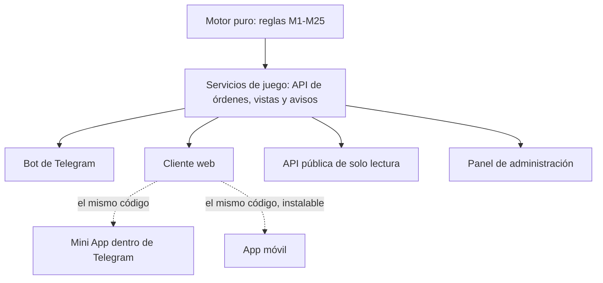

# Web y multiplataforma

> **Módulo** [01 · Plataforma](README.md) · **Depende de:** [Arquitectura modular](arquitectura-modular.md) · **Se conecta con:** [Telegram](telegram.md), [Seguridad y anti-trampas](seguridad-y-anti-trampas.md), [Convenciones de código](convenciones-de-codigo.md), [Monetización](../07-economia/monetizacion.md) · **Condiciona a:** todos los módulos · **Estado:** **regla decidida por el dueño (D-40, D-41)**; los detalles son propuesta

**La regla del dueño:** el juego tiene que ser **modular para montarlo también en web** (D-40), y también en una **app móvil de texto** (D-41). Se monta primero en el bot de Telegram [@LostRealmsbot](https://t.me/LostRealmsbot), pero Telegram es **el primer cliente, no el único**.

**De dónde sale.**
- **TowerWars:** la arquitectura hexagonal ("nada en el motor importa nada de los adaptadores"), que ya separa las reglas del bot (ver [Lecciones de TowerWars](../99-referencias/lecciones-de-towerwars.md)).
- **Los MUD** (juegos de rol multijugador en texto): el mismo servidor se juega desde clientes muy distintos. Con el protocolo **GMCP**, el servidor manda, además del texto, datos ordenados (vida, sala, salidas), y clientes como Mudlet dibujan con ellos barras y mapas. Es la idea de las vistas neutras (§3).
- **Old School RuneScape** y **Albion Online:** un solo mundo y los mismos servidores para computadora y teléfono. Quien juega en una plataforma se cruza con quien juega en la otra.
- **Lichess:** se juega desde la web, la app o programas de terceros, y el servidor valida cada jugada. El cliente solo muestra y envía.
- **El azar "comprobable"** (*provably fair*) de los juegos de azar en línea: el servidor publica la huella de su semilla antes de tirar y la revela después, para que cualquiera compruebe que no hizo trampa (§6.1).
- **Telegram:** el botón oficial de **inicio de sesión con Telegram** para sitios web (*Telegram Login Widget*) y las **Mini Apps**, que son páginas web abiertas dentro de Telegram.

---

## 1. El principio: un mundo, un motor, varios clientes

Hay **un solo mundo** y **un solo motor**. Telegram, la web y la app móvil son **clientes**: muestran el mundo y envían las órdenes del jugador. No deciden nada.

| Igual en todos los clientes | Cambia según el cliente |
|---|---|
| Las reglas, las fórmulas y el azar | Cómo se dibuja cada pantalla |
| Los temporizadores y las horas de cierre | Cuántos toques o clics hacen falta para llegar a una acción |
| La información que ve cada jugador y su precisión | Por dónde llegan los avisos (privado del bot, notificación del navegador, correo) |
| Las acciones disponibles en cada momento | Cómo se pliegan y se paginan los textos largos |
| La cuenta, los héroes, el inventario, el oro y las Gemas | Los atajos de navegación (menú fijo, barra lateral, teclas) |

**Reglas de paridad:**
1. **Ningún cliente agrega reglas, información ni ventajas.** Solo traduce órdenes y vistas.
2. **El motor no sabe desde qué cliente juega cada jugador** (D-40, D-41). Lo sabe la capa que entrega los mensajes, para poder entregarlos, pero ninguna regla del juego lo usa.
3. **Mismas reglas, mismos temporizadores, misma información.** Si un dato o una acción existe en un cliente, existe en todos.
4. **Ninguna plataforma da ventaja:** ni por velocidad, ni por tener una pantalla más grande, ni por recibir antes los avisos.
5. **Pruebas de paridad:** las pruebas del motor corren los mismos escenarios a través de cada adaptador y tienen que dar el mismo resultado.
6. **El juego no muestra desde qué cliente juega cada uno.** Nadie es "el de la web" ni "el de Telegram".

**El filtro del diseño cambia.** Antes: "si no funciona en mensajes, botones y turnos, no entra". Ahora: **"si no funciona en cualquier cliente de texto por turnos, no entra"**. Las restricciones propias de Telegram (largo de mensaje, cantidad de botones, límites de envío) condicionan solo al adaptador de Telegram, no a las reglas del juego.

### Reglas de cliente (valen para todos)

Varios principios de [Telegram](telegram.md) §3 no son de Telegram: son del juego. Pasan a ser **reglas de cliente**, iguales para todos:

| Regla de cliente | Qué dice |
|---|---|
| **Por turnos, nunca reflejos** | Rondas simultáneas con temporizador en grupo y sin temporizador en solitario. Nada depende de la velocidad de entrada |
| **Acciones discretas** | El jugador elige una acción de una lista. No hay movimiento libre, puntería ni destreza que decidan un resultado |
| **Tope de acciones de combate** | Es una regla de balance del motor (6 botones, D-46), no un límite de pantalla |
| **Resumen y detalle** | Todo informe tiene un resumen corto y un detalle completo que se pide |
| **Lo privado es privado** | Cada dato tiene su visibilidad, y el motor solo lo envía a quien puede verlo |
| **Tres ritmos** | Toque, sesión y cita (ver [Telegram](telegram.md) §3) |
| **Nada que se gane pulsando lo mismo** | Lo repetitivo se automatiza de forma oficial (ver [Seguridad](seguridad-y-anti-trampas.md)) |

## 2. Las capas



| Capa | Qué hace | Qué no hace |
|---|---|---|
| **Motor puro** | Las reglas: combate, salud, economía, mundo (los 25 módulos de la [arquitectura](arquitectura-modular.md)). Recibe órdenes, cambia el estado, publica eventos y arma vistas | No conoce Telegram, la web ni ninguna librería de cliente. No escribe textos sueltos: los toma de los archivos de idiomas |
| **Servicios de juego (API)** | La puerta única al motor: identifica al jugador, recibe órdenes, devuelve vistas y empuja las versiones nuevas y los avisos a cada cliente conectado | No tiene reglas propias ni decide resultados |
| **Bot de Telegram** | Traduce botones y comandos a órdenes, y vistas a mensajes con botones. Lleva la cola de ediciones y los límites de envío de Telegram | No guarda estado del juego. No tira dados ni cuenta tiempos |
| **Cliente web** | Dibuja las vistas con interfaz visual (barras, mapas, paneles) y envía órdenes. **El mismo código se abre como Mini App dentro de Telegram** | No calcula nada que el motor no haya entregado |
| **App móvil** (D-41) | Usa el mismo contrato de órdenes y vistas. Empieza como la web instalable en el teléfono (P-61) | Lo mismo que la web |
| **API pública de solo lectura** | Datos públicos para herramientas de la comunidad: precios, rankings, Gaceta (P-48) | No acepta órdenes de juego |
| **Panel de administración** | Radiografías, registro de balance, moderación | No cambia reglas sin pasar por el registro de balance |

**Tecnología.** El motor en Python (P-46) no depende de aiogram ni de ninguna librería de cliente: aiogram vive solo en el adaptador de Telegram. Los servicios de juego reciben las órdenes por HTTP y empujan los cambios por WebSocket. El cliente web puede usar otro lenguaje (por ejemplo TypeScript), con las mismas notas `[ES]` (ver [Convenciones de código](convenciones-de-codigo.md)).

## 3. Vistas neutras: el motor devuelve pantallas, no mensajes

El motor no devuelve "un mensaje de Telegram". Devuelve una **vista**: una pantalla estructurada con el estado, los avisos y las acciones disponibles, cada una con su identificador. Cada cliente la dibuja a su manera.

### 3.1 Un ejemplo: la vista de una ronda de combate

Los nombres, los números y las habilidades son de ejemplo.

```yaml
# [ES] Vista de una ronda de combate. Es la misma para Telegram, la web y la app.
# [ES] Solo trae lo que este jugador puede ver, con la precisión pública de cada dato.
view: combat_round
combat_id: cmb_8f21
version: 14                          # [ES] Sube con cada cambio. El cliente muestra siempre la última.
round: 3
closes_at: "2026-10-01T18:04:45Z"    # [ES] Hora de cierre del servidor, igual para todos.
status: choosing                     # [ES] choosing (eligiendo), resolving (resolviendo) o ended (terminó).
enemies:
  - id: e1
    name: "Caballero Ceniciento"     # [ES] Texto ya traducido al idioma de la cuenta (M1).
    hp_pct: 62                       # [ES] Vida del jefe en % entero, nunca el número exacto.
    posture_tenths: 7                # [ES] Postura en décimos: ningún cliente recibe 783/1000.
warnings:
  - text: "El Caballero alza la espada sobre la primera fila."
    tags: [front_row]                # [ES] Solo etiquetas públicas. Nunca el tipo real del movimiento.
initiative: [me, e1, ally_2, ally_3]
me:
  hp: {current: 184, max: 240}       # [ES] Lo propio se ve exacto.
  conditions: ["Sangrado leve"]
actions:                             # [ES] La lista completa de lo que se puede hacer esta ronda.
  - id: act.attack
    kind: action
    label: "Atacar"                  # [ES] Nombre corto, con un largo máximo fijo.
    help: "Golpe básico del arma. Sin costo."   # [ES] Costo y efecto, a un toque en cualquier cliente.
    targets: [e1]
    available: true
  - id: skill.shield_wall
    kind: action
    label: "Muro de escudos"
    help: "Tu fila recibe un 40 % menos de daño esta ronda. Cuesta 30 de Ira."
    available: true
  - id: skill.taunt
    kind: action
    label: "Provocar"
    help: "El enemigo te elige como objetivo durante 2 rondas."
    available: false
    reason: "En recarga: 1 ronda"    # [ES] Por qué no se puede, para mostrarlo igual en todos.
  # [ES] ... hasta 6 acciones (D-46): Atacar, 3 habilidades, Huir y Mochila.
log:
  summary:                           # [ES] Resumen corto de la ronda anterior.
    - "El Caballero golpeó a la primera fila (−38)."
    - "Rompiste un décimo de su postura."
  details_ref: log_cmb_8f21_r2       # [ES] El detalle completo, con cada número, se pide aparte.
```

### 3.2 Cómo la dibuja cada cliente

| | Telegram | Web (y Mini App) | App móvil |
|---|---|---|---|
| **Estado** | Mensaje vivo que se edita, con barras de texto (▓░) | Panel que se actualiza solo, con barras gráficas de la misma precisión | Como la web, para pantalla chica |
| **Acciones** | Botones de 2 por fila, máximo 6 en combate (D-46). El costo va en el texto del mensaje vivo o en la ayuda, nunca en el botón, para que no cueste un toque extra con el plazo corriendo | Botones con nombre y costo a la vista; teclas 1 a 6 | Botones grandes |
| **Tiempo** | Hora de cierre y una cuenta que se edita cada pocos segundos, más un aviso cuando queda poco | Cuenta atrás viva, sincronizada con el reloj del servidor | Como la web |
| **Registro** | Cita plegable, páginas o parte en `.txt`, por el límite de 4.096 caracteres | Desplegable con desplazamiento y botón de descarga | Desplegable |

Los ejemplos **"Cómo se ve en Telegram"** de todo el diseño (combate, cirugía, forja, jornada de obra, rastreo, tablero de investigación, Foso) son **una representación entre varias**. La regla está en la vista, no en el dibujo.

### 3.3 Reglas de las vistas

1. **Lo que no se muestra no se envía.** El motor arma en el servidor la vista de cada jugador. Ningún dato oculto viaja escondido en la página web: ni el tipo real de un aviso, ni la enfermedad sin diagnosticar, ni la acción del rival, ni la solución de un caso, ni el nombre real detrás de un apodo. En Telegram esto se cumplía solo, porque el bot manda texto; en la web hay que exigirlo, porque todo lo que llega al navegador se puede leer.
2. **Cada dato tiene su precisión pública,** definida por el motor: vida del jefe en % entero, postura y acumulaciones en décimos, Aguante en fichas, lo propio exacto. Ningún cliente recibe un número más fino. **Los umbrales para mostrar algo también son del motor:** si la barra de un estado solo aparece cuando pasa de la mitad (D-44, ver [Daño y estados](../04-combate/dano-y-estados.md)), la vista no la trae antes, en ningún cliente. Así la web, que tiene lugar de sobra, no ve lo que Telegram calla para ser ligero.
3. **Datos estructurados, no texto cortado.** Los informes llegan como un resumen (unas 5 líneas) y secciones de detalle. Cada cliente decide cómo plegar y paginar según sus límites, y todo el detalle está disponible en todos.
4. **Cada acción trae ID, tipo, nombre corto, ayuda con costo y efecto, objetivos posibles y si está disponible** (y si no, por qué). Ningún cliente esconde por falta de espacio una acción que el motor ofrece: si no cabe, la pasa a una segunda página ("Más…"). El combate no la necesita: sus 6 botones caben siempre y D-46 no permite botón de Más. Ningún cliente agrega acciones ni atajos que hagan más de una acción por ronda.
5. **Los textos vienen del motor, ya traducidos** al idioma de la cuenta desde los archivos de idiomas (M1). El cliente solo escribe los textos de su propia interfaz ("Cerrar sesión", "Cargando").
6. **Cada vista tiene versión.** El cliente muestra siempre la última. Una orden enviada sobre una versión vieja se valida contra el estado actual.
7. **La vista es un contrato:** se agregan campos, no se cambian ni se quitan (ver [Convenciones de código](convenciones-de-codigo.md) §6.1).

### 3.4 Órdenes

Cada acción del jugador llega al motor como una **orden**: un ID de acción con sus parámetros mínimos, por ejemplo `{action: "skill.shield_wall", version: 14}`. El estado vive solo en el servidor, y el motor valida cada orden contra el estado actual: no confía en lo que diga ningún cliente. Un botón de Telegram (con sus 64 bytes de `callback_data`), un clic en la web y un toque en la app producen la misma orden.

### 3.5 Las vistas principales

| Vista | Qué trae | Documento |
|---|---|---|
| **Menú principal** | Las secciones (Héroe, Inventario, Ciudad, Mercado…) y cuáles están disponibles según el estado del jugador | — |
| **Ronda de combate y resumen de ronda** | §3.1 | [Ronda y acciones](../04-combate/ronda-y-acciones.md) |
| **Estado del cuerpo** | Resumen, zonas, heridas, enfermedades diagnosticadas, condiciones y rasgos | [Heridas](../05-salud/heridas.md) |
| **Minijuego de oficio** | Estado (progreso, calidad, durabilidad…) y acciones del paso | [Fabricación](../07-economia/fabricacion.md), [Curación](../05-salud/curacion-y-tratamientos.md) |
| **Jornada de obra** | Avance, solidez, clima, constructores presentes y acciones de la etapa | [Sistema de construcción](../09-construccion/sistema-de-construccion.md) |
| **Ficha de zona y mapa conocido** | Bioma, terrenos, producción, yacimientos; las zonas que el jugador recuerda (D-61) y el tiempo de cada viaje | [Geografía y recursos](../02-mundo/geografia-y-recursos.md), [Mapa infinito y viaje](../02-mundo/mapa-infinito-y-viaje.md) |
| **Sala** | Participantes, estado compartido, chat y quién ve qué | §5 |
| **Votación, documento y reparto de botín** | Censo y plazo; texto y firmantes; elecciones y tiradas | §6 |
| **Bandeja de avisos** | Invitaciones, retos y avisos pendientes | §8 |
| **Noticias** | Gaceta, Mercado, Salón de los Caídos y Novedades | §6.5 |

## 4. Identidad y cuentas

### 4.1 Una cuenta, varias puertas

La identidad ya no es el ID de Telegram. Es una **cuenta del juego** con su propio ID, a la que se vinculan **identidades** de cada cliente. Desde cualquiera de ellas se entra a la misma cuenta y a los mismos héroes.

| Forma de entrar | Dónde | Cómo funciona |
|---|---|---|
| **Telegram** | Bot y Mini App | El bot recibe el ID de Telegram y la Mini App recibe datos firmados por Telegram. No hace falta registrarse aparte |
| **Iniciar sesión con Telegram** | Web y app | El botón oficial de Telegram para sitios web. El servidor comprueba la firma con el token del bot y que el ingreso sea reciente. Es la forma recomendada (P-59) |
| **Correo** | Web y app | Correo verificado, con enlace de acceso o contraseña, para quien no usa Telegram |
| **Otras** (Google, Apple) | Web y app | Más adelante, si hacen falta (por ejemplo, para las tiendas, P-62) |

### 4.2 Vincular y desvincular

1. **Se vincula desde una sesión ya abierta.** En la web: "Vincular Telegram" con el botón oficial. Desde Telegram: el bot da un código de un solo uso (vence en 10 minutos) que se escribe en la web, o al revés.
2. **Una identidad pertenece a una sola cuenta.** Un mismo Telegram no puede estar vinculado a dos cuentas.
3. **Desvincular pide confirmar otra vez** y nunca deja la cuenta sin ninguna forma de entrar.
4. **Una identidad desvinculada espera 30 días** antes de vincularse a otra cuenta, para que no se use para pasar de una cuenta a otra saltándose las reglas de cuenta nueva.
5. **Las cuentas no se fusionan:** héroes, oro e inventarios no pasan de una cuenta a otra.

### 4.3 Una sola sesión activa por héroe en las actividades con rondas

Se puede tener abierto Telegram y la web a la vez. Para **mirar** no hay límite. Para **actuar** en una actividad con rondas (combate, minijuego de oficio, jornada de obra, mesa de cartas, Foso), **solo un cliente tiene el control** del héroe:

- El control lo toma el cliente desde el que se entra a la actividad.
- El otro cliente ve la misma vista en modo lectura, con el botón **"Jugar desde aquí"**. Al tocarlo, el control pasa y el cliente anterior recibe un aviso.
- El motor rechaza las órdenes del cliente que no tiene el control. Así nadie manda dos órdenes por ronda ni comparte la cuenta para jugar más rápido.
- Pasar el control no cambia el plazo de la ronda ni la elección ya hecha.
- **Un héroe activo por cuenta.** Si la cuenta tiene varios héroes (un alt, ver [Talentos](../03-personaje/talentos.md)), solo uno a la vez puede estar en una actividad con rondas, sea cual sea el cliente. Abrir dos pestañas, o Telegram y la web, no permite jugar dos héroes en paralelo (en Telegram, el chat único del bot ya lleva a un héroe por vez). Los encargos y temporizadores de los otros héroes siguen corriendo.
- Fuera de esas actividades (mercado, inventario, chat), cualquier cliente abierto puede actuar. Cada orden se valida contra el estado actual, así que nada se gasta dos veces.

### 4.4 Multicuentas y privacidad

- Las restricciones de cuenta nueva, de voto y de guerra cuentan **cuentas del juego**, no identidades de un cliente (ver [Seguridad](seguridad-y-anti-trampas.md)).
- En la web una cuenta puede costar solo un correo, menos que el número de teléfono que pide Telegram. Eso se compensa con verificación al crear la cuenta, **nunca con reglas de juego distintas** para un cliente.
- Se guarda lo mínimo: ID de cuenta, identidades vinculadas, idioma, el correo solo si se usa para entrar, y los datos del juego.

## 5. Juego cruzado

Los jugadores de Telegram, de la web y de la app comparten todo:

| Qué se comparte | Cómo se garantiza |
|---|---|
| **La misma ronda** | La hora de cierre es del servidor y lleva un margen que cubre al cliente más lento (§10) |
| **El mismo grupo y la misma banda** | La sala es una entidad del motor; cada cliente la muestra a su manera |
| **El mismo mercado** | Un solo libro de órdenes; los precios de referencia salen a la vez para todos |
| **El mismo gremio** | Los canales, la orden vigente, el banco y los vales son datos del motor |
| **Las mismas votaciones** | El censo y los votos los lleva el motor, no un grupo de Telegram |
| **Las mismas colas y clasificaciones** | Una cola de emparejamiento y un ranking para todos |
| **Las mismas mesas** | Cartas, dados y Foso con jugadores de cualquier cliente |

### 5.1 Las salas

Un bot de Telegram no puede crear grupos, y por eso el diseño inventó las **salas retransmitidas**. Ahora la **sala** es una entidad del motor (M11 y M15): participantes, estado compartido, chat de sala y quién ve qué.

- **Telegram** la muestra retransmitiendo todo al privado de cada participante.
- **La web** la muestra como una sala con panel compartido y chat.
- **Una misma sala mezcla clientes,** y todos ven lo mismo al mismo tiempo.

**El chat entre jugadores es un servicio aparte**, con orden de mensajes, que cada cliente entrega lo mejor que puede. **Ninguna mecánica depende de la velocidad del chat:** los avisos y el estado los publica el motor en la vista de la ronda, y el plazo deja margen para coordinarse aunque el chat se atrase.

### 5.2 Los grupos de Telegram pasan a ser puentes

Los grupos oficiales (castillo, ciudad, región, gremio con temas, rol) eran el lugar de muchas cosas del juego. Ahora:
- **Los espacios de comunidad son del motor:** sala del castillo, de la ciudad, de la región, del gremio (con sus subcanales) y de rol. Los miembros salen del estado del juego: residente, miembro, presente en la región.
- **Un grupo de Telegram es un puente opcional:** el bot copia los mensajes en los dos sentidos. Para leer la conversación del grupo, el bot tiene que ser administrador (modo privacidad).
- **El puente no abre una sala cerrada.** La sala del gremio o la de un grupo solo tiene puente si el bot controla quién entra: acepta solo solicitudes de ingreso de cuentas vinculadas que sean miembros de la sala y saca a quien deja de serlo. Si no, el puente solo sirve para salas públicas (ciudad, región). Así un espía no lee las órdenes del gremio entrando al grupo de Telegram, cosa que en la web no podría.
- **Lo que importa al juego es una acción, no un mensaje suelto:** una queja que cuenta como señal de crisis es la acción "presentar queja"; una orden de guerra es la "orden vigente"; un avistamiento es un evento de la zona.
- **La moderación es la misma en todos los clientes:** una sanción de chat es un estado de la cuenta (silenciado hasta cierta hora, expulsado de cierta sala), con registro y motivo.

## 6. Tabla de equivalencias

Cada función de Telegram que usa el diseño, con su regla neutral y su forma en la web. Sale de la auditoría del diseño del 1 de octubre de 2026. **La regla neutral es la que vale;** las columnas de Telegram y de la web son representaciones.

### 6.1 Azar a la vista

| Función de Telegram | Dónde se usa | Regla neutral | En Telegram | En la web |
|---|---|---|---|---|
| **Dados animados nativos** 🎲🎯🏀⚽🎳🎰 (el valor lo decide Telegram, no el bot) | Botín Necesidad/Codicia, dados de taberna, Dados del Destino del Pícaro Forajido, emboscada e iniciativa inicial ([Mecánicas avanzadas](../04-combate/mecanicas-avanzadas.md) §8), juegos de la Fortuna, cara o cruz, tragaperras, lotería, ruleta del Guantelete, regla de la noche del Foso, rol con máster | **Tirada pública auditable** (abajo). El dado nativo no decide ninguna tirada que cuente, porque no puede mostrar un valor elegido por el motor | La cara del dado (⚀-⚅), un sticker propio del juego por cara, o el emoji con el número | Animación que cae en el número del motor, con el número y un enlace para verificarlo |
| **Spoiler** que tapa un resultado | Rasca y gana | **Boleto sellado:** el resultado se fija y se registra al comprarlo; destaparlo no cambia nada | Spoiler | Casilla que se raspa o se destapa al tocarla |

**Tirada pública auditable:**
1. El motor saca el resultado de una semilla.
2. Antes de que se cierren las elecciones o las apuestas, publica la **huella** (hash) de esa semilla.
3. Después de tirar, revela la semilla. Cualquiera puede recalcular el resultado desde cualquier cliente o desde la API pública.
4. Las tiradas dentro de un combate usan la semilla del combate y quedan en el registro de la ronda (regla 6 de la [arquitectura](arquitectura-modular.md)). Así el simulador de balance y la radiografía de combate las pueden repetir.
5. Las tablas (pesos, pagos, ventaja de la casa) son datos públicos.
6. El resultado se publica a la vez en todos los clientes.
7. En los juegos con información oculta (Dados del Mentiroso, cartas), cada jugador ve solo lo suyo hasta que se destapa, y la semilla se revela al terminar la mano.
8. Las trampas ilegales (dados cargados, cartas marcadas) son modificadores del motor sobre esa misma tirada, que se descubren con habilidad o con una investigación.

**Reparto de botín:** cada participante elige Necesidad, Codicia o Pasar antes de un plazo del servidor. El motor tira por cada uno con la tirada pública auditable; Necesidad gana sobre Codicia, y un empate se resuelve con otra tirada entre los empatados. El resultado sale a la vez en la sala, sea cual sea el cliente de cada uno.

### 6.2 Votos, firmas y documentos

| Función de Telegram | Dónde se usa | Regla neutral | En Telegram | En la web |
|---|---|---|---|---|
| **Encuestas nativas** | Elección del gobernador, leyes, moción de censura, cisma y reunificación, juicios, missio del Foso, concursos, votaciones de gremio y de planos, asamblea de residentes antes de la Villa, consejo y proyectos de saber de las comunidades | **Votación del motor:** censo según la regla (residentes activos, miembros, presentes), un voto por cuenta o por héroe, plazo del servidor, voto secreto o público según la ley, y recuento auditable publicado en la Gaceta | Botones del bot. Una encuesta nativa solo puede ser un espejo sin valor | Página de votación con la ficha de cada candidato, botón con confirmación y recuento al cierre |
| **Encuestas en modo quiz** | Trivia de lore, quiz semanal, trivia de gremio contra gremio | **Pregunta del motor:** ventana fija medida en el servidor, una respuesta por héroe y ranking del motor. Los puntos bajan con cada pista revelada, nunca por milisegundos, y no se desempata por velocidad | Quiz con botones en privado (en un canal las encuestas son siempre anónimas y no sirven para dar títulos) | Formulario con cuenta atrás sincronizada |
| **Reenvío como firma** (cabecera "reenviado de @bot") | Carta de fundación del cisma, tratados entre castillos, informes de hazañas, partes de guerra y de ataque, contratos, tarjeta de presentación y tarjeta de perfil, resumen "Tu semana en la Lejanía" | **Documento verificable:** ID único y código de verificación del motor. Firmar es la orden "Firmar documento X" de un jugador identificado, registrada con la hora. Probar algo es mostrar el ID o su enlace | Reenviar sigue como **atajo**: el adaptador lee el ID y lo convierte en la orden. La prueba es el ID, no la cabecera | Página del documento con "Firmar" o "Compartir enlace" y la lista de firmantes |
| **Reenvío para mover objetos** | Vales del almacén o del banco del gremio | **Vale:** objeto del motor de un solo uso, con caducidad, que cambia de dueño con una orden ("Dar", "Cobrar"); no es un mensaje que se copia | El mensaje reenviado funciona como atajo de "Dar" | "Dar a un miembro" y "Cobrar", o un código para copiar |
| **Mensajes fijados** | Órdenes del gremio y de la facción, programa de los candidatos | **Dato del motor:** la "orden vigente" de cada canal y el programa de cada candidato | Mensaje fijado | Arriba de la pestaña o en la ficha |
| **"El bot" como garante** | Custodia de contratos, préstamos y apuestas; Sobres del Foso; garantía de las consultas médicas; registro de contraseñas | **El juego garantiza,** por el módulo dueño: custodia y crédito en Economía (M13), reglas del Foso en PvP y crimen (M12), aptitud médica en Salud (M7) | El bot muestra la garantía | La web muestra la misma garantía |

### 6.3 Pantallas y mensajes

| Función de Telegram | Dónde se usa | Regla neutral | En Telegram | En la web |
|---|---|---|---|---|
| **Teclado inline y edición** (mensaje vivo) | Combate, fabricación, obra, mapa, consultas | **Vista viva:** el motor publica el estado con número de versión y, aparte, avisos con prioridad (te toca, te atacan, terminó) | Edita un mensaje. La cola de ediciones y los límites de envío son del adaptador | Panel que se actualiza solo; avisos aparte |
| **4.096 caracteres, citas plegables, spoilers, parte en `.txt`** | Registro de combate, partes, repetición de muerte de las manchas | **Informe en dos capas:** resumen corto y detalle estructurado completo | Pliega, pagina o manda `.txt` | Desplegable con desplazamiento y descarga |
| **`callback_data` de 64 bytes** | Todos los botones | **Orden de cliente** (§3.4) | ID corto en el botón | El mismo ID en la petición |
| **Botones que se truncan, 2 o 3 por fila** | Todas las pantallas | Cada acción tiene **nombre corto** (largo máximo) y **ayuda** con costo y efecto. El costo siempre está a un toque | El costo va en la ayuda, nunca en el botón | Costo en una segunda línea o en una ayuda al pasar el cursor |
| **Tope de botones** | Combate (6, D-46), fabricación, jornada de obra | El tope de combate es una **regla de balance del motor**. En los minijuegos, el motor entrega la lista de acciones de cada paso | En combate caben las 6, sin botón de Más (D-46). En los minijuegos, si no caben, segunda página con "Más…"; nunca se quita una acción | Todas a la vista o con teclas: las mismas que en Telegram, ni una más |
| **Menú persistente** (reply keyboard) | Navegación principal | **Menú principal del motor:** las secciones y cuáles están disponibles | Botonera fija abajo | Barra fija (abajo en el teléfono, a un costado en la computadora) |
| **Comandos con barra** | `/cuerpo`, `/ciudad`, `/buscar`, `/descubrimientos`, `/medico`, `/rezar`, `/brindar` | **Consultas y acciones con nombre del motor** ("Estado del cuerpo", "Vista Ciudad", "Buscar por rol" con sus filtros, "Rezar", gestos de plantilla), que devuelven lo mismo en cualquier cliente | El comando y, además, un botón | Una sección del menú o un botón |

### 6.4 Información privada y oculta

| Función de Telegram | Dónde se usa | Regla neutral | En Telegram | En la web |
|---|---|---|---|---|
| **Modo inline y privado del bot** | Mano de cartas, rol secreto de La Máscara, fichas, inventario, lugar y hora del Foso, retos | **Visibilidad de cada dato:** pública, de grupo o privada. El motor manda a cada cliente solo lo que ese jugador puede ver | Privado del bot o modo inline | Panel privado en la misma pantalla. La mano de otro nunca viaja escondida en la página |
| **El bot solo manda el texto final** (oculta sin proponérselo) | Avisos que mienten, síntomas sin diagnóstico, lecturas y fintas del Foso, casos personalizados, barras de 10 segmentos | **Vista del jugador calculada en el servidor,** con su precisión pública (§3.3). Nunca se envía el ID interno de un movimiento, la enfermedad real, la acción del rival ni la solución de un caso | El mismo texto | El mismo texto, sin íconos, colores ni números que salgan de un dato oculto |
| **La cabecera de reenvío muestra el nombre de Telegram** | Apodos del Foso | **ID de contexto** (el apodo) que no revela ni la identidad real ni la de la plataforma | El bot copia el texto, no reenvía | Solo el apodo, también en los datos que llegan a la página |

### 6.5 Comunidad y difusión

| Función de Telegram | Dónde se usa | Regla neutral | En Telegram | En la web |
|---|---|---|---|---|
| **Grupos de Telegram** | Facción o castillo, ciudad, región, gremio, rol, "cualquier chat de grupo" del jefe errante | **Espacios de comunidad del motor** (§5.2). El Cuerno de Invocación crea un combate ligado a una sala del juego; participa quien se une, desde cualquier cliente, y las cajas se reparten entre los participantes | Grupo como puente opcional | Salas de chat del sitio |
| **Temas (topics)** | #órdenes, #banda, #mercado, #taberna, #rol | **Subcanales** de la sala del gremio | Temas del grupo puente | Pestañas |
| **Salas retransmitidas** | Mazmorras por buscador, grupos, bandas, Foso | **Sala del motor** (§5.1) | Retransmisión al privado | Sala nativa |
| **Canales** | Gaceta, Canal del Mercado, Salón de los Caídos, Novedades | **Feed de noticias del motor:** cada entrada tiene ID y se publica a la vez en todos los clientes y en la API. El canal es un espejo | Canal | Página de noticias con historial y avisos opcionales |
| **Avisos en el grupo de la región** | Apariciones de criaturas y reliquias, avistamientos de bestias, jefes errantes | **Aviso de zona:** el motor avisa a la vez a todos los presentes o suscritos a la zona; lo que se disputa sigue la apertura simultánea o la ventana sin carrera (§6.6), y queda en el tablón del asentamiento | Mensaje en el grupo de la región o en el privado | Aviso en el panel de la zona |

**Lo que da ventaja por saberlo antes** (una veta excepcional, una bestia legendaria) lo sabe primero quien lo descubrió en el juego, nunca quien usa un cliente determinado.

### 6.6 Tiempos y avisos

| Función de Telegram | Dónde se usa | Regla neutral | En Telegram | En la web |
|---|---|---|---|---|
| **Límites de envío** (unos 30 mensajes por segundo en total y 20 por minuto por grupo) | Apertura de regiones y de la Guarida, eventos de servidor, caso semanal, bestia legendaria, veta excepcional, aviso previo de la guerra | **Apertura simultánea:** todo lo que abre una competencia tiene una hora de inicio fija, anunciada con anticipación. El motor rechaza acciones antes de esa hora. El aviso puede llegar escalonado; la apertura, nunca | Avisos escalonados en minutos | Aviso inmediato con cuenta atrás hasta la hora |
| **Cada botón va y vuelve al servidor, y las ediciones están limitadas** | Temporizador de ronda (45 s en mazmorra y en el Foso, 60-90 s en banda), desempate "gana quien eligió primero", combos "como un ritmo", ritmo de las expediciones | **Ronda simultánea:** hora de cierre absoluta, igual para todos, con un margen que cubre la entrega más lenta. Se resuelve por iniciativa, nunca por orden de llegada. Los empates de iniciativa ("gana quien eligió primero") se resuelven por tramos gruesos del tiempo que tardó cada uno **desde que la vista le llegó** (no desde que abrió la ronda), y luego con una tirada del motor. Así la cola de ediciones de Telegram no hace perder empates. Los combos cuentan el orden de las acciones en rondas seguidas, nunca el tiempo entre toques. Si un ritmo importa, el motor fija un tiempo mínimo por paso, igual para todos | Hora de cierre y cuenta editada cada pocos segundos | Cuenta atrás viva con el reloj del servidor |
| **Cuotas y relojes que se refrescan cada pocos segundos** | Cartelera de apuestas del Foso | Las cuotas visibles se publican **con la misma cadencia** en todos los clientes y se congelan unos segundos antes del cierre. La cuota final la calcula el motor al cerrar | Edición cada pocos segundos | La misma cadencia, aunque la web podría ir más rápido |
| **El bot no puede escribir sin `/start`** | Invitaciones a grupo, retos, consultas médicas | **Bandeja de avisos del motor:** cada invitación queda guardada, y ningún plazo es tan corto que no recibir un aviso a tiempo sea una desventaja de cliente | Privado del bot | Bandeja, notificación del navegador o correo |
| **"Conectado"** (en Telegram no existe) | Signos de invocación, tomar el mando en la defensa, "presentes" en una redada, inactividad en el Foso, descanso y sueños "fuera de línea" | **Estados explícitos del motor:** "disponible para ayudar" (lo activa el jugador), "presente" (entró al local con una acción y no salió), "descansando" (el héroe está en una cama de posada o de su casa) y ventanas de respuesta con plazo fijo. Cerrar la pestaña o dejarla abierta no cambia nada. Si la entrega de una ronda falló, esa ronda no cuenta como inactividad | Botón en el aviso | Botón en el aviso |
| **Orden de llegada** (el primero que escribe en el grupo o que pulsa) | Criaturas y reliquias que aparecen en el chat de la región, Charadas del Juglar, rendición en grupo ("decide el primero que pulsa", 15 s), primer descubridor, primera muerte de un jefe | **Ventana, no carrera:** lo que se disputa se contesta con una orden al motor, no con un mensaje de chat, dentro de una ventana con el mismo margen de entrega que la ronda. Cuentan todas las respuestas válidas de la ventana; si hay varias, decide la regla del motor (en una decisión de grupo, la mayoría; si no, la tirada auditable). Los "primeros" se miden por la ronda o el minuto del servidor, y quienes empatan comparten el mérito | Botón o respuesta en el privado del bot; el chat del grupo puente no cuenta | Botón o campo en la sala |

### 6.7 Minijuegos, pagos y cuentas

| Función de Telegram | Dónde se usa | Regla neutral | En Telegram | En la web |
|---|---|---|---|---|
| **Plataforma de juegos HTML5 y `setGameScore`** | Forja rítmica, pesca, ganzúa | **Minijuego como complemento del motor (M16):** la puntuación la valida el servidor, el récord vive en el motor y los rankings son por grupo del juego (gremio, taberna, región). Si hay destreza, solo da récords y cosméticos, y siempre hay una forma por turnos de hacer lo mismo. La cerrajería y la cirugía son por turnos | El juego HTML5 dentro de Telegram; `setGameScore` solo refleja el récord | El mismo juego dentro de la página |
| **Mini Apps** | Mapa de la zona, árbol de talentos, gráfico del mercado, vivienda, mapa de conquista | **Vista rica opcional:** todo lo que muestra existe también en texto (tabla, lista o imagen). La Mini App **es** el cliente web. Pintar el mapa (estilo Not Pixel) gasta cargas que el motor da al mismo ritmo a todos, y se pinta con una orden por casilla también desde el texto: nunca gana quien hace más clics por segundo | Se abre desde el bot | Es la propia web |
| **Telegram Stars** | Gemas, cosméticos, aceleradores | **Pagos enchufables (M22):** el motor solo recibe "compra confirmada". Catálogo y precios en Gemas iguales en todos los medios de pago; las Gemas son de la cuenta. Nada comprado con dinero real se apuesta, venga del medio que venga (D-43) | Telegram Stars | Pasarela de pago propia (ver [Monetización](../07-economia/monetizacion.md)) |
| **Enlaces profundos** (`t.me/LostRealmsbot?start=código`) | Invitar amigos y sus recompensas (ver [Seguridad](seguridad-y-anti-trampas.md)) | **Código de invitación de la cuenta:** sirve para entrar por cualquier cliente y paga igual, cuando el invitado llega a cierto nivel | Enlace al bot con el código | Enlace al sitio con el mismo código |
| **ID de Telegram como identidad** | Cuenta del jugador (M1) | **Cuenta del juego con identidades vinculadas** (§4) | Entra con su Telegram | Inicio de sesión con Telegram, correo u otras formas |
| **Alta con número de teléfono** | Freno a las multicuentas | Las restricciones de cuenta nueva son iguales por cuenta; un alta más barata se compensa con verificación | — | Correo verificado |
| **"El mismo dispositivo en la Mini App"** | Detección de multicuentas | Las señales de juego son iguales para todos. Una señal técnica de un solo cliente solo abre una revisión humana; nunca sanciona sola | — | Los datos del navegador, solo como pista |
| **Herramientas de moderación de grupos** | Grupos oficiales | **Sanción de chat** como estado de la cuenta (§5.2) | Además, las restricciones del grupo | Las mismas sanciones en el chat web |

## 7. Qué aporta la web, y qué no puede hacer

### 7.1 Lo que aporta sin romper la paridad

| Aporte | Condición |
|---|---|
| **Mapa visual** de las zonas, de conquista y de los campos de batalla | Solo los nodos y datos que el jugador conoce. Moverse sigue siendo una orden de nodo a nodo. En Telegram, el mismo mapa existe como lista o imagen |
| **Inventario** con arrastrar y soltar, filtros y comparación | Las mismas órdenes que en Telegram (equipar, mover, vender). La comparación la entrega el motor y existe igual en Telegram |
| **Mercado con gráficos** | Los mismos datos y el mismo retraso (24 h para otras ciudades). En Telegram, el gráfico existe como imagen o tabla |
| **Árbol de talentos** | Los mismos datos. En Telegram, una lista por ramas |
| **Lectura cómoda de documentos largos** | Registros, partes, leyes, libros de jugadores y lore, con el mismo texto completo que en Telegram |
| **Editores visuales** | El editor de Tácticas (arrastrar y ordenar) y el tablero de investigación (tarjetas e hilos) producen la misma estructura que el editor por botones. Las uniones que haga el jugador son notas suyas y no revelan nada |
| **Silueta del cuerpo y barras gráficas** | La misma precisión que la vista de texto |

**Regla:** todo dato de una vista rica existe también en la vista de texto. La vista rica es más cómoda, nunca más informativa. La base de la web también es texto y turnos (D-05); las vistas ricas son una capa opcional encima.

### 7.2 Lo que no puede hacer

| Prohibido | Por qué |
|---|---|
| **Acciones extra:** más casillas de combate, macros que encadenen acciones, atajos que hagan más de una acción por ronda | Rompe el balance de la barra de combate (D-46) |
| **Información que Telegram no tiene:** números más finos, probabilidades calculadas, la condición futura de la forja sin haber usado Observar, el tipo de un aviso | La vista es la misma para todos y el cliente no calcula nada propio |
| **Reflejos:** tiempo real, puntería, ritmo o destreza que cambien una recompensa | Pilar 1: nada depende de reflejos |
| **Llegar antes:** entrar a un evento por recibir antes el aviso | Apertura simultánea (§6.6) |
| **Complementos que agreguen datos** | El servidor solo manda la vista del jugador, así que un complemento del navegador solo puede reordenar lo que ya se ve. Las herramientas de la comunidad usan la API pública |

## 8. Notificaciones por plataforma

El motor emite **avisos con prioridad** y cada cliente los entrega por su vía. **Ningún efecto del juego depende de recibir un aviso:** curarse, terminar un encargo o vencer un plazo pasa igual. Lo que pide respuesta (una ronda, una defensa, un signo) tiene el mismo plazo en todos los clientes, y si nadie responde actúan las Tácticas.

| Prioridad | Ejemplos | Telegram | Web | App móvil |
|---|---|---|---|---|
| **Urgente** | Te toca en una ronda, atacan tu casa, aceptaron tu reto, te invocan con un signo | Mensaje nuevo del bot | Notificación del navegador; con la pestaña abierta, aviso en pantalla | Notificación del teléfono |
| **Normal** | Encargo listo, herida curada, seguidor de vuelta, subasta ganada | Mensaje del bot, agrupado | Bandeja del juego y notificación si el jugador la aceptó | Notificación |
| **Resumen** | Noticias, informe del mercado, novedades | Canal o resumen diario | Página de noticias | Bandeja |

- **El jugador elige el canal de cada tipo de aviso.** Si tiene varios clientes vinculados, elige dónde recibir. Un aviso leído en uno queda leído en todos.
- **La web solo avisa fuera de la página con permiso del jugador.** Si un jugador web no activó ningún canal urgente, el juego se lo dice cuando equipa algo que depende de avisos (torre de vigía, alarma mágica). Puede usar Telegram o el correo como canal de avisos. En iPhone, la web solo recibe notificaciones si se instala en la pantalla de inicio.
- **Los objetos que avisan dan anticipación y urgencia, no un canal.** La torre de vigía da 20 minutos de anticipación y la alarma mágica marca el aviso como urgente. Si nadie responde, la defensa sigue con las Tácticas.
- **Horas de silencio** opcionales, iguales en todos los clientes.

## 9. Seguridad y anti-bots en la web

En la web es más fácil automatizar: un script del navegador o un programa que llame directo a la API no necesita imitar a Telegram. El principio sigue siendo el de [Seguridad](seguridad-y-anti-trampas.md): **que no haya nada que ganar con un bot**. Además:

| Medida | Qué hace |
|---|---|
| **Autoridad del servidor** | El cliente no decide nada: ni resultados, ni tiempos, ni récords. Cada orden se valida contra el estado actual |
| **Lo que no se muestra no se envía** | Leer el código de la página no da información extra (§3.3) |
| **Límites de órdenes** | Un máximo de órdenes por minuto por cuenta, igual en todos los clientes, y otro por dirección de red en la web |
| **Retos contextuales** | Los mismos que en Telegram ("¿Qué dijo el aviso del jefe en la ronda anterior?"), en los mismos momentos. En la web se puede sumar un reto al crear la cuenta, o al entrar si algo parece sospechoso |
| **Ritmo humano** | Las mismas señales: las acciones con una regularidad imposible se marcan |
| **Sesiones seguras** | Conexión cifrada (HTTPS), sesiones que vencen, protección contra peticiones falsas desde otros sitios y nueva confirmación para lo sensible (desvincular, cambiar el correo, transferencias grandes) |
| **Firmas de Telegram comprobadas** | Los datos del inicio de sesión con Telegram y de la Mini App solo se aceptan si la firma es válida y reciente |
| **Una sola sesión con control** | Una cuenta no juega una actividad con rondas desde dos clientes a la vez (§4.3) |
| **Revisión humana** | Las señales técnicas de un cliente (datos del navegador) solo abren una revisión; nunca sancionan solas |

## 10. Rendimiento y tiempo real

**En la web también se juega por rondas.** Lo que la web tiene de "tiempo real" es que la pantalla se actualiza sola, no que se juegue más rápido.

- **El motor emite una vez por ronda.** Los eventos se agrupan y se aplican por ronda (ver [Telegram](telegram.md) §5), y los servicios de juego reparten la versión nueva a cada cliente conectado.
- **Conexión viva en la web** (WebSocket) para recibir las versiones nuevas. Si se corta, la web consulta cada pocos segundos y, al volver, pide la última versión. No hace falta repetir lo perdido: cada vista trae el estado completo.
- **El reloj es del servidor.** La web calcula la diferencia con su propio reloj y muestra la cuenta atrás del servidor. El margen de cada ronda cubre la entrega más lenta, que normalmente es la cola de ediciones de Telegram en las salas grandes.
- **Se mide la entrega.** Los servicios registran cuándo llegó cada versión a cada cliente. Con eso se ajusta el margen, y si una ronda no le llegó a alguien por un fallo, no cuenta como inactividad.
- **Conexiones abiertas con tope:** unas pocas por cuenta (por ejemplo, 3), señales periódicas para cerrar las que quedaron muertas y desconexión tras un rato sin uso.
- **Ligera** (pilar 11): vistas de texto pequeñas y sin imágenes obligatorias. La web funciona con conexiones lentas y teléfonos modestos.

## 11. Idiomas

- Los textos de juego viven en los **archivos de idiomas del motor** (M1), en español e inglés (P-04). El motor devuelve cada texto en el idioma de la cuenta.
- **El idioma es de la cuenta**, igual en todos los clientes: cambiarlo en la web lo cambia en Telegram.
- Los clientes solo traducen **su propia interfaz** ("Cerrar sesión", "Reconectando…").
- Números, fechas y horas llegan como valores, con las horas en UTC. Cada cliente los muestra según el idioma y la zona horaria del jugador, así las horas de apertura se ven en la hora local de cada uno.
- Las frases de plantilla (gestos, notas en el suelo) son del motor y se traducen como el resto.

## 12. Accesibilidad

Un juego de texto se puede jugar con lector de pantalla, y eso es una ventaja que no hay que perder:
- **Cada barra, emoji o color tiene su texto.** La vista trae el valor ("Vida 62 %") y el cliente lo dibuja. El lector de pantalla lee el valor, no "cuadrado verde, cuadrado verde…".
- **El color nunca va solo:** la gravedad de una herida también se dice con palabras.
- **En Telegram:** un "modo lectura" opcional, sin emojis decorativos en las barras.
- **En la web:** todo se puede usar con el teclado, con buen contraste, letra ajustable y opción de reducir las animaciones (las tiradas se ven como número).
- **Los plazos no cambian por cliente.** Quien necesita más tiempo juega en solitario, sin temporizador, o deja actuar a sus Tácticas. En grupo el plazo es el mismo para todos.

## 13. Orden sugerido

| Fase (ver [Hoja de ruta](../00-vision/hoja-de-ruta.md)) | Qué se hace |
|---|---|
| **Fase 1 · Cimientos** | El contrato de órdenes y vistas del motor. El adaptador de Telegram mínimo y un **cliente de prueba** (de consola o una web muy simple) que corre los mismos escenarios. Así se prueba desde el principio que el motor no depende de Telegram |
| **Alfa y beta** | Telegram primero (P-58) |
| **Después de la beta** | El **cliente web**, empezando como **Mini App** dentro de Telegram: la cuenta ya es la de Telegram y no hace falta un inicio de sesión nuevo. Sirve primero para las vistas ricas (mapa, talentos, mercado) |
| **Luego** | El mismo cliente web como **sitio propio**, con inicio de sesión con Telegram y por correo (P-59, P-60) |
| **Más adelante** | La **app móvil**, empezando como la web instalable en el teléfono (P-61) y después en las tiendas (P-62) |

**Preguntas abiertas** (ver [Preguntas abiertas](../00-vision/preguntas-abiertas.md)):

| # | Pregunta | Recomendación |
|---|---|---|
| P-58 | ¿La versión web entra en la beta o después? | Después: primero Telegram; la web empieza como Mini App dentro de Telegram y luego como sitio propio |
| P-59 | ¿El mismo personaje en Telegram y en la web, entrando con la cuenta de Telegram? | Sí |
| P-60 | ¿Dominio y alojamiento del sitio web? | Decidirlo antes de construir el cliente web |

Relacionadas: P-44 (Mini App), P-46 (tecnología), P-48 (API pública), P-61 y P-62 (app móvil).

## 14. Documentos que hay que ajustar

La auditoría encontró mecánicas descritas con funciones de Telegram. Esta tabla dice qué cambiar en cada documento para que diga la regla neutral. **Mientras tanto, vale lo que dice este documento.**

| Documento | Qué ajustar |
|---|---|
| [Visión y pilares](../00-vision/vision-y-pilares.md) | La frase del juego ("un solo mundo y varios clientes, primero Telegram"); el pilar 1 sin nombrar plataforma; el posicionamiento |
| [Decisiones](../00-vision/decisiones.md) | D-02 como "primer cliente"; en D-14, "formato nacido en Telegram" describe el origen, no la forma de funcionar; en D-44, "ligero para un juego de texto" sin nombrar plataforma (solo el dueño cambia una decisión confirmada) |
| [Hoja de ruta](../00-vision/hoja-de-ruta.md) | Fase 1 con el contrato de vistas y el cliente de prueba; dados de taberna con la tirada del motor; riesgo "límites de cada cliente"; arrancar cada cliente antes de subir |
| [Glosario](../00-vision/glosario.md) | "Mensaje vivo" y "Sala retransmitida" como la forma de Telegram de la vista viva y de la sala; términos nuevos: vista, orden, cliente, sala, tirada auditable |
| [Roles](../00-vision/roles-y-caminos-de-juego.md), [Catálogo ampliado](../00-vision/catalogo-ampliado.md) | Tarjeta de presentación con enlace; comandos como consultas con nombre; tratados como documentos que se firman; sala de rol |
| [Telegram](telegram.md) | Separar las reglas de cliente (§1) de las del adaptador. Los principios 6, 7 y 8 ya siguen D-46 y §6 |
| [Seguridad](seguridad-y-anti-trampas.md) | Multicuentas por cuenta del juego; alta en la web; señales técnicas solo como pista; datos que se guardan |
| [Fundación y cisma](../02-mundo/fundacion-y-cisma.md), [Crimen y justicia](../06-contenido/crimen-y-justicia.md), [Supervivencia del asentamiento](../02-mundo/supervivencia-del-asentamiento.md), [El Colapso y las comunidades](../02-mundo/el-colapso-y-las-comunidades.md), [Facciones](../02-mundo/facciones.md) | Votaciones, asambleas y juicios del motor, no encuestas nativas; la firma de la carta como orden; la orden vigente del castillo, no el mensaje fijado del grupo |
| [Ronda y acciones](../04-combate/ronda-y-acciones.md), [Avisos y tácticas](../04-combate/avisos-y-tacticas.md), [Mecánicas avanzadas](../04-combate/mecanicas-avanzadas.md) | Vista de ronda; hora de cierre con margen; desempate medido desde la entrega; precisión pública; "Representación en Telegram"; motivos sin nombrar plataforma; emboscada con la tirada del motor; rendición en grupo por ventana, no "el primero que pulsa" (§6.6) |
| [Clases](../03-personaje/clases-y-especializaciones.md), [Equipamiento](../03-personaje/equipamiento.md), [Botín](../03-personaje/botin.md), [Progresión](../03-personaje/progresion.md), [Balance](../03-personaje/balance.md), [Descubrimiento](../03-personaje/descubrimiento-y-colecciones.md) | Dados del Destino con la semilla del combate; combo del Duelista por orden, no por ritmo; botín con tirada auditable; descanso por estado del héroe, no por conexión; primer descubridor por minuto del servidor; motivos sin nombrar plataforma |
| [05 · Salud](../05-salud/README.md) | `/cuerpo` como la vista "Estado del cuerpo"; la consulta médica sin "en Telegram"; los datos ocultos del diagnóstico nunca se envían |
| [Mazmorras y bandas](../06-contenido/mazmorras-y-bandas.md), [Jefes](../06-contenido/jefes.md), [Peleas clandestinas](../06-contenido/peleas-clandestinas.md) | Salas del motor; tiradas auditables; "disponible para ayudar"; presencia como estado; apuestas con cadencia común |
| [Eventos](../06-contenido/eventos.md), [Investigaciones](../06-contenido/investigaciones.md), [Cacerías](../06-contenido/cacerias.md), [Misiones y exploración](../06-contenido/misiones-y-exploracion.md), [PvP](../06-contenido/pvp.md) | Apertura simultánea; Gaceta como feed; avisos de zona; tablero de gremio; tiempo mínimo por paso; parte de guerra con enlace |
| [Economía](../07-economia/economia.md), [Fabricación](../07-economia/fabricacion.md), [07 · Economía](../07-economia/README.md) | Gemas por pagos enchufables; vales como objetos; custodia del motor; tope de acciones del motor (Fabricación todavía dice "8 botones, como en el combate", y el combate es de 6 por D-46) |
| [08 · Social](../08-social/README.md), [Gremios](../08-social/gremios-y-social.md), [Minijuegos](../08-social/minijuegos-y-formatos-telegram.md), [Apuestas](../08-social/apuestas.md) | Social depende de las salas, no de Telegram; dados del motor; minijuegos definidos sin plataforma; criaturas que aparecen y Charadas sin carrera (§6.6); pintar el mapa con cargas; el azar con una sola fuente |
| [Sistema de construcción](../09-construccion/sistema-de-construccion.md), [Defensa](../09-construccion/defensa-y-protecciones.md) | Vista de la jornada; aviso de ataque sin canal fijo; ventana para tomar el mando |
| [Investigación de Telegram](../99-referencias/investigacion-juegos-telegram.md), [Lecciones de TowerWars](../99-referencias/lecciones-de-towerwars.md) | Marcarlas como recursos del adaptador de Telegram; el reenvío pasa a "vale verificable" |
